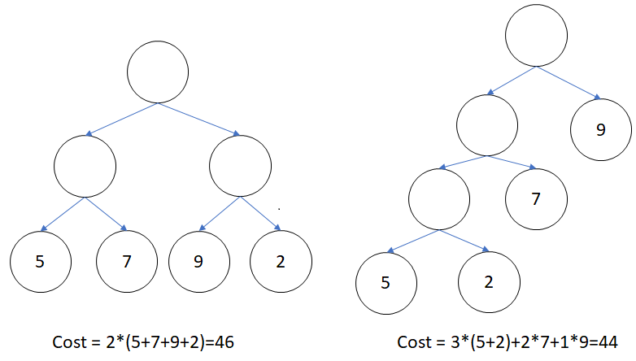
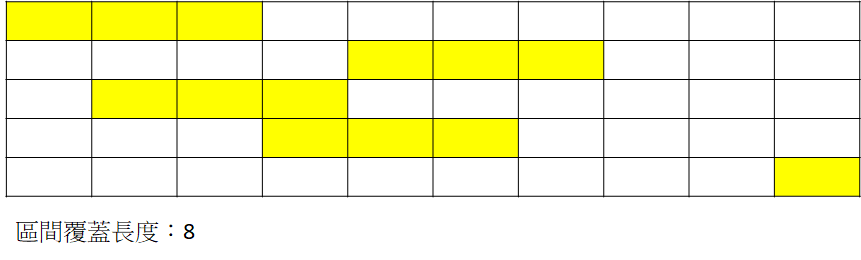
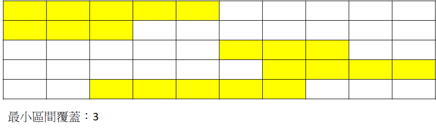
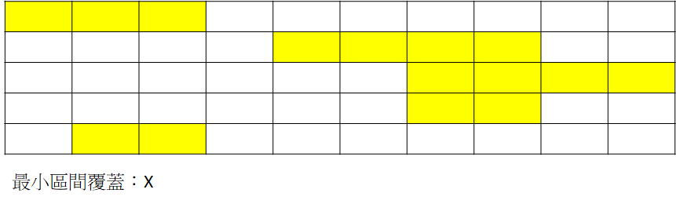
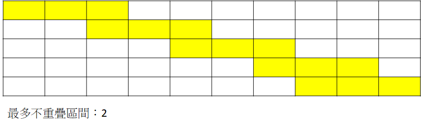
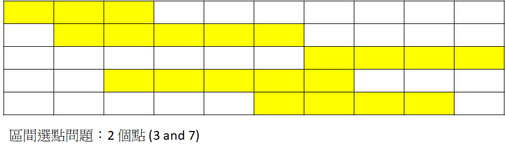

# 貪心

貪心演算法的核心為，採取在目前狀態下最好或最佳（即最有利）的選擇。

貪心演算法雖然能獲得當前最佳解，但不保證能獲得最後（全域）最佳解，提出想法後可以先試圖尋找有沒有能推翻原本的想法的反例，確認無誤再實作。

## Scarecrow

???+ Question "UVa 12405 - Scarecrow"
    有一個 $N\times 1$ 的稻田，有些稻田現在有種植作物，為了避免被動物破壞，需要放置稻草人，稻草人可以保護該塊稻田和左右兩塊稻田，請問最少需要多少稻草人才能保護所有稻田?

從左到右掃描稻田，如果第 $i$ 塊稻田有作物，就把稻草人放到第 $i+1$ 塊稻田，這樣能保護第 $i,i+1,i+2$ 塊稻田，接著從第 $i+3$ 塊稻田繼續掃描。

??? "參考程式碼"

    ```cpp
    --8<-- "docs/algorithm/code/uva12405.cpp"
    ```

## 霍夫曼樹

???+ Question "霍夫曼樹"
    給定 $N$ 個有權重 $w_i$ 的葉節點，請構出一顆有 $N$ 個葉節點的二元樹 $T$，$T$ 的 $cost=\Sigma w_id_i$ 要最小，$d_i$ 代表葉節點的深度。
    

將每個點視為一棵樹，每次將最小權重的兩棵樹合併起來，直到最後合併成一棵樹。

???+ Question "UVa 10954 Add All"
    給定 $N$ 個數，每次將兩個數 $a,b$ 合併成 $a+b$，只到最後只剩一個數，合併成本為兩數和，問最小合併成本為多少。

建構霍夫曼樹的變形題。

??? "參考程式碼"

    ```cpp
    --8<-- "docs/algorithm/code/uva10954.cpp"
    ```

## Commando War

???+ Question "UVa 11729 - Commando War"
    有 $n$ 個部下，每個部下要花 $B_i$ 分鐘交待任務，再花 $J_i$ 分鐘執行任務，一次只能對一位部下交代任務，但可以多人同時執行任務，問最少要花多少時間完成任務。

執行時間長的人先交代任務。

??? "參考程式碼"

    ```cpp
    --8<-- "docs/algorithm/code/uva11729.cpp"
    ```

## 刪數字問題

???+ Question "刪數字問題"
    給定一個數字 $N(\le 10^{100})$，需要刪除 $K$ 個數字，請問刪除 $K$ 個數字後最小的數字為何?

第一種想法是將最大的數字移除，但這種想法存在反例($1879 -> 187$)。

第二種想法是刪除滿足第 $i$ 位數大於第 $i+1$ 位數的最左邊第 $i$ 位數，扣除高位數的影響較扣除低位數的大。

??? "參考程式碼"

    ```cpp
    --8<-- "docs/algorithm/code/numberErase.cpp"
    ```

## 換硬幣問題

???+ Question "換硬幣問題"
    給定硬幣幣值 $x_0=1,x_1,x_2,x_3,...,x_M,x_i<x_j$ and $x_j|x_i,\forall i<j$，請問最少需要幾個硬幣才能湊出 $C$ 元?

從大幣值的硬幣開始使用，如果用剩餘的再用更小的餘額，以此類推。

如果幣值之間沒有整除，要使用到動態規劃。

## 區間覆蓋相關問題

這類題目會需要一個紀錄起點、終點和支援排序的資料結構。

??? "參考程式碼"

    ```cpp
    --8<-- "docs/algorithm/code/Line.cpp"
    ```

### 區間覆蓋長度

???+ Question "zerojudge b966 - 區間覆蓋長度"
    給定 $n$ 條線段區間為 $[L_i,R_i]$，請問這些線段的覆蓋所覆蓋的長度?
    

先將所有區間依照左界由小到大排序，左界相同依照右界由小到大排序，用一個變數 $R$ 紀錄目前最大可以覆蓋到的右界。如果目前區間左界 $\le R$，代表該區間可以和前面的線段合併。

??? "參考程式碼"

    ```cpp
    --8<-- "docs/algorithm/code/zjb966.cpp"
    ```

### 最小區間覆蓋問題

???+ Question "最小區間覆蓋問題"
    給定 $n$ 條線段區間為 $[L_i,R_i]$，請問最少要選幾個區間才能完全覆蓋 $[0,S]$?
    
    

先將所有區間依照左界由小到大排序，對於當前區間 $[L_i,R_i]$，要從左界 $>R_i$ 的所有區間中，找到有著最大的右界的區間，連接當前區間。

???+ Question "Codeforces 1066B - Heaters"
    長度 $n$ 的直線中有數個加熱器，在 $x$ 的加熱器可以讓 $[x-r,x+r]$ 內的物品加熱，問最少要幾個加熱器可以把 $[0,n]$ 的範圍加熱。

對於最左邊沒加熱的點 $a$，選擇最遠可以加熱 $a$ 的加熱器，更新已加熱範圍，重複上述動作繼續尋找加熱器。

??? "參考程式碼"

    ```cpp
    --8<-- "docs/algorithm/code/cf1066B.cpp"
    ```

### 最多不重疊區間

???+ Question "最多不重疊區間"
    給你 $n$ 條線段區間為 $[L_i,R_i]$，請問最多可以選擇幾條不重疊的線段(頭尾可相連)?
    

依照右界由小到大排序，每次取到一個不重疊的線段，答案 $+1$。

??? "參考程式碼"

    ```cpp
    --8<-- "docs/algorithm/code/uva12694.cpp"
    ```

### 區間選點問題

???+ Question "區間選點問題"
    給你 $n$ 條線段區間為 $[L_i,R_i]$，請問至少要取幾個點才能讓每個區間至少包含一個點?
    

將區間依照右界由小到大排序，$R=$ 第一個區間的右界，遍歷所有區段，如果當前區間左界 $>R$ 代表必須多選一個點 ($ans += 1$)，並將 $R=$ 當前區間右界。

???+ Question "UVa 1615 - Highway"
    給定 $N$ 個座標，要在 $x$ 軸找到最小的點，讓每個座標至少和一個點距離 $\le D$。

以每個點 $(x_i,y_i)$ 為圓心半徑為 $D$ 的圓 $C$，求出 $C$ 和 $x$ 軸的交點 $L_i,R_i$，題目轉變成區間選點問題。

??? "參考程式碼"

    ```cpp
    --8<-- "docs/algorithm/code/uva12694.cpp"
    ```

## 工作排程相關問題

### 最小化最大延遲問題

???+ Question "最小化最大延遲問題"
    給定 $N$ 項工作，每項工作的需要處理時長為 $T_i$，期限是 $D_i$，第 $i$ 項工作延遲的時間為 $L_i=max(0,F_i-D_i)$，原本$F_i$ 為第 $i$ 項工作的完成時間，求一種工作排序使 $max{L_i}$ 最小。

按照到期時間從早到晚處理。

??? "證明"
    假設第 $i$ 項工作和第 $j$ 項工作相鄰 ($j=i+1$)，且 $D_i>D_j$，我們稱 $i,j$ 是相鄰逆序對。
    
    - 將 $i,j$ 兩項工作不會影響其他工作的延遲時間 $L_k$。
    - $L_i'=F_i'-D_i=F_j-D_i\le F_j-D_j$
    - $L_j'=F_j'-D_j=F_i-D_j\le F_j-D_j$

    由上面三點可以推得交換是相鄰逆序對並不會增加 $max{L_i}$，透過不斷交換相鄰逆序對，最後證明提出的想法是對的。

??? "參考程式碼"

    ```cpp
    --8<-- "docs/algorithm/code/minMaxLatency.cpp"
    ```

### 最少延遲數量問題

???+ Question "最少延遲數量問題/烏龜塔問題"
    給定 $N$ 個工作，每個工作的需要處理時長為 $T_i$，期限是 $D_i$，求一種工作排序使得逾期工作數量最小。

期限越早到期的工作越先做。將工作依照到期時間從早到晚排序，依序放入工作列表中，如果發現有工作預期，就從目前選擇的工作中，移除耗時最長的工作。

上述方法為 Moore-Hodgson's Algorithm。

???+ Question "UVa 10154 - Weights and Measures"
    給定烏龜的重量和可承受重量，問最多可以疊幾隻烏龜?

和最少延遲數量問題是相同的問題，只要將題敘做轉換。

- 工作處裡時長 $\to$ 烏龜重量
- 工作期限 $\to$ 烏龜可承受重量
- 多少工作不延期 $\to$ 可以疊幾隻烏龜

??? "參考程式碼"

    ```cpp
    --8<-- "docs/algorithm/code/uva10154.cpp"
    ```

### 任務調度問題

???+ Question "任務調度問題"
    給定 $N$ 項工作，每項工作的需要處理時長為 $T_i$，期限是 $D_i$，如果第 $i$ 項工作延遲需要受到 $p_i$ 單位懲罰，請問最少會受到多少單位懲罰。

依照懲罰由大到小排序，每項工作依序嘗試可不可以放在 $D_i-T_i+1,D_i-T_i,...,1,0$，如果有空閒就放進去，否則延後執行。

???+ Question "Zerojudge a567 - 死線排程"
    給定 $N$ 項工作，每項工作的需要處理時長為 $T_i$，期限是 $D_i$，如果第 $i$ 項工作在期限內完成會獲得 $a_i$ 單位獎勵，請問最多會獲得多少單位獎勵。

和上題相似，這題變成依照獎勵由大到小排序。

??? "參考程式碼"

    ```cpp
    --8<-- "docs/algorithm/code/zja567.cpp"
    ```

### 多機調度問題

???+ Question "多機調度問題"
    給定 $N$ 項工作，每項工作的需要處理時長為 $T_i$，有 $M$ 台機器可執行多項工作，但不能將工作拆分，最快可以在什麼時候完成所有工作?

將工作由大到小排序，每項工作交給最快空閒的機器。

??? "參考程式碼"

    ```cpp
    --8<-- "docs/algorithm/code/machineScheduling.cpp"
    ```

## 相關題目

- 區間選點問題
    - [UVa 10148 - Advertisement](https://vjudge.net/problem/UVA-10148)
- 最小區間覆蓋問題
    - [UVa 221 - Urban Elevations](https://vjudge.net/problem/UVA-221)
    - [UVa 10020 - Minimal coverage](https://vjudge.net/problem/UVA-10020)
    - [UVa 10382 - Watering Grass](https://vjudge.net/problem/UVA-10382)

[^1]: [Moore-Hodgson's Algorithm](https://nicknick0630.github.io/2019/03/07/Moore-Hodgson-s-Algorithm-Minimizing-the-number-of-late-jobs/)