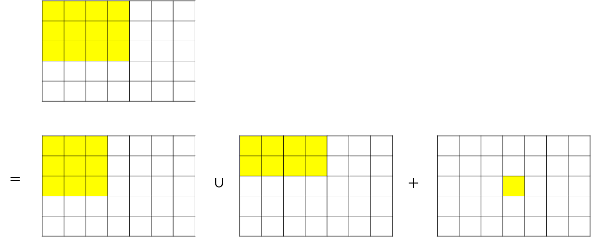
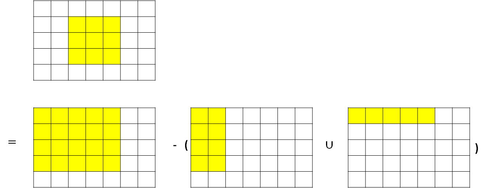

# 前綴和

???+ Question "前綴和"
    給定長度為 $N$ 的序列 $A$，給定 $Q$ 筆查詢，每筆查詢要求出 $A_{i}+A_{i+1}+A_{i+2}+..+A_{j}$。

如果每一次都用迴圈累加答案，單次查詢得時間複雜度為 $O(N)$，要是 $N,Q$ 範圍都在 $10^6$ 以內，很容易超出時限。

## 推導

令前 $x$ 項的和為 $S_x$，$S_x=A_1+A_+...+A_x=\Sigma_{i=1}^{x}A_i$。

那麼前 $x+1$ 項的和 $S_{x+1}=A_1+A_+...+A_x+A_{x+1}=(A_1+A_+...+A_x)+A_{x+1}=S_x+A_{x+1}$。

得出 $S_x=S_{x+1}+A_x$。

算出 $S_1,S_2,...$ 後，如果要計算 $A_{i}+A_{i+1}+A_{i+2}+..+A_{j}$，同樣將公式做整理：

$A_{i}+A_{i+1}+A_{i+2}+..+A_{j}=(A_{1}+A_{2}+A_{3}+..+A_{j}) - (A_{1}+A_{2}+A_{3}+..+A_{i-1})=S_j-S_{i-1}$。

計算 $S_1,S_2,...$ 的時間複雜度為 $O(N)$，單次查詢的時間複雜度為 $O(1)$，整體時間複雜度為 $O(N+Q)$。

```cpp
--8<-- "docs/algorithm/code/prefixSum.cpp"
```

## 二維前綴和

二維前綴和的基礎，排容原理：$A\cup B=A+B-A\cap B$。

假設 $S_{x,y}=\Sigma_{i=1}^{x}\Sigma_{j=1}^{y}A_{i,j}$，將要計算的範圍畫在二維平面上，假設 $A=S_{x-1,y},B=S_{x,y-1},C=A_{x,y}$，那麼 $S_{x,y}=A\cup B+C$，根據排容原理，。$A\cup B=A+B-A\cap B=S_{x-1,y}+S_{x,y-1}-S_{x-1,y-1}$，所以 $S_{x,y}=S_{x-1,y}+S_{x,y-1}-S_{x-1,y-1}+A_{x,y}$。

- 

今天要查詢 $\Sigma_{i=x_1}^{x_2}\Sigma_{j=y_1}^{y_2}A_{i,j}$ 也要用相同的方式，令 $A=S_{x_1-1,y_2},B=S_{x_2,y_1-1}$，$\Sigma_{i=x_1}^{x_2}\Sigma_{j=y_1}^{y_2}A_{i,j}=S_{x_2,y_2}-A\cup B=S_{x_2,y_2}-(S_{x_1-1,y_2}+S_{x_2,y_1-1}-S_{x_1-1,y_1-1})$。

- 

計算 $S_{x,y}$ 的時間複雜度為 $O(N^2)$，單次查詢的時間複雜度為 $O(1)$，整體時間複雜度為 $O(N^2+Q)$。

```cpp
--8<-- "docs/algorithm/code/2DprefixSum.cpp"
```

根據以上方法，可以推廣到三維以上的前綴和。

## 差分

假設 
$$
B_i=\left \{ \begin{matrix} A_i\ i=1\\ A_i-A_{i-1}\ i\ge 2\end{matrix}\right.
$$

那麼 $A_x$ 就是 $B$ 的前 $x$ 項之和：$A_i=\Sigma_{i=1}^{x}B_i$。

用 $B$ 表示 $A$ 的前 $x$ 項之和：$Sum_{i=1}^{x}A_i=Sum_{i=1}^{x}\Sigma_{j=1}^{i}B_i$

???+ Question "區間加值"
    給定序列 $A$，給定 $Q$ 次區間加值操作(在 $A_{i},A_{i+1},...,A_{j}$ 加上 $k$)，輸出最後的 $A$。

每次操作，只會影響 $A_{i-1},_A{i}$ 和 $A_{j},_A{j+1}$ 這兩對相鄰項的差，如果使用差分序列 $B$ 維護 $A$，只要修改 $B_i$ 和 $B_{j+1}$。

## 相關題目

- 前綴和
    - [Zerojudge e339 - 前綴和練習](https://zerojudge.tw/ShowProblem?problemid=e339)
- 差分
    - [Leetcode 1109 - Corporate Flight Bookings](https://leetcode.com/problems/corporate-flight-bookings/)