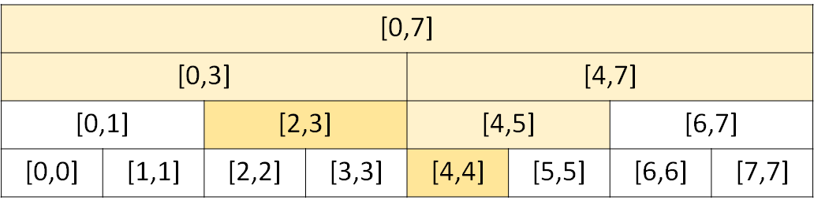

# ICPC 台灣賽區 2021

## C - Community Service
題意：給定區間 $[0,n)$ 和 $e$ 筆操作，有兩種類型操作。

- `1 name L R`：在 $[L,R]$ 之間插入 `name`。
- `2 L R`：查詢 $[L,R]$ 之間最晚出現的名字，並將其刪除。

作法：將每個 `name` 編號，利用線段樹維護編號，每個節點除了紀錄代表區間外，還要記錄 1) 所有完全覆蓋該節點區間的編號 `vector<int> semiStack` 2) 紀錄所有子節點的 `semiStack` 中最大的編號 (`mx`)。有兩種修改操作 `update` 和 `rePushup`，他們兩個的唯一差異是，前者在 `semiStack` 新增編號，後者在 `semiStack` 刪除編號，兩種操作可以分開寫成兩個函式，或合併寫成一個函式，如果合併成一個函式比較好維護，`update/rePushup` 的 `pull`，將 `sumUp` 更新成左右子節點的 `sumUp` 和 `mx`。有一種查詢操作 `query` 查詢 $[L,R]$ 之間最大的編號，查詢除了取所有完全覆蓋該節點區間的 `sumUp` 和 `mx`，還要取沿路上所有拜訪過點的 `mx`，例如下圖中要查詢 $[2,4]$ 的最大值，除了要參考 $[2,3]$ 和 $[4,4]$ 的 `sumUp` 和 `mx`，還要參考 $[0,7]$、$[0,3]$、$[4,7]$ 和 $[4,5]$的 `mx`。



複雜度分析：所有操作的複雜度為 $O(log\ n)$，整題時間複雜度為 $O(elog\ n)$。

後記：範例程式碼用指標寫的，原本比較喜歡指標的寫法，但參考別人的程式碼後，發現陣列寫法也有好處，例如可以一次把記憶體開好。

??? "參考程式碼 ( `update` 和 `rePushup` 分開寫)"
    ```cpp
    --8<-- "docs/contest/code/icpcTaiwan2021C1.cpp"
    ```
??? "參考程式碼 ( `update` 和 `rePushup` 合併)"
    ```cpp
    --8<-- "docs/contest/code/icpcTaiwan2021C2.cpp"
    ```

## D - Largest Remainder
題意：給定 $D$ 個各位數字，可以隨意排序，求出一個數字，在 $mod\ K$ 之下有最大的值，如果有多組數字符合，輸出最大的值。

解法：狀態 DP，$dp[s][r]$ 代表在選取子集合 $s(0\le s\le 2^D-1)$ 情況下，是否有 $mod\ K=r$ 的排列，最大的餘數是 $maxR = max_{0\le k\le K}{k|dp[2^D-1][k]=1}$，另外維護 $ans[s][r]$ 為在選取子集合 $s(0\le s\le 2^D-1)$ 情況下，有 $mod\ K=r$ 的最大數字，最後的答案就是 $ans[2^D-1][maxR]$。

複雜度分析：有 $2^D\times K$ 個狀態，每個狀態需要 $D$ 次轉移，整題時間複雜度為 $O(2^D\times D\times K)$。

??? "參考程式碼"
    ```cpp
    --8<-- "docs/contest/code/icpcTaiwan2021D.cpp"
    ```