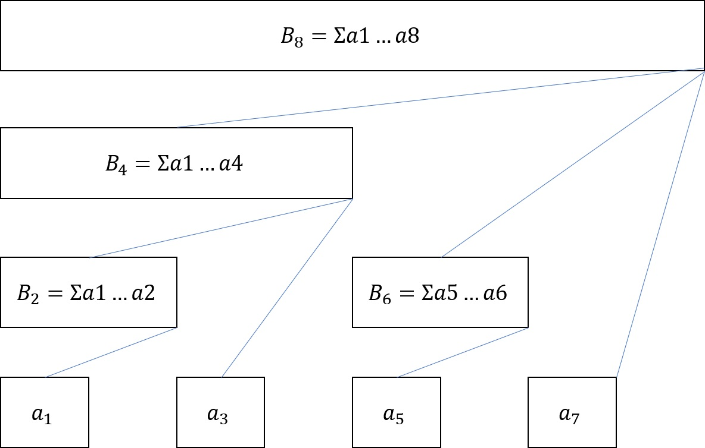
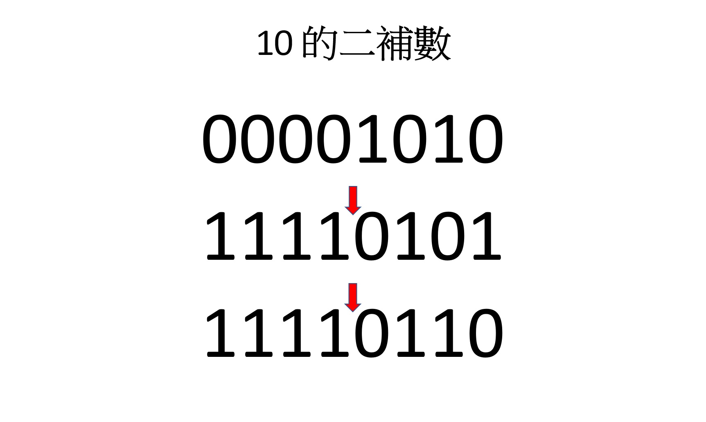
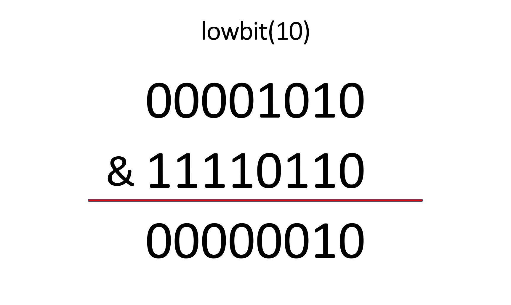

# 樹狀數組 (Bit Index Tree, BIT)

???+ Question "支援單點修改的區間和查詢"
    給定一個長度為 $N$ 的序列 $A$ 和 $Q$ 筆操作，有兩種操作：
    
    - `1 x v`：將 $A_x$ 加上 $v$。
    - `2 x y`：詢問 $[x,y]$ 之間的和。

支援修改及查詢區間訊息的題目可以用線段樹實作，然而比線段樹容易實作的樹狀數組也可解決這類問題。樹狀數組只需要一個長度為 $N$ 的陣列 $B$，$B$ 的每一個位置存放的資料和編號有關：

- $B[i]$ 存放 $A[i-lowbit(i)+1]$ 到 $A[i]$ 的資訊。
- $lowbit(i)=i\&(-i)$，為 $i$ 在二進位下的最低為 $1$ 的位數。
- 節點 $i$ 的父節點為 $i+lowbit(i)$，父節點有子節點的資訊。



???+ "lowbit 計算原理"
    整數 $-x$ 的二補數，是先把 $x$ 的二進位中 `01` 互換，再加上 $1$ 得來的。將 $x$ 和 $-x$ 相比，大於 $lowbit(x)$ 的每一位數，如果 $x$ 是 $0$，在 $-x$ 會是 $1$，如果 $x$ 是 $1$，在 $-x$ 會是 $0$；小於 $lowbit(x)$ 的每一位數，在 $x$ 和 $-x$ 都會是 $0$；只有 $lowbit(x)$ 所對應的位數在 $x$ 和 $-x$ 都會是 $1$。因此 $x\&-x$ 的結果會是 $lowbit(x)$。下面以 $10$ 為例。
    
    

## 單點修改

單點修改 $A[i]$，需更新所有包含 $A[i]$ 的資訊，從 $B[i]$ 開始，依序更新 $B[i]$ 和 $B[i]$ 的所有祖先。

```cpp
--8<-- "docs/dataStructure/code/bitIndexTree1.cpp"
```

$lowbit(i)$ 會不斷增加，在二進位下，每次至少會右移一位，一次查詢的時間複雜度為 $O(log\ N)$。

## 區間查詢

區間查詢 $A[1]$ 到 $A[i]$ 的資訊，從 $B[i]$ 獲得 $A[i-lowbit(i)+1]$ 到 $A[i]$ 的資訊，再到 $B[i-lowbit(i)]$ 獲得下一個區間的資訊，以此類推。

```cpp
--8<-- "docs/dataStructure/code/bitIndexTree2.cpp"
```

$lowbit(i)$ 會不斷減少，在二進位下，每次會將最低為 $1$ 的位數變成 $0$，一次修改的時間複雜度為 $O(log\ N)$。

## 應用

可用來維護可修改的區間和與區間積查詢，不支援區間極值查詢。

- $[x,y]$ 的區間和（積）可由 $[1,x]$ 和 $[1,y]$ 的區間和（積）相減（除）求得。
- $[1,x]$ 和 $[1,y]$ 的區間極值不能推出 $[x,y]$ 的區間極值。

## 支援區間加值

???+ Qusetion "支援區間加值的區間和查詢"
    給定一個長度為 $N$ 的序列 $A$ 和 $Q$ 筆操作，有兩種操作：

    - `1 x y v`：將 $[x,y]$ 之間的元素加上 $v$。
    - `2 x y`：詢問 $[x,y]$ 之間的和。

區間加值可以搭配差分技巧實現，令 $D_i$ 為差分數列：

$$
D_i=
\begin{cases}
A_i & i=1\\
A_i - A{i-1} & \text{else}
\end{cases}
$$

區間和就變成：

$$
\Sigma_{i=1}^{N}A_i
\\=\Sigma_{i=1}^{N}D_i\times(N-i-1)
\\=(N+1)\Sigma_{i=1}^{N}D_i-(\Sigma_{i=1}^{N}D_i\times i)
$$

如此一來，只要維護 $D_i$ 和 $D_i\times i$，就能實現區間修改的功能。


???+ Question "逆序數對"
    給定一個長度為 $N$ 的序列 $A$，求有幾組數對 $i,j$ 滿足 $i < j$ 且 $A_i > A_j$ 。

對於每個位置 $i$，計算出有幾個 $j$ 滿足 $i < j$ 且 $a_i > a_j$，逆序數對維護每一個數字各出現幾次，從左到右拜訪，每次找出目前有幾個數字 $>=a[i]$ (全部的個數 - $<a[i]$ 的個數)，再把 $a[i]$ 出現個數 $+1$。


```cpp
--8<-- "docs/dataStructure/code/inversion.cpp"
```

[^1]: [樹狀數組 - WiwiHo 的競程筆記](https://cp.wiwiho.me/fenwick-tree/)
[^2]: [前缀和 & 差分 - OI Wiki](https://oi-wiki.org/basic/prefix-sum/)