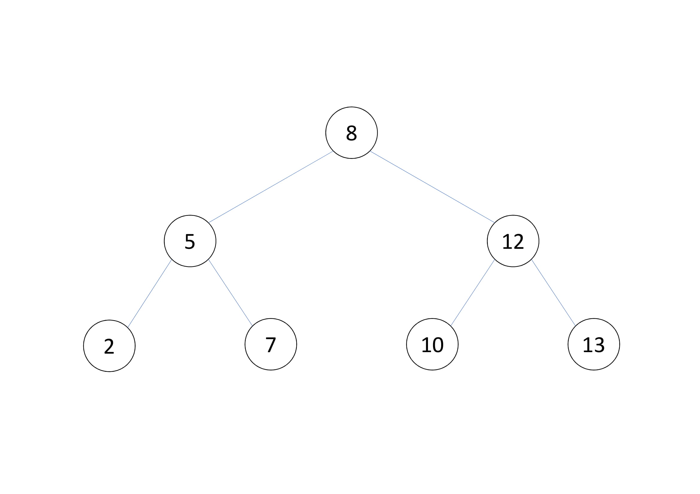
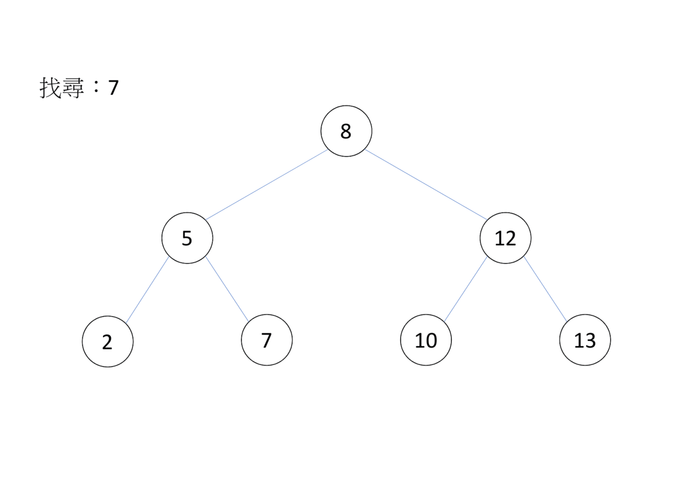
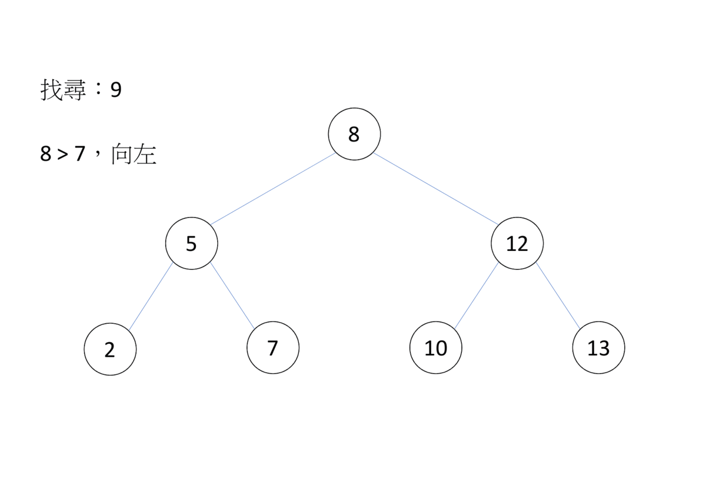

# 二元平衡樹 (Balanced Binary Search Tree)

## 二元搜尋樹

二元搜尋樹可在 $O(\log N)$ 時間內在大小為 $N$ 的資料中找尋元素的二元樹。

- 
-   定義：
    - 節點的值 > 左子樹每個節點的值
    - 節點的值&lt;右子樹每個節點的值
    - 二元搜尋樹的左右子樹，也是二元搜尋樹

二元搜尋樹兩個重要的指令為插入和搜尋。

### 插入

```txt
對於每個要插入的值 $val$
從根節點開始
如果該節點為空，開一個新節點，並存值 $val$
如果該節館的值 > $val$，$val$ 和該節點的左子節點比較，反之和該節點的右子節點比較
```

- 

### 時間複雜度

每一次插入查詢的時間和深度有關，深度越高，效率越低，理想在二元搜尋樹的深度為 $O(N\log N)$ ，但最差狀況會是 $O(N)$ 

### 搜尋

```txt
從根節點開始搜尋
1. 比較節點值和搜尋值
2. 如果沒節點，代表找不到
3. 如果節點值 = 搜尋值，代表找到
4. 如果節點值 < 搜尋值，向右子節點走，回到 1.
5. 如果節點值 > 搜尋值，向左子節點走，回到 1.
```

- 

- 

## 二元平衡樹

二元平衡樹會自動調整高度，常見的有：紅黑樹、AVL 樹等。

### STL

set 和 map 皆為紅黑樹實作，支援插入、刪除及查詢一個值，不同的是，set 會回傳鍵值，map 則是回傳對應值，也可以說 set 的鍵值和對應值一樣

### set

- 標頭檔： `<set>` 
- 建構式： `set <T1> s` 
-  `s.size()` ：回傳元素個數，複雜度 $O(1)$ 
-  `s.empty()` ：回傳是否為空，複雜度 $O(1)$ 
-  `s.clear()` ：清除元素，複雜度 $O(size)$ 
-  `s.insert(T1 a)` ：加入元素 a, 複雜度 $O(\log size)$ 。
-  `s.erase(iterator first,iterator last)` ：刪除 $[first,last)$ , 若沒有指定 last 則只刪除 first, 複雜度 $O(\log size)$ 與加上元素個數有關係。
-  `s.erase(T1 a)` ：刪除鍵值 a, 複雜度 $O(\log size)$ 。
-  `s.find(T1 a)` ：回傳指向鍵值 a 的迭代器，若不存在則回傳 s.end (), 複雜度 $O(\log size)$ 。
-  `s.count(T a)` ：計算有幾個元素 `a` 。
-  `s.lower_bound(T1 a)` ：回傳指向第一個鍵值大於等於 a 的迭代器。複雜度 $O(\log size)$ 。
-  `s.upper_bound(T1 a)` ：回傳指向第一個鍵值大於 a 的迭代器。複雜度 $O(\log size)$ 。

```cpp
#include <iostream>
#include <set>
using namespace std;

int main() {
  set<int> sb;
  sb.insert(1);
  sb.insert(2);
  sb.insert(3);

  cout << "1 : " << (sb.find(1) != sb.end() ? "find\n" : "not find\n");
  cout << "1 : " << (sb.count(1) ? "find\n" : "not find\n");

  sb.erase(1);
  cout << "1 : " << (sb.find(1) != sb.end() ? "find\n" : "not find\n");
  cout << "1 : " << (sb.count(1) ? "find\n" : "not find\n");
}
```

    1 : find
    1 : find
    1 : not find
    1 : not find

### pair

- 將兩個資料綁在一起
- 制造 `pair` ： `make_pair` 

### insert 回傳

-  `pair` 
- 如果元素不存在：first 是指向剛插入的元素的迭代器、second 是 true;
- 如果元素存在：first 是指向鍵值為 k.first 的元素的迭代器，second 是 false。

### map

-   下列同 `set` 
    -  `m.size()` 
    -  `m.empty()` 
    -  `m.clear()` 
    -  `m.count()` 
    -  `m.erase(iterator first, iterator last)` 
    -  `m.erase(T1 a)` 
    -  `m.find(T1 a)` 
    -  `m.lower_bound(T1 a)` 
    -  `m.upper_bound(T1 a)` 
-  `m[a]` ：存取鍵值 a 對應的值，若 a 沒有對應的值，會插入一個元素，使 a 對應到預設值並回傳之。複雜度 $O(\log size)$ 。
-  `m.insert(pair<T1,T2> a)` ：加入元素 a，包含鍵值和對應值，複雜度 $O(\log\ size)$ 。

```cpp
#include <iostream>
#include <map>
using namespace std;

int main() {
  map<string, int> tb;
  tb["123"] = 1;
  tb["owowowo"] = 2;
  tb["omomo"] = 3;
  cout << "tb[\"123\"]: " << tb["123"] << '\n';
  cout << "tb[\"owowowo\"]: " << tb["owowowo"] << '\n';
  cout << "tb[\"omomo\"]: " << tb["omomo"] << '\n';

  cout << "123 : " << (tb.find("123") != tb.end() ? "find\n" : "not find\n");
  cout << "123 : " << (tb.count("123") ? "find\n" : "not find\n");

  tb.clear();
  cout << "123 : " << (tb.find("123") != tb.end() ? "find\n" : "not find\n");
  cout << "123 : " << (tb.count("123") ? "find\n" : "not find\n");

  cout << "owo : " << (tb.find("owo") != tb.end() ? "find\n" : "not find\n");
  tb.insert(make_pair("owo", 659));
  cout << "owo : " << (tb.find("owo") != tb.end() ? "find\n" : "not find\n");
}
```

    tb["123"]: 1
    tb["owowowo"]: 2
    tb["omomo"]: 3
    123 : find
    123 : find
    123 : not find
    123 : not find
    owo : not find
    owo : find

## multi - 系列

可插入重複元素，代價為 map 無法用下標運算子

- equal_range (T1 a)：回傳 iterator 的 `pair<lower_bound (a),upper_bound (a)>` ，為 a 所在範圍
- erase (T1 a)：刪除所有元素 a，如果只要刪除一個，用 `s.erase (s.find (a))` 

## unorder - 系列

降低常數，期望複雜度少一個 log，代價為不會排序，沒有 `lower_bound/upper_bound` ，也不會依鍵值大小遍歷。迭代器為單向。
