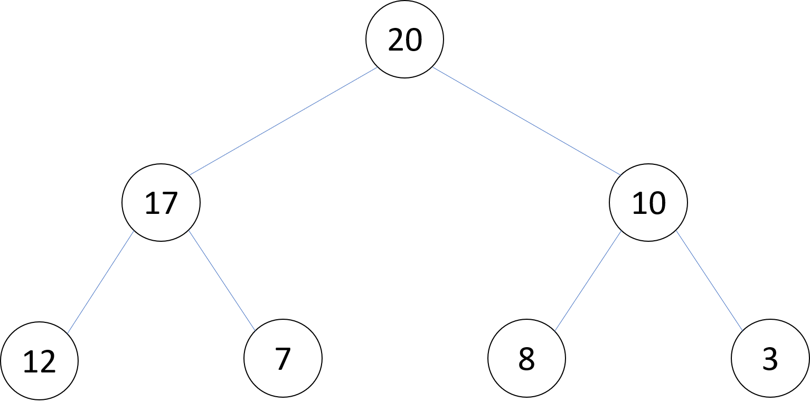
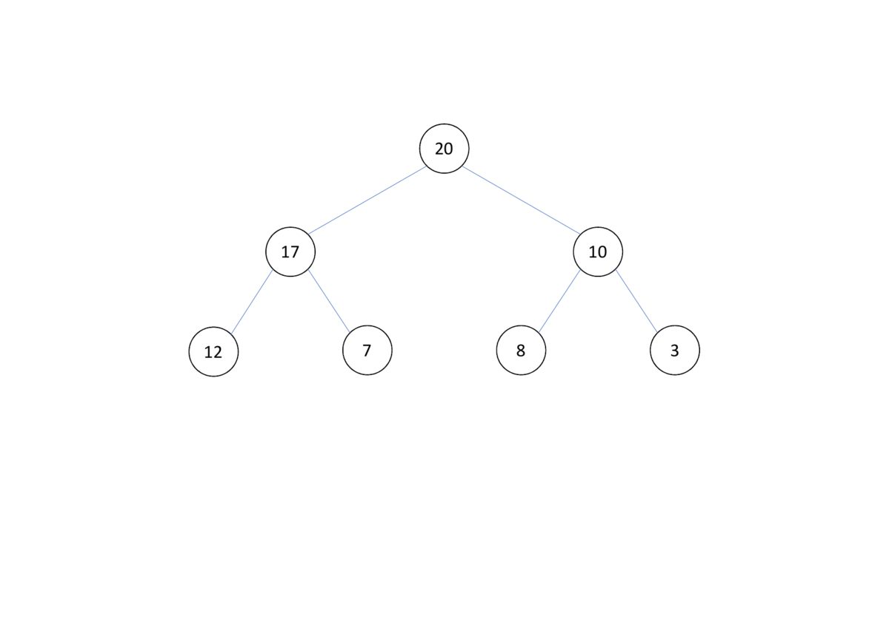
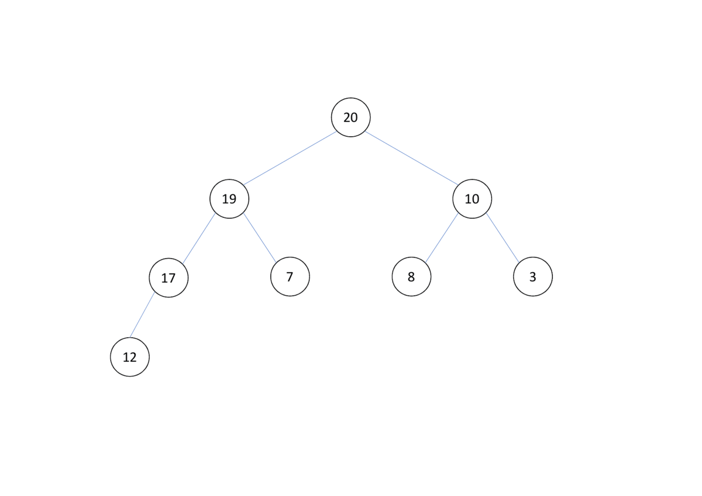

# 堆 (Heap)

簡介：在 $O(log N)$ 時間維護最大/最小值
總類：配對堆、二元堆、左偏樹、二項堆、費波那契堆

## 二元堆

- 每個節點最多有 2 個子節點
- 節點的值 > 左子樹每個節點的值
- 節點的值 > 右子樹每個節點的值
- 二元堆的左右子樹，也是二元堆
- 二元堆也是一顆 Complete Binary Tree

* * *



重要操作為插入和刪除，操作過程中要保持是一顆 Complete Binary Tree，下面說明以維護最大值的 Heap 來說明：

### 插入

1. 插在樹的最後面
2. 跟父節點比較，如果父節點的值 < 該節點的值就交換，以此類推

* * *



### 刪除

1. 刪除根節點後，把最後一個節點移到最上頭
2. 該節點和兩個子節點比較，兩節點其中值較大的那一個(我們稱為 $c_{larger}$)。如果該節點的值小於 $c_{larger}$ 的值，就交換兩節點的位置，以此類推

* * *



```cpp
--8<-- "docs/dataStructure/code/heap.cpp"
```

## STL

C++ 的 `priorty_queue` （優先隊列），是一種 Heap 的實作。

- 標頭檔： `<queue>` 
- 建構式： `priorty_queue <T> pq` 
- 建構式： `priorty_queue <T,Con,Cmp> pq` 
- 建構式： `priorty_queue <T,Con,Cmp> pq(iterator first, iterator seecond)` 插入 $[first,second)$ 內的東西
-  `pq.push(T a)` ：插入元素 $a$ ，複雜度 $O(\log size)$ 
-  `pq.pop()` ：刪除頂端元素，複雜度 $O(\log size)$ 
-  `pq.top()` ：回傳頂端元素，複雜度 $O(1)$ 
-  `pq.size()` ：回傳元素個數，複雜度 $O(1)$ 
-  `pq.empty()` ：回傳是否為空，複雜度 $O(1)$ 

```cpp
--8<-- "docs/dataStructure/code/pq.cpp"
```
