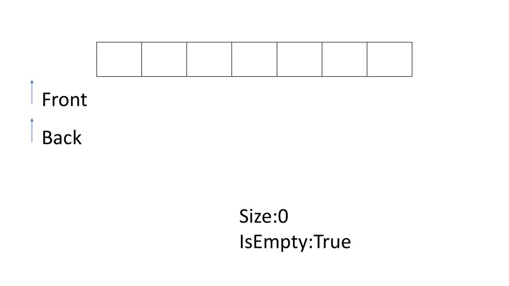

# 佇列 (Queue)

有兩個端口，一個負責插入，另一個端口負責刪除的資料結構



```cpp
--8<-- "docs/dataStructure/code/queue1.cpp"
```

## STL

- 標頭檔： `<queue>` 
- 建構式： `queue <T> q` 
-  `q.push(T a)` ：插入尾端元素，複雜度 $O(1)$ 
-  `q.pop()` ：刪除頂端元素，複雜度 $O(1)$ 
-  `q.front()` ：回傳頂端元素，複雜度 $O(1)$ 
-  `q.size()` ：回傳元素個數，複雜度 $O(1)$ 
-  `q.empty()` ：回傳是否為空，複雜度 $O(1)$ 

```cpp
--8<-- "docs/dataStructure/code/queue2.cpp"
```

## deque 雙向佇列

有兩個端口，皆負責刪除、插入的資料結構

- 標頭檔： `<deque>` 
- 建構式： `deque <T> dq` 
-  `dq.push_front(T a),dq.push_back(T a)` ：插入頂端/尾端元素，複雜度 $O(1)$ 
-  `dq.pop_front(),dq.pop_back()` ：刪除頂端/尾端元素，複雜度 $O(1)$ 
-  `dq.front(),dq.back()` ：回傳頂端/尾端元素，複雜度 $O(1)$ 
-  `dq.size()` ：回傳元素個數，複雜度 $O(1)$ 
-  `dq.empty()` ：回傳是否為空，複雜度 $O(1)$ 
