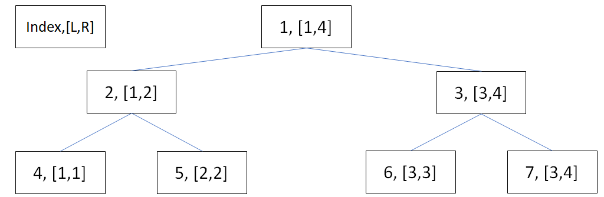
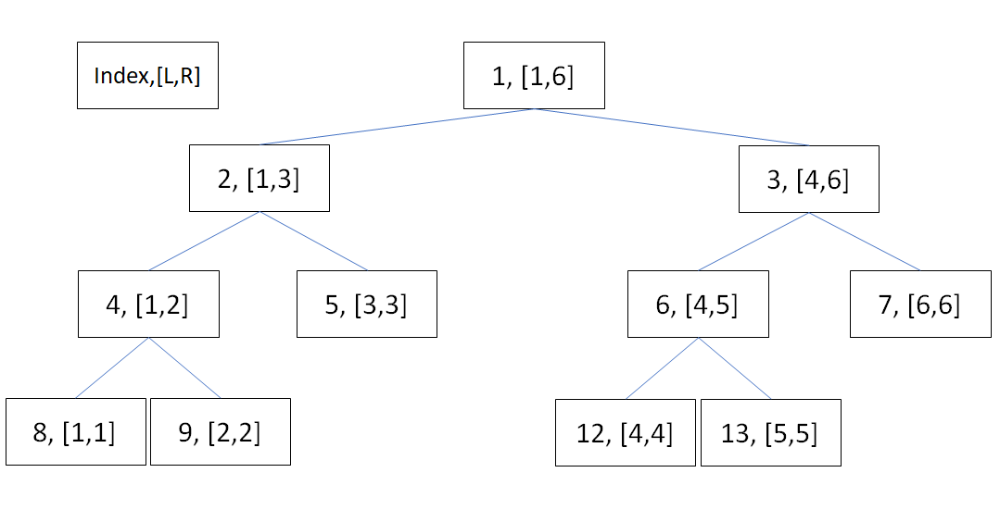
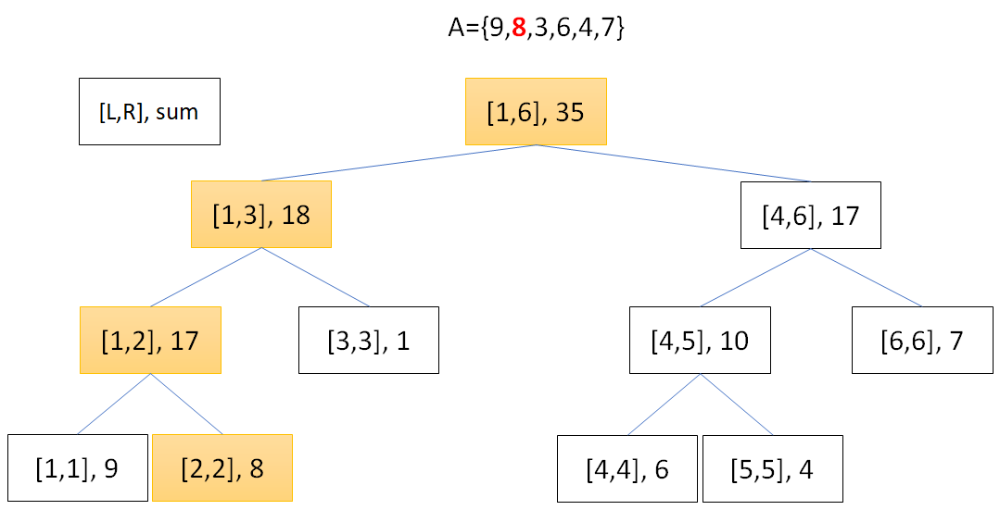
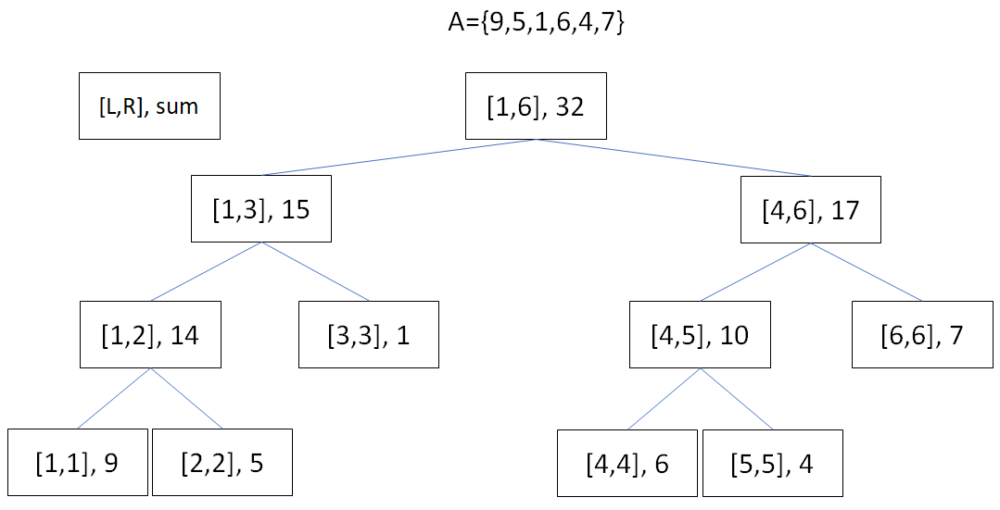
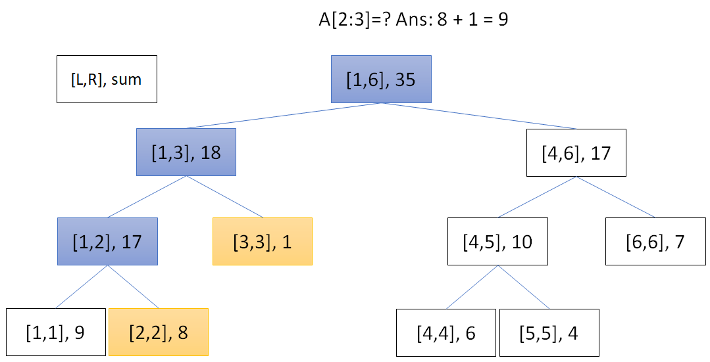
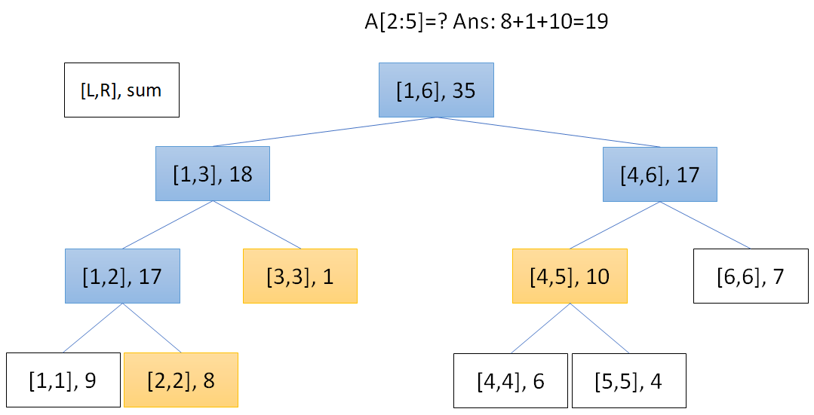
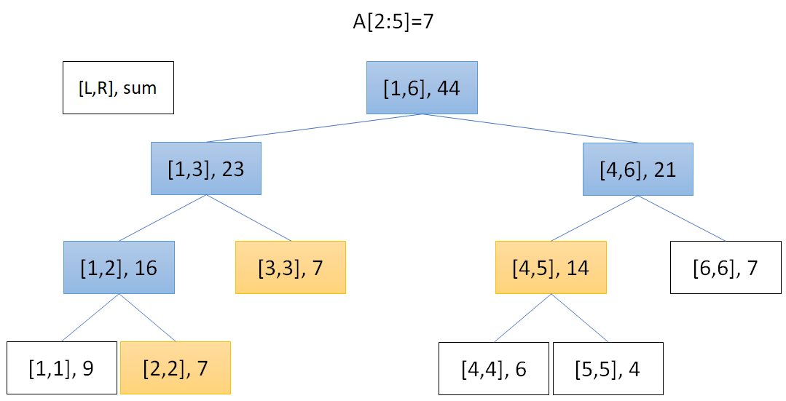
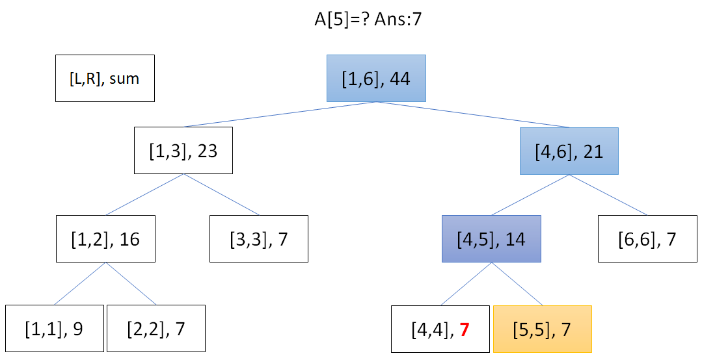

# 線段樹 (Segment Tree)

???+ Question "支援單點修改的區間和查詢"
    給定一個長度為 $N$ 的序列 $A$ 和 $Q$ 筆操作，有兩種操作：
    
    - `1 x v`：將 $A_x$ 改成 $v$。
    - `2 x y`：詢問 $[x,y]$ 之間的和。

線段樹是一種常用來於處理區間查詢及修改的題目，根節點紀錄 $[1,N]$ 之間的數據，令每個紀錄 $[L,R]$ 節點 $node_{L,R}$，令 $M=(L+R)/2$，左子節點為 $node_{L,M}$，右子節點為 $node_{M+1,R}$。

- 
- 

## 儲存

線段樹可以用和 Complete Binary Tree 一樣的方式儲存（雖然不完全是 Complete Binary Tree），一般來說會開大小為 $4n$ 的陣列避免編號超出陣列範圍。

除了陣列，指標也可用來實作線段樹，但指標實作較容易出錯，建議非必要不用指標實作。

```cpp
--8<-- "docs/dataStructure/code/segmentTree.cpp"
```

## 單點修改

假設要更新的位置為 $x$，那麼所有包含 $x$ 的節點就要更新。從起點開始，遍歷所有包含 $x$ 的節點，最深的節點為 $node_{x,x}$。$node_{x,x}$ 直接更新值，其他遍歷的節點 $N_{L,R}$ 則是根據 $node_{L,M}$ 和 $node_{M+1,R}$ 的值合併。

```cpp
--8<-- "docs/dataStructure/code/segmentTree1.cpp"
```

- 

每次往下一層節點區間長度會減半，最多往下 $log\ N$ 層，時間複雜度為 $O(log\ N)$。

???+ "初始化寫法"
    有一些人會寫一個 `build` 函式遍歷並更新所有節點，時間複雜度為 $O(N)$。

    ```cpp
    --8<-- "docs/dataStructure/code/segmentTree2.cpp"
    ```
    
    


    另一種方式是利用 $N$ 次單點修改初始化線段樹，時間複雜度為 $O(N\ log\ N)$。

    不論哪種寫法，都不會影響最終的時間複雜度。

## 區間查詢

???+ Question "支援區間修改的區間和查詢"
    給定一個長度為 $N$ 的序列 $A$ 和 $Q$ 筆操作，有兩種操作：
    
    - `1 x y v`：將 $A_x$ 到 $A_y$ 改成 $v$。
    - `2 x y`：詢問 $[x,y]$ 之間的和。

假設要查詢的範圍 $[L,R]$，要找出所有節點 $node_{x,y}$ 其中 $L\le x\le y\le R$。

- 
- 

```cpp
--8<-- "docs/dataStructure/code/segmentTree3.cpp"
```

符合的區間最多有 $log N$ 個，最多會拜訪 $4\ log\ N$ 個節點[^1]，時間複雜度 $O(log N)$。

## 區間修改

假設要修改的範圍 $[L,R]$，仿效區間查詢的思維，更新所有節點 $node_{x,y}$ 其中 $L\le x\le y\le R$，並在該節點上新增一個懶人標記，當要拜訪 $node_{x,y}$ 的子節點時，會將懶人標記傳遞給 $node_{x,y}$ 的子節點。

- 
- 

```cpp
--8<-- "docs/dataStructure/code/segmentTree4.cpp"
```

時間複雜度 $O(log N)$，原因和區間查詢相同。

## 應用

可用來查詢區間總和或極值，支援區間修改，不支援區間刪除、翻轉。

## 例題練習

???+ Question "Codeforces 747F - Igor and Interesting Numbers"
    給定一個長度為 $N$ 的數列 $A$，給定 $Q$ 筆詢問 $[L,R]$ 之間有幾個數不能整除該區間至少一個數。

能整除所有的數，只有該區間最大公因數，利用線段樹維護區間 GCD，查詢時計算 $[L,R]$ 之間有幾個數字 $=$ 該區間的 GCD。

[^1]: [Implementation - Competitive Programming Algorithms](https://cp-algorithms.com/data_structures/segment_tree.html)