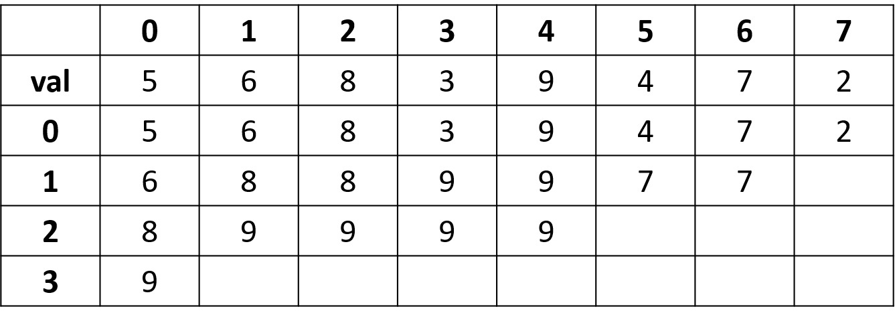

# Sparse Table

???+ Question "區間和查詢"
    給定一個長度為 $N$ 的序列 $A$ 和 $Q$ 筆查詢：
    
    - `x y`：詢問 $[x,y]$ 之間的最大值。

Sparse Table 適合用於查詢區間訊息，但不帶任何修改操作的問題。Sparse Table 需要 $O(Nlog\ N)$ 的空間。

## 建表

利用倍增法的概念建表。

- 狀態：$sp[i][j]$ 記錄第 $[j,j+2^i)$ 之間的答案。
- 轉移：$sp[i][j]=f(sp[i-1][j],sp[i-1][j+(1<<(i-1))])$
- $f$ 的作用和題目有關，例如上敘問題求區間最大值，那麼 $f(a,b)=max(a,b)$。



```cpp
--8<-- "docs/dataStructure/code/spareTable1.cpp"
```

總共有 $N\log N$ 個狀態，每個狀態會花 $O(1)$ 時間轉移，整題時間複雜度為 $O(N\log N)$。

## 查詢

假設要查詢的區間 $[L,R]$，現在要適合的兩個長度為 $2^x$ 的區間剛好覆蓋住 $[L,R]$，兩個區間可能重疊，但不能超出 $[L,R]$ 之外。$x$ 會是 $\left\lfloor\log_2(R-L+1)\right\rfloor.$，這兩個區間的起點會是 $L$ 和 $R-2^x+1$。

```cpp
--8<-- "docs/dataStructure/code/spareTable2.cpp"
```

查詢時間複雜度是 $O(1)$，$2^x$ 和 $log_2\ x$ 可以先預處理。

## 應用

可用來查詢區間極值，但不能修改（同個元素會包含在許多區間）。

[^1]: [Sparse Table - WiwiHo 的競程筆記](https://cp.wiwiho.me/sparse-table/)