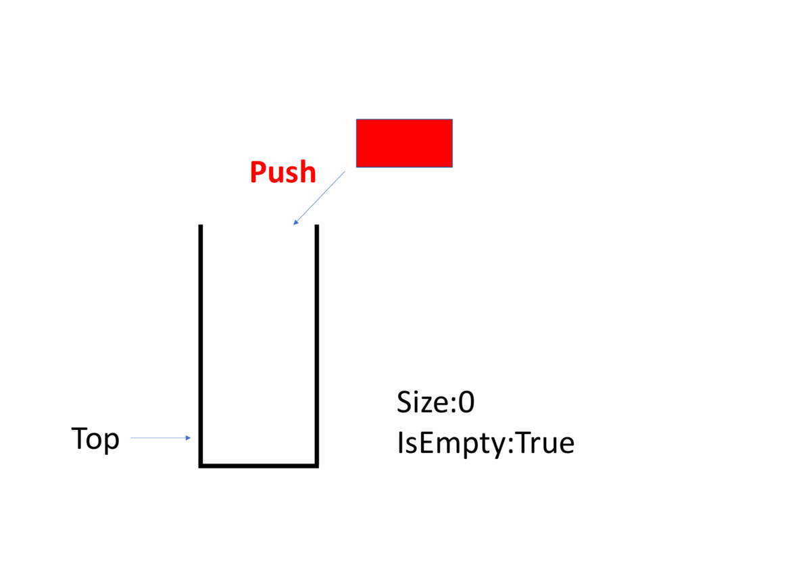

# stack 堆疊

- 

有兩個端口，其中一個封閉，另一個端口負責插入、刪除的資料結構

```cpp
struct stack {
  int st[N], top;
  Stack() : top(0) {}
  int size() { return top; }
  void push(int x) { st[++top] = x; }
  int top() { assert(top > 0) return st[top]; }
  void pop() {
    if (top)
      --top;
  }
}
```

- 標頭檔： `<stack>` 
- 建構式： `stack <T> s` 
-  `s.push(T a)` ：插入頂端元素，複雜度 $O(1)$ 
-  `s.pop()` ：刪除頂端元素，複雜度 $O(1)$ 
-  `s.top()` ：回傳頂端元素，複雜度 $O(1)$ 
-  `s.size()` ：回傳元素個數，複雜度 $O(1)$ 
-  `s.empty()` ：回傳是否為空，複雜度 $O(1)$ 

```cpp
#include <iostream>
#include <stack>
using namespace std;

int main() {
  stack<int> st;
  st.push(1);
  cout << st.top() << '\n'; // 1
  st.push(2);
  cout << st.top() << '\n'; // 2
  st.push(3);
  cout << st.top() << '\n'; // 3
  st.pop();
  cout << st.top() << '\n'; // 2
}
```
