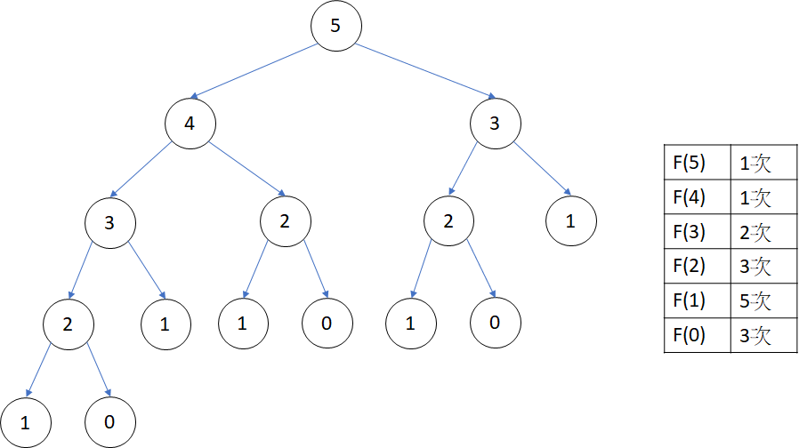
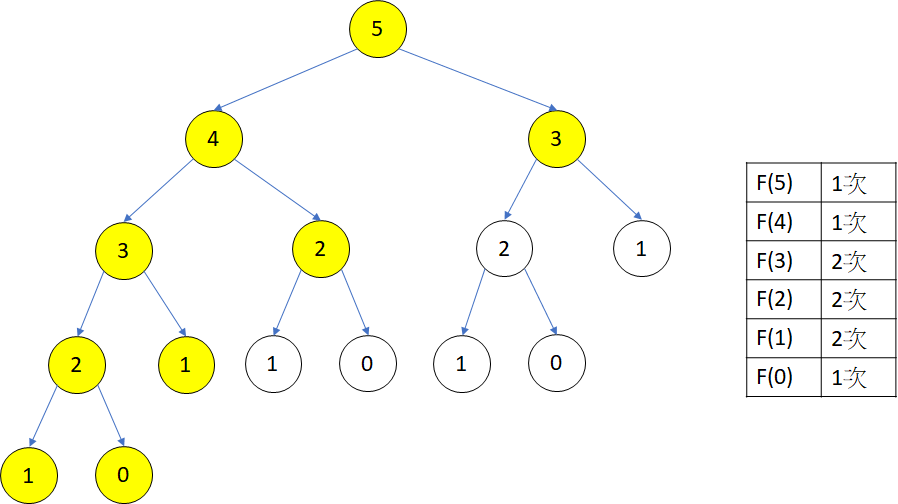

# 基礎題目

## 費式數列

???+ Question  "費式數列"
    費式數列的定義： $f(n)=f(n-1)+f(n-2),f(0)=0,f(1)=1$ 。
    給定 $i$ ，請求出 $f(i)$ 。

狀態轉移式如下：

- 狀態： $f(n)$ 代表費式數列第 $n$ 項。
- 初始狀態： $f(n)=n\ where\ n\leq 1$ 。
- 轉移： $f(n)=f(n-1)+f(n-2)$ 。

下列展示四種計算費式數列的版本：

### 遞迴（未搭配陣列）

```cpp
--8<-- "docs/dynamicProgramming/code/fib1.cpp"
```

這種版本的時間複雜度 $O(n)=f(n)$ ，和費式數列成長速度相同，時間效率非常低。



### 遞迴（搭配陣列）

這種版本建立上個版本的基礎，增加了陣列紀錄已計算出的答案。

```cpp
--8<-- "docs/dynamicProgramming/code/fib2.cpp"
```

一開始將每個 $dp$ 設為 $-1$ ，代表該狀態未被計算。

???+ Tip "技巧：表示未計算狀態"

    將陣列的數值初始化一個不可能成為答案的數字 (例如：$-1,0$)，代表該狀態未被計算。

時間複雜度為 $O(N)$ 。

??? Note "時間複雜度證明"
    這種版本的時間複雜度我們用以下程式碼解釋：

    ```cpp
    --8<-- "docs/dynamicProgramming/code/fib3.cpp"
    ```

    當呼叫 $f(n)$，每個 $f(i), 0\leq i\leq n$，至多會被呼叫兩次，第一次 $f(i)$ 被 $f(i+1)$ 呼叫，這時 $f(i)$ 還沒被計算，因此會繼續遞迴求值；第二次 $f(i)$ 被 $f(i+2)$ 呼叫，這時 $f(i)$ 已被計算，直接回傳結果。每個 $f(i)$ 最多呼叫兩次，時間複雜度為 $O(n)$。
    
    

### 迴圈（往前看）

當前狀態是從那些狀態得到。

```cpp
--8<-- "docs/dynamicProgramming/code/fib4.cpp"
```

### 迴圈（往後看）

當前狀態會影響那些狀態。

```cpp
--8<-- "docs/dynamicProgramming/code/fib5.cpp"
```

???+ Tip "DP 實作辦法"

    - 遞迴
    - 迴圈 (向前看)
    - 迴圈 (向後看)

除了費式數列，任何數列可以寫成 $f(i)=a_1f(i-1)+a_2f(i-2)+...+a_nf(i-n)+k$ 的形式，皆可利用 DP 來解出。

## 帕斯卡三角形 (Pascal's triangle)

???+ Question
    帕斯卡三角形的第 $m$ 層第 $n$ 項 $=C_n^m$ ，給定 $i,j$ ，請求出帕斯卡三角形的第 $i$ 層第 $j$ 項。

帕斯卡三角形有以下性質： $C^n_k=C_k^{n-1}+C_{k-1}^{n-1}$ ，根據性質設計出狀態轉移式：

- 狀態： $f(i,j)$ 代表帕斯卡三角形的第 $i$ 層第 $j$ 項。
- 初始狀態： $f(i,j)=1, if\ j==0\ or\ j==i$ 。
- 轉移： $f(i,j)=f(i-1,j)+f(i-1,j-1)$ 。

```cpp
--8<-- "docs/dynamicProgramming/code/pascal.cpp"
```

##  [AtCoder Educational DP Contest A - Frog 1](https://atcoder.jp/contests/dp/tasks/dp_a) 

???+ Question "Frog"
    有隻青蛙要從第 $1$ 塊石頭跳到第 $N$ 塊石頭，每塊石頭都有高度 $h_i$ ，每一次可以從第 $i$ 塊跳到第 $i+1$ 塊，成本為兩塊石頭的高低差，求最小成本。

狀態轉移式如下：

- 狀態： $f(n)$ 代表從第 $1$ 塊石頭跳到第 $n$ 塊石頭的最小成本。
- 初始狀態： $f(0)=0$ 。
- 轉移： $f(n)=min(abs(h_{n}-h_{n-1})+f(i-1),abs(h_{n}-h_{n-2})+f(i-2))$ 。

??? "參考程式碼"
    作者： [allem40306](https://github.com/allem40306) 

    ```cpp
    --8<-- "docs/dynamicProgramming/code/atDpA.cpp"
    ```

???+ Tip "技巧：$dp[i]=1\to i$ (前綴狀態)"

    一維 DP 常用狀態，經典的例子為前綴和。

## 最大連續區間和

???+ Question "最大連續區間和"
    給定一個長度為 $N$ 的序列 $A$ ，求出一組 $i,j(i\leq j)$ ，使得 $\sum_{x=i}^{j}A[x]$ 最大。

### 方法 1：枚舉 $i,j$ 

為了能快速第 $i$ 項到第 $j$ 項的和，這裡利用前綴和加速計算。

```cpp
--8<-- "docs/dynamicProgramming/code/maximumIntervalSum1.cpp"
```

### 方法 2

- 狀態： $f(i)$ 代表前 $i$ 項的最大連續區間和。
- 初始狀態： $f(1)=A[1]$ 。
- 轉移： $f(n)=max(0,f(n-1))+A[i]$ 。

```cpp
--8<-- "docs/dynamicProgramming/code/maximumIntervalSum2a.cpp"
```

只有 $dp[i-1]$ 的資訊會被用到，又 $dp[i-1]$ 可被 $dp[i]$ 覆蓋，故可只用一個變數紀錄，（滾動陣列技巧）。

```cpp
--8<-- "docs/dynamicProgramming/code/maximumIntervalSum2b.cpp"
```

### 方法 3

- 狀態： $f(i)$ 代表前 $i$ 項的最小的前綴和。
- 初始狀態： $f(1)=A[1]$ 。
- 轉移： $f(n)=min(sum[i],f(n-1))$ 。

答案為 $max_{i=1}^{n}(sum[i]-f(i-1))$ （結尾為第 $i$ 項的最大連續區間和）。

```cpp
--8<-- "docs/dynamicProgramming/code/maximumIntervalSum3.cpp"
```

### 加上長度限制

???+ Question "最大連續區間和 2"
    給定一個長度為 $N$ 的序列 $A$ ，求出一組 $i,j(i\leq j,j-i<L)$ ，使得 $\sum_{x=i}^{j}A[x]$ 最大。

一樣先計算出前綴和，對於每個 $sum[i]$ ，找出 $min_{max(0,i-L)\le j< i}sum[j]$ ，直接枚舉的時間複雜度 $O(N^2)$ 。

觀察以下性質：假設 $i<j$ 且 $sum[i]>sum[j]$ ，當遍歷到 $j$ ， $sum[i]$ 這項資料因為位置和本身數值兩項因素，不可能比 $sum[j]$ 還要好，因此不再需要考慮 $sum[i]$ 是否為解。

根據以上觀察，可以用資料結構（deque）維護可能解，當遇到以下情況， $sum[x]$ 再也不能成為最佳解。

- 長度超過 $L$ 
- 右邊出現一個更好的解


每個解最多被插入和刪除一次，時間複雜度 $O(N)$ 。

```cpp
--8<-- "docs/dynamicProgramming/code/maximumIntervalSum4.cpp"
```

???+ Tip "技巧：單調對列優化"

    利用題目中的「單調性」，利用資料結構維護可能的解，通常可以讓時間複雜度降低 $1$ 個維度 (e.g. $O(N^2)\to O(N)$)。

## 最大矩形面積

???+ Question "最大矩形面積"
    給定 $N$ 條相連的長條圖，求圖內最大長方形面積。


對於每個高度 $H[i]$ ，計算左右邊界 $L[i],R[i]$ ，面積 $A[i]=H[i]\times(R[i]-L[i]+1)$ 

-  $L[i]=max\{j|j<i\ and\ H[j]<H[i]\}+1$ 
-  $R[i]=min\{j|j>i\ and\ H[j]<H[i]\}-1$ 

用迴圈枚舉找到答案，時間複雜度 $O(N^2)$ ，用上文提到的單調隊列優化，時間複雜度 $O(N)$ 。

計算 $L$ 為例，對於每個位置 $i$ ，和堆疊 $st$ ，從右到左遍歷元素：

- 如果 $st$ 為空， $st.push(i)$ 
- 如果 $H[st.top()]<=H[i]$ ， $st.push(i)$ 
- 如果 $H[st.top()]>H[i]$ ， $L[st.top()]=i+1$ 、 $st.pop()$ 

遍歷所有元素後，如果 $st$ 還有元素，對於每個元素 $x$ ， $L[x]=0$ 


```cpp
--8<-- "docs/dynamicProgramming/code/maximumIntervalSum5.cpp"
```

### 延伸題目

???+ Question "最大矩形面積 2"
    給定 $N\times M$ 的格子 $A$ ，每格格子只有數字 $0$ 或 $1$ ，請求出只包含 $1$ 的最大矩形。
    
        0 0 0 0 0
        0 1 0 0 1
        1 1 1 0 1
        1 1 1 1 1
        0 0 0 0 0

我們先算出以下狀態轉移式：

- 狀態： $S[i][j]$ 代表由 $A[i][j]$ 往上連續有幾個 $1$ 
- 初始狀態： $S[i][j]=A[i][j],if\ i=0$ 
-   轉移：
    $$
    dp[i][j]=
    \begin{cases}
    dp[i-1][j]+1 & A[i][j]=1\\
    0 & \text{else}
    \end{cases}
    $$

以題目範例為例子， $S[i][j]$ 為：

    0 0 0 0 0
    0 1 0 0 1
    1 2 1 0 2
    2 3 2 1 3
    0 0 0 0 0

如果單求矩形底部落在某一條水平線上的最大矩形面積，可利用上文提過的單調隊列優化求得；對每一條水平線求一次最大矩形面積，再取最大值，就會是本題答案。

## 例題練習

-   數列
    -  [UVa 00900 - Brick Wall Patterns](http://uva.onlinejudge.org/external/9/900.pdf) 
    -  [Zerojudge d212 - 東東爬階梯](https://zerojudge.tw/ShowProblem?problemid=d212) 
-   機器人往右下走問題
    -  [UVa 00825 - Walking on the Safe Side](http://uva.onlinejudge.org/external/8/825.pdf) 
-   DAG DP
    -  [UVA 10000 - Longest Paths](http://uva.onlinejudge.org/external/100/10000.pdf) 
-  [AtCoder Educational DP Contest B - Frog 2](https://atcoder.jp/contests/dp/tasks/dp_b) 
-  [AtCoder Educational DP Contest C - Vacation](https://atcoder.jp/contests/dp/tasks/dp_c) 
