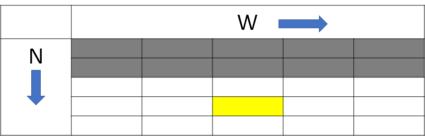
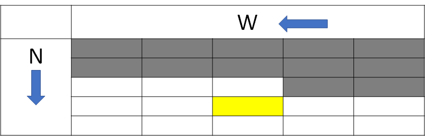

# 背包 DP (Knapsack DP)

## 0-1 背包問題

???+ Question "0-1 背包問題"

    給定 $N$ 個物品的重量 $w_i$ 和價值 $v_i$，和一個容量為 $W$ 的背包。選取若干件物品放入背包，在不超過背包容量的情況下，背包內物品價值總和最大為何?

每種物品有兩個狀態不放與放，可對應二進位的 $0$ 和 $1$ ，故稱為「0-1 背包問題」。

題目有三項資料，物品個數、物品重量、物品價值，利用這些資料設計出狀態式：

- 狀態： $f(i,j)$ 代表前 $i$ 樣物品在重量總和 $\leq j$ 的情況下，物品價值總和最大值。
- 初始狀態： $f(i,j)=0,\ if\ i = 0$ 。

當算好 $i-1$ 個物品的狀態，對於第 $i$ 個物品有兩種選擇

- 不放：重量和價值不變 $\to$  $f(i,j)=f(i-1,j)$ 。
- 放：重量 $+w_i$ ，價值 $+v_i$  $\to f(i,j)=f(i-1,j-w_i)+v_i$ 。

轉移式就由上面兩種選擇歸納出：

-  $f(i,j)=max(f(i-1,j),f(i-1,j-w_i)+v_i)$ 。

以下為利用二維陣列儲存答案的範例：

```cpp
int dp[MXN + 1][MXW + 1];
memset(dp, 0, sizeof(dp));
for (int i = 1; i <= MXN; ++i) {
  for (int j = 0; j < w[i]; ++j) {
    dp[i][j] = dp[i - 1][j];
  }
  for (int j = w[i]; j <= MXW; ++j) {
    dp[i][j] = max(dp[i - 1][j − w[i]] + v[i], dp[i - 1][j]);
  }
}

cout << dp[MXN][MXW] << '\n';
```

### 滾動陣列

空間複雜度 $O(NW)$ ，採用「滾動陣列」，可以降低空間複雜度



由上圖可得知，當在計算 $f(i,j)$ 時，只會用到上一列的資料，因此我們的需要陣列大小降到 $2\times W$ 。

```cpp
int dp[2][MXW + 1];
memset(dp, 0, sizeof(dp));
for (int i = 0; i < N; ++i) {
  for (int j = 0; j < w[i]; ++j) {
    dp[i & 1][j] = dp[(i & 1) ^ 1][j];
  }
  for (int j = w[i]; j <= MXW; ++j) {
    dp[i & 1][j] = max(dp[(i & 1) ^ 1][j − w[i]] + v[i], dp[(i & 1) ^ 1][j]);
  }
}
```

再來，如果我們將 $f(i,j)$ 當中的 $j$ 由大到小計算。



會發現計算 $f(i,j)$ 時， $f(i-1,j),f(i-1,j+1),f(i-1,j+2),...,f(i-1,C)$ 也不會用到，可以將 $f(i,j),f(i,j+1),f(i,j+2),...,f(i,W)$ 覆蓋到 $f(i-1,j),f(i-1,j+1),f(i-1,j+2),...,f(i-1,W)$ 上面。我們可以再次縮小陣列，變成大小為 $W$ 的一維陣列。

```cpp
int dp[MXW + 1];
memset(dp, 0, sizeof(dp));
for (int i = 0; i < N; ++i) {
  for (int j = MXW; j >= w[i]; --j) {
    dp[j] = max(dp[j − w[i]] + v[i], dp[j]);
  }
}
```

???+ Tip "滾動陣列"
    覆蓋不會用到的資訊，降低記憶體使用量。

0-1 背包問題時間複雜度 $O(NW)$ ，空間複雜度 $O(N)$ 。

### 背包問題另一種狀態式

-  [AtCoder Educational DP Contest E - Knapsack 2](https://atcoder.jp/contests/dp/tasks/dp_e) 

這題的 $W$ 範圍在 $[1,10^9]$ ，用上述的狀態式肯定 `TLE` ，因此我們將狀態式改成：

- 狀態： $f(i,j)$ 代表前 $i$ 樣物品在價值總和為 $j$ 的情況下，重量總和最小值。
- 初始狀態： $f(i,0)=0,\ where\ 0\leq 1< n,else\ f(i,j)=\infty$ 。

轉移式改成：

-  $f(i,j)=min(f(i-1,j),f(i-1,j-v_i)+w_i)$ 

最後找出：

-  $max\{i|f(n,i)\leq w\}$ 

???+ Tip "技巧：表示(負)無限大"

    (負)無限大只要設成一個比最大(小)答案還要大(小)的值就行了。

## 無限背包問題

???+ Question "無限背包問題"

    給定 $n$ 種物品的重量 $w_i$ 和價值 $v_i$，和一個容量為 $W$ 的背包。每種物品可選取任意個放入背包，在不超過背包容量的情況下，背包內物品價值總和最大為何?

無限背包問題和 0-1 背包問題差異在於無限背包的物品可以選無限多個。

無限背包問題和 0-1 背包問題的狀態式相同，以下為轉移式：

-  $f(i,j)=max(f(i-1,j-k\times w_i)+ k\times v_i), \forall k\times w_i\leq j$ 

可以簡化成：

-  $f(i,j)=max(f(i-1,j),f(i-1,j-w_i)+v_i,f(i,j-w_i)+v_i)$ 。
-  $f(i,j)=max(f(i-1,j),max(f(i-1,j-w_i),f(i,j-w_i)+)v_i)$ 。

為什麼可以這樣優化？是因為當 $f(i,j)$ 當中的 $j$ 由小到大計算時， $f(i,j-w_i)$ 已被 $f(i,j-2\times w_i)$ 更新過，那麼 $f(i,j-w_i)$ 就是選擇第 $i$ 種物品數次的最佳結果。

> 換言之，我們通過局部最優子結構的性質重複使用了之前的枚舉過程，優化了枚舉的複雜度。(from [背包 DP - OI Wiki](https://oi-wiki.org/dp/knapsack/) )

下面為範例程式碼，一樣有用到滾動陣列的技巧：

```cpp
int dp[MXW + 1];
memset(dp, 0, sizeof(dp));
for (int i = 0; i < N; ++i) {
  for (int j = w[i]; j <= MXW; ++j) {
    dp[j] = max(dp[j − w[i]] + v[i], dp[j]);
  }
}
```

無限背包問題時間複雜度 $O(NW)$ ，空間複雜度 $O(W)$ 。

## 例題練習

-   0-1 背包問題
    -  [UVa 10664 - Luggage](http://uva.onlinejudge.org/external/106/10664.pdf) 
    -  [UVa 10130 - SuperSale](http://uva.onlinejudge.org/external/101/10130.pdf) 
    -  [AtCoder Educational DP Contest D - Knapsack 1](https://atcoder.jp/contests/dp/tasks/dp_d) 
-   無限背包問題
    -  [UVa 10465 - Homer Simpson](http://uva.onlinejudge.org/external/104/10465.pdf) 
    -  [UVa 00825 - Coin Change](http://uva.onlinejudge.org/external/8/825.pdf) 
    -  [UVa 00357 - Let Me Count The Ways](http://uva.onlinejudge.org/external/3/357.pdf) 
