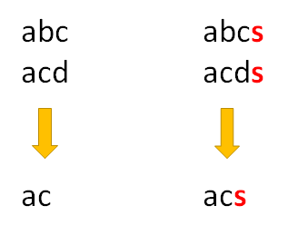

# LCS 和 LIS

???+ "子序列"
    子序列是指一個序列去除任意個(包含 $0$)元素後所形成的新序列。
    例如：$A,AB,AC,ABC$ 都是 $ABC$ 的子序列，但 $CA,CAB$ 不是

## 最長共同子序列 (Longest Common Subsequence)

???+ Question "最長共同子序列"
    給定兩序列 $A,B$ ，求最長的序列 $C$ ， $C$ 同時為 $A,B$ 的子序列。

- 狀態： $f(i,j)$ 表示使用 $a[1:i]$ 和 $b[1:j]$ 的 LCS 長度。
- 初始狀態： $f(i,0)=f(0,i)=0$ when $i\geq 0$ 
-   轉移：
    $$
    f(i,j)=
    \begin{cases}
    dp[i-1][j-1]+1 & a[i]=b[j]\\
    max(dp[i-1][j],f(i)[j-1]) & \text{else}
    \end{cases}
    $$
    - $a[i]=b[j]$ 代表可以從 $a[1:i]$ 和 $b[1:j]$ 所形成的 LCS，再加上 $a[i]$ 成為新的 LCS。
    - 

求出 LCS 的時間、空間複雜度都是 $O(N^2)$ ，使用滾動陣列技巧，可將空間複雜度降至 $O(N)$ 。

## 最長遞增子序列 (Longest Increasing Subsequence)

???+ Question "最長遞增子序列"
    給你一個序列 $A$ ，求最長的序列 $B$ ， $B$ 是一個（非）嚴格遞增序列，且為 $A$ 的子序列。

- 狀態： $f(i)$ ：第 $1$ 到 $i$ 個數字所形成最長遞增子序列的長度
- 轉移： $f(i)=max\{f(j)|\forall j<i\ and\ A[j]<A[i]\}+1$ 
- 初始化： $f(0)=0$ 

求出 LIS 的時間複雜度 $O(N^2)$ ，空間複雜度 $O(N)$ 

## LCS 和 LIS 題目轉換

-   LIS 轉成 LCS
    -  $A$ 為原序列， $B=sort(A)$ 
    - 對 $A,B$ 做 LCS
-   LCS 轉成 LIS
    -  $A,B$ 為原本的兩序列
    - 最 $A$ 序列作編號轉換，將轉換規則套用在 $B$ 
    - 對 $B$ 做 LIS
    - 重複的數字在編號轉換時後要變成不同的數字，越早出現的數字要越小
    - 如果有數字在 $B$ 裡面而不在 $A$ 裡面，直接忽略這個數字不做轉換即可

## LIS 的時間複雜度優化

LIS 還有另一種狀態轉移式：

- 狀態： $f(n,i)$ 表示使用前 $n$ 個數字湊出長度 $i$ 的 LIS, 末端數字最小為何。
-   轉移：
    $$
    f(n,i)=
    \begin{cases}
    min(f(n-1,i),a[n]) & a[n]>f(n-1,i-1)\\
    f(n-1,i) & \text{else}
    \end{cases}
    $$
- 初始狀態： $f(0,0) = -INF, f(0,i) = INF, f(i,0)=don't\ care$ when $i \geq 1$


這樣的狀態轉移式時間和空間複雜度依舊是 $O(N^2)$ ，不過，有幾點值得觀察：

令 $g[i]=f(x,i)$ , where $1\leq x \leq N$ ，忽略 $\infty$ ， $g$ 為一個嚴格遞增序列，當 $x$ 每次 $+1$ ， $g$ 每次都有一個數字改變，改變的數字皆為 $a[i]$ ，被改的數字為 $lower\_bound(a[i])$ 。

根據上述性質，可用二分搜更新 $g$ ，藉此找到 LIS 的長度。每次二分搜的時間複雜度為 $O(\log N)$ ，整體時間複雜度為 $O(N\log N)$ 。

```cpp
--8<-- "docs/dynamicProgramming/code/lis.cpp"
```

## 相關題目

???+ Question "UVa 10534 - Wavio Sequence"
    給定一個序列 $A$，要求一個最腸子序列，長度為 $2n+1$，前 $n$ 個數字遞增，後 $n$ 個數字遞減。

從左到右和從右到左做兩次 LIS 得到 $dp1,dp2$，接著枚舉所有點為中心，以第 $i$ 個點為中心的最長子序列長度為 $2\times min(dp1[i],dp2[i])-1$。

## 例題練習

-  [UVa 10405 - Longest Common Subsequence](http://uva.onlinejudge.org/external/104/10405.pdf) 
-  [UVa 00481 - What Goes Up](http://uva.onlinejudge.org/external/4/481.pdf) 
