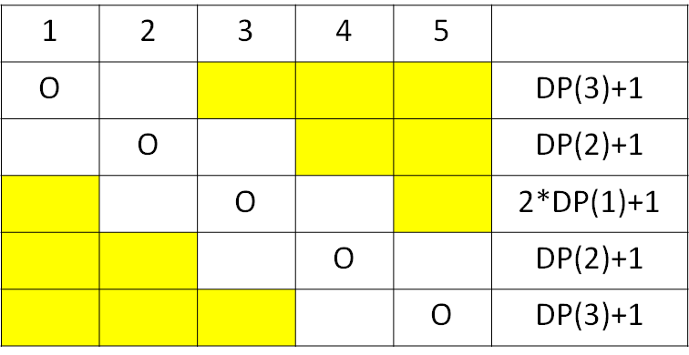

# 機率 DP

跟機率有關的 DP，包含機率和期望值。

## 計算機率

???+ Question "AtCoder Educational DP Contest I. Coins"
    有 $N$ 枚硬幣，$N$ 是奇數。第 $i$ 枚丟的時候正⾯機率是 $p_i$，反⾯機率是 $1-p_i$。現在想要⼀次丟這 $N$ 個硬幣，問有多少機率正⾯的硬幣個數比反⾯的個數還要更多。

- 狀態：$f(i,j,k)$ 代表前 $i$ 枚硬幣，$j$ 枚正面硬幣，$k$ 枚反面硬幣的機率。
    - $k=i-j$，最後一個維度可以去除。
- 轉移
    - $f(i+1,j+1)+=f(i,j)\times p_i$
    - $f(i+1,j)+=f(i,j)\times (1.0-p_i)$
- 答案：$\sum\limits_{i=n/2+1}^{n}f(n,i)$

## 計算期望值

???+ Question "落谷 P1291 - 百事世界盃之旅"
    每瓶飲料上有 $1$ 名球星的名字，每位球星出線機率相同，平均需要幾瓶飲料才能收集完所有 $N$ 位球星的名字。

- 狀態：$f(i)=$ 已收集 $i$ 位球星的期望值。
- 轉移：$f(i)=\frac{n-i}{n}f(i-1)+\frac{i}{n}f(i)+1$
    - 買到新的球星：$\frac{n-i}{n}f(i-1)$
    - 買到重複的球星：$\frac{i}{n}f(i)$

???+ Question "UVa 12730 - Skyrk's Bar"
    紳士們上小便的時候，彼此之間會隔著 $K$ 個小便斗 (空著人的小便斗)，請問當有 $N$ 個一排的小便斗，請問壅塞個數的期望值為何 (一次平均可以多少人上小便)。[^1]

- 狀態：$f(i)$：$i$ 個小便斗壅塞個數的期望值。
- 初始狀態：$f(i)=1\ if\ i\le K$
- 轉移：$f(i)=2(\sum\limits_{j=1}^{i-k-1}f(j))/i+1$。

枚舉最後一個人進入的位置 $x$，期望值為 $1+f(p-K-1)+f(i-(p+K))$。

將所有可能狀況加總，可得轉移式 $f(i)=2(\sum\limits_{j=1}^{i-k-1}f(j))/i+1$。

當 $i\le K$ 時，同時只能有 $1$ 個小便斗使用，這時 $f(i)=1$。

???+ Question "UVa 10529 - Dumb Bones"
    要擺放骨牌，放一張骨牌左倒機率為 $P_L$，右倒機率為 $P_R$，問放 $N$ 張連續骨牌的期望次數最小為何?

設 $dp[i]$ 為放 $i$ 張連續骨牌的最小期望次數，枚舉最後一張放骨牌的位置 $x$，試 $1$ 次的期望值為 $((1-P_L)*f(x-1)+(1-P_R)*f(i-x))/(1-P_L-P_R)$，$1/(1-P_L-P_R)$ 為平均要嘗試的次數。

???+ Question "AtCoder Educational DP Contest J. Sushi"
    有 $N$ 個盤子，每個盤子中有 $0$ 到 $3$ 個壽司，每次隨機選一盤吃到一個壽司，如果沒壽司就不吃，問把所有壽司吃完花費次數的期望值是多少?

- 狀態：$f(i,j,k)=$ 壽司數量為 $1,2,3$ 的盤子數時，所需次數的期望值。

一種狀態定義為 $f(p_1,p_2,...,p_N)$，但狀態數太多且不固定在這裡不考慮，在這裡定義 $f(h,i,j,k)$ 為壽司數量為 $0,1,2,3$ 的盤子數時，所需次數的期望值，又 $N=h+i+j+k$，可以去除一個狀態。

- 轉移：$f(i,j,k)=\frac{N-i-j-k}{N}f(i,j,k)+\frac{i}{N}f(i-1,j,k)+\frac{j}{N}f(i+1,j-1,k)+\frac{k}{N}f(i,j+1,k-1)+1$。

把轉移式移項變成 $\frac{i+j+k}{N}f(i,j,k)=\frac{i}{N}f(i-1,j,k)+\frac{j}{N}f(i+1,j-1,k)+\frac{k}{N}f(i,j+1,k-1)+1$，算完右式後再除以 $\frac{i+j+k}{N}$ 即為所求。

[^1]:[UVa 12730 in Morris' Blog](https://morris821028.github.io/2014/08/30/oj/uva/uva-12730/)