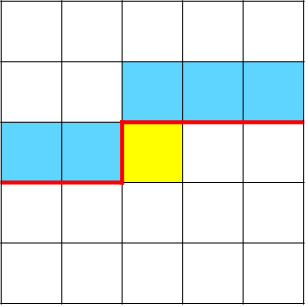
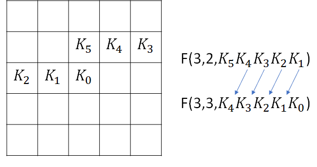

# 狀態壓縮 DP

遇到多個狀態($\ge 5$)的題目，如果依然用多維陣列，在除錯方面會有困難，為了避免在除錯花費大量時間和適當減少程式碼長度，可以將每個狀態用編號來表示。

???+ Question "UVa 10898 - Combo Deal"
    給定每種單點和套餐的價錢，現在問每種食物分別買 $x_1,x_2,...$ 份最少需要多少錢。
    
最多種有 $6$ 種食物，每種最多需要 $9$ 份，可利用 $0$ 到 $10^6-1$ 這些數字表示每種組合，例如 $142352$ 代表六種食物分別有 $1,4,2,3,5,2$ 份。

## 二進位
集合常以二進位表示取或不取，比賽中常見以集合當為狀態的，在狀態壓縮 DP 中常會用到 `&`、`>>`、`<<` 這三種二元運算子

```cpp
--8<-- "docs/dynamicProgramming/code/biniaryState.cpp"
```

???+ Question "UVa 10944 (TSP 旅行銷售員問題)"
    給定人的起始位置和 $N$ 個物品位置，問收集所有物品再回到原點的最短距離。
    
    設位置 $0$ 是人所在的位置，先計算每個物品(包含人的起始位置)之間的距離。

$dp[S][i]=$ 目前已經收集 $S$，目前在第 $i$ 樣物品的位置，每個狀態 $S$ 枚舉所有未走過的點，得到新的狀態 $S'$，轉移方向依二進位位元數由少到多。

???+ Question "UVa 11795 - Mega Man's Mission"
    今天有 $N$ 個敵人要擊敗，一開始拿的武器不可以擊敗所有人，但是擊敗敵人後可以強奪他的武器攻擊別人，每種武器可以擊敗不同敵人，問有幾種攻擊順序可以擊敗所有敵人。

先把每個武器可以擊敗的敵人用二進位表示，$dp[S]$ 代表擊敗集合 $S$ 的方法數，$state[S]$ 代表擊敗集合 $S$ 後可以擊敗哪些敵人，每個狀態 $S$ 可以攻擊的士兵 $=S$ 未走過的和 $state[i]$ 的交集。

可參考 [NaiveRed's Blog 的題解](https://naivered.github.io/2016/06/03/Problem_Solving/UVa/UVa-11795-Mega-Man-s-Mission/)。

???+ Question "Atcoder Beginner Contest 213 G Connectivity 2"
    給定一張圖，問有幾張子圖其中點 $1$ 和點 $k$ 相連。

令 $S\subseteq V$，是點集的一個子集合，$g[S]=$ 點集 $S$ 的子圖數，$f[S]=$ 點集 $S$ 的連通子圖數，點 $1$ 和點 $k$ 相連的子圖數 $C(k)=\sum_{\{i,k\}\subseteq S\subseteq V}f[S]g[V\setminus S]$。

$g[S]=2^{E[S]}$，$E[S]$ 為 $S$ 內的邊數。

$f[S]$ 為所有點集 $S$ 的子圖數，扣到所有 $S$ 的非連通圖，根據排容原理，$f[S]=g[S]-\sum_{T\in S\ and\ S\neq T}F[T]\times g[S\setminus T]$，這裡特別提一點，這個式子其實是從 $V$ 裡面選一些點當 $S$ 再從 $S$ 選一堆點當 $T$，也就是把點分三堆，時間複雜度 $O(3^V)$。

## 輪廓線 DP

在 $N\times M$ 的格子，決策過程為從上到下、從左到右，用一條線分開決策和未決策的格子，這條線成為輪廓線（下圖紅線）。



決策點(黃格子)需要考慮上方和左方的格子，因為需要保存輪廓線上格子的資訊，被稱為輪廓線 DP。

???+ Question "UVa 11270 - Tiling Dominoes"
    給定 $N\times M$ 的方塊，有幾種辦法可以被 $1\times 2$ 的骨牌放滿?

對於每一格格子，通過上方和左方格子的資訊（0:沒放、1:沒放），判斷是否能直放、橫放或不放骨牌。



- 狀態：$f(i,j,s)=$ 從 $(i,j)$ 往前連續 $M$ 格格子狀態為 $s$ 的情況下，排列的方格數。

轉移的方向是一個座標轉移到另一個座標，利用滾動陣列技巧，在實作時只要開一個 $2\times 2^M$ 的陣列即可。

```cpp
--8<-- "docs/dynamicProgramming/code/uva11270.cpp"
```

## 插頭 DP

插頭代表格子之間的連通性，如果 $(i,j)$ 和 $(i,j+1)$ 相連，那麼 $(i,j)$ 有一個右插頭，$(i,j+1)$ 有一個左插頭，插頭是成雙成對存在。


??? Question "Ural 1519 - Formula 1"
    給定 $N\times M$ 的方格，請問有幾種哈密頓迴路覆蓋所有沒有障礙的格子?

一個合法的哈密頓迴路，每個沒有障礙的格子都有兩個插頭，且輪廓線以上是由數條互不相交的路徑組成。

把插頭分成三種：無狀態插頭、左括號插頭、右括號插頭，分別用 $0,1,2$ 表示

<!-- https://zigzagk.top/2019/02/10/BZOJ1814 -->

[^1]: [插头 DP - OI Wiki](https://oi-wiki.org/dp/plug/)
[^2]: [插头DP - 知乎](https://zhuanlan.zhihu.com/p/268278214)
[^3]: [插头 DP - OI Wiki](https://oi-wiki.org/dp/plug/)
[^4]: [【SDUACM-暑期专题div1】插头DP入门 in bilibili](https://www.bilibili.com/video/BV1Tt4y1S7gB/)
[^5]: [基于连通性状态压缩的动态规划问题 Cdq](https://www.docin.com/p-46797997.html)
