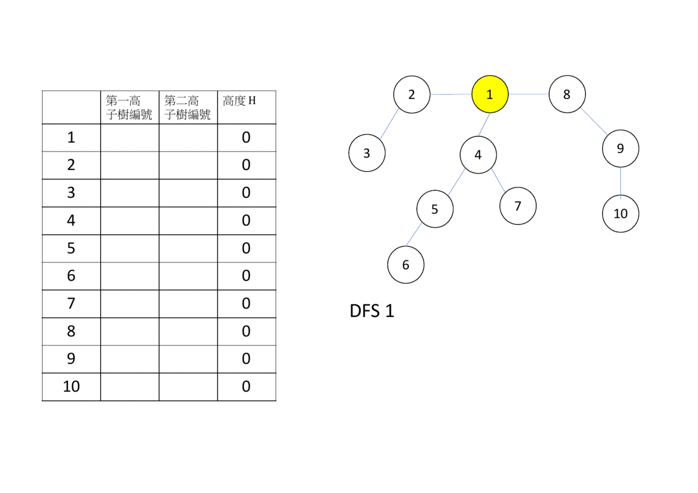
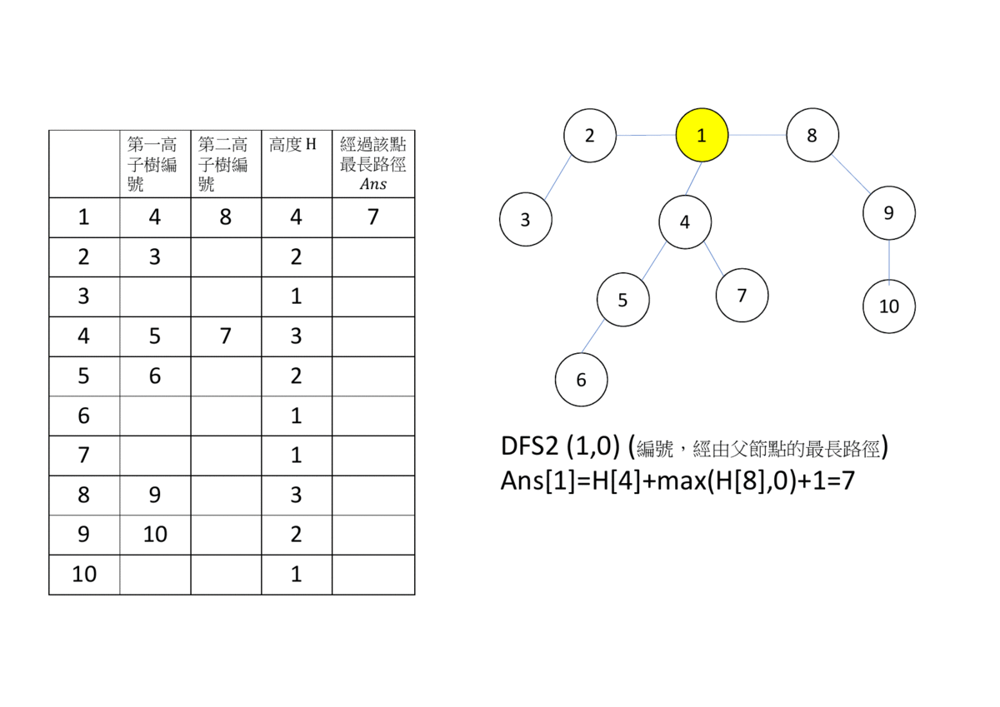

# 樹 DP

在樹上 DP，通常會使用 DFS（遞迴），從父節點遞迴到子節點，再合併子節點的答案。

## 最小點覆蓋

???+ Question "最小點覆蓋"
    給定一棵樹 $T$ ，樹上所有點一開始為白色，要求將一些點塗成黑色，使得所有的邊至少與一個黑色點相連，求最少要塗幾個點？

- 狀態： $dp[u][c]$ 代表以 $u$ 為根的子樹，在點 $u$ 為 (0: 白色；1: 黑色），最小需要幾個點為黑色。

- 初始狀態：如果 $u$ 是葉節點， $dp[u][0]=0,dp[u][1]=1$ 。

-   轉移
    - 當 $u$ 為白色， $u$ 的子節點應為黑色
    - 當 $u$ 為黑色， $u$ 的子節點可為白色或黑色
    -  $dp[u][0]=\Sigma_{(u,v)\in E}dp[v][1]$ 
    -  $dp[u][1]=\Sigma_{(u,v)\in E}min(dp[v][0],dp[v][1])$ 

-   其他題目
    - 最大獨立集
    - 最小支配集

## 換根 DP（全方位樹 DP)

進行兩次 DFS，第一次求子節點對當前節點的貢獻（樹 DP)，第二次：根據求父節點點對當前節點的貢獻。

### 樹直徑

???+ Question "樹直徑"
    一棵樹中，最長的路徑稱為樹直徑。給定一顆樹，求直徑長度。

第一種做法是枚舉所有的點為根，求出兩顆深度最深的子樹 $h_1,h_2$ ，找出最大的 $h_1+h_2+1$ ，一次 DFS 的時間複雜度為 $O(V+E)$ ，整體時間複雜度 $O(V(V+E))$ 。

第二種做法是用換根 DP。第一次 DFS 固定一點為根，求出每個點最深的兩顆子樹高度 ( $h_1,h_2$ )。第二次 DFS 對於每個點 $u$ ，求出經過父節點最長的路徑 ( $h_3$ )。取 $h_1,h_2,h_3$ 前兩大數值和再加 $1$ 即為答案。這種作法使用了兩次 DFS，時間複雜度 $O(V+E)$ 





```cpp
#include <bits/stdc++.h>
using namespace std;
const int MXV = 15;
vector<int> G[MXV];
int high[MXV][2];
int ans[MXV], height[MXV];

void dfs(int u) {
  height[u] = 1;
  for (int v : G[u]) {
    dfs(v);
    height[u] = max(height[u], height[v] + 1);
    if (high[u][0] == 0 || height[high[u][0]] < height[v]) {
      high[u][1] = high[u][0];
      high[u][0] = v;
    } else if (high[u][1] == 0 || height[high[u][1]] < height[v]) {
      high[u][1] = v;
    }
  }
}

void dfs2(int u, int legnth) {
  ans[u] = height[high[u][0]] + max(height[high[u][1]], legnth) + 1;
  for (int v : G[u]) {
    if (v == high[u][0]) {
      dfs2(v, max(height[high[u][1]], legnth) + 1);
    } else {
      dfs2(v, max(height[high[u][0]], legnth) + 1);
    }
  }
}

int main() {
  int n;
  cin >> n;
  for (int i = 1; i < n; ++i) {
    int x, y;
    cin >> x >> y;
    G[x].emplace_back(y);
  }
  dfs(1);
  dfs2(1, 0);
  for (int i = 1; i <= n; ++i) {
    cout << ans[i] << '\n';
  }
}
```

## 例題練習

-   最小點覆蓋
    -  [UVa 01292 - Strategic game](http://uva.onlinejudge.org/external/12/1292.pdf) 
-   換根 DP
    -  [AtCoder Educational DP Contest V - Subtree](https://atcoder.jp/contests/dp/tasks/dp_v) 
