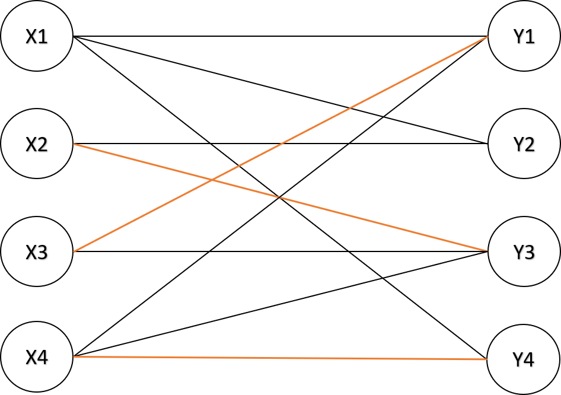
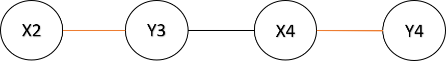
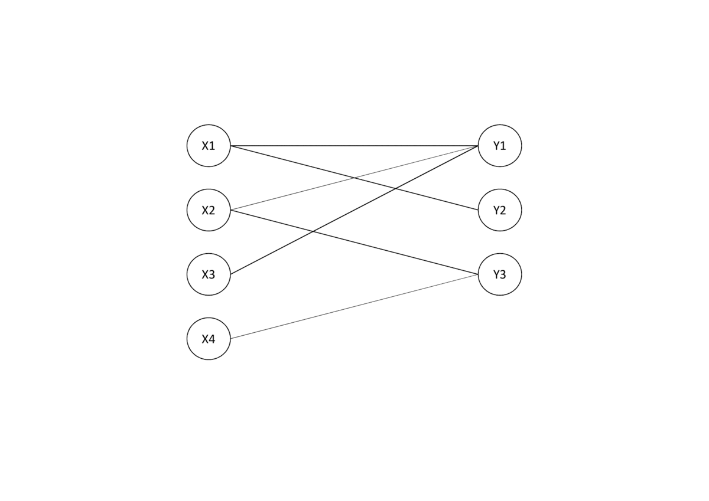

# 二分圖(Bipartite graph)
如果一張圖的點可以分成兩個集合，集合內的點彼此沒有邊相連。

## 性質
- 不存在奇環，奇環為邊數為奇數的環。
- 用兩種顏色塗所有的點，存在至少一種辦法使得任兩相鄰點對顏色相異。(著色問題)

## 判別二分圖
著色問題可以用來判斷一張圖是否為二分圖，用 `color` 紀錄每個點的顏色(無色 `-1`、白色 `0`、黑色 `1`)，一開始每個點紀錄為無色。利用 BFS 或 DFS 遍歷所有點，首先，判斷一個點是否有顏色，如果點為無色，就讓這個點變成白色，否則照舊。接著，讓其他相鄰的點的顏色和這個顏色相異，如果在遍歷途中發現有任意相鄰點對同色，則該圖不是二分圖。

??? "參考程式碼"
    作者：[allem40306](https://github.com/allem40306)
    ```cpp
    #include <bits/stdc++.h>
    using namespace std;
    const int N = 305;
    int color[N];
    vector<int> v[N];

    bool dfs(int s){
        for(auto it: v[s]){
            if(color[it] == -1){
                color[it] = 3 - color[s];
                if(!dfs(it)) return false;
            }
            if(color[s] == color[it])return false;
        }
        return true;
    }

    void isBipatirate(){
        bool ok = true;
        for(int i = 1; i <= n; ++i){
            if(color[i] == -1){
                color[i] = 1;
                ok &= dfs(i);
            }
        }
        if(ok){
            cout << "YES\n";
        }else{
            cout << "NO\n";
        }
    }
    ```

## 匹配
- 匹配：在圖論中是指一個邊集合，集合中任意兩條邊沒有共同頂點。
    - 匹配點、非匹配點、匹配邊、非匹配邊
    - 最大匹配(最大邊獨立集)：一張圖的所有匹配中，有著最大邊數的匹配。
    - 完美匹配：如果一個匹配包含所有的點，那麼該匹配稱為「完美匹配」。
    - 最大權重匹配：一張圖的所有匹配中，有著最大邊權重和的匹配。

## 二分圖最大匹配
### 匈牙利演算法 (Hungarian algorithm)

???+ "交錯路 (Alternating Path) 及增廣路 (Agumenting Path)"
    交錯路：依序經過非匹配邊、匹配邊、...、非匹配邊、匹配邊、非匹配邊所形成的路徑。
    
    增廣路：從非匹配點出發，經過交錯路，最後經過另一個集合的非匹配點，該路徑稱為增廣路。把增廣路上的非匹配邊和匹配邊替換，就能使匹配數量 $+1$。

    
    

???+ "Berge's Theorem"
    如果一個匹配 $M$ 找不到任何增廣路，那麼 $M$ 就是一個最大匹配。
    
    此定理可延伸出，如果一個非匹配點 $v$ 找不到增廣路，那麼存在不包含 $v$ 的最大匹配 $M'$。

根據 Berge's Theorem，我們得到一個算法：枚舉集合 $X$ 未匹配的點 $s$，如果找到增廣路，則翻轉所有邊，否則就把 $s$ 移出匹配。找出增廣路的方式為，從 $X$ 集合的每個點 $s$ 開始 DFS，去拜訪集合 $Y$ 的每個和 $s$ 相連的點 $t$，如果 $t$ 是未匹配點，則找到一條增廣路；如果 $t$ 是匹配點，則從和 $t$ 匹配點 $s'$ 開始 DFS 尋找增廣路。

s 集合個每個點都匹配一次，最多有 $V$ 個點，每次 DFS 的最多找到長度為 $E$ 的增廣路，整體時間複雜度為 $O(VE)$。



??? "參考程式碼"
    作者：[allem40306](https://github.com/allem40306)
    ```cpp
    int lhs, rhs, Left[MXV], G[MXV][MXV];
    bitset<MXV> used;

    bool dfs(int s)
    {
        for (int i = 1; i <= rhs; i++)
        {
            if (!G[s][i] || used[i])
            {
                continue;
            }
            used[i] = true;
            if (Left[i] == -1 || dfs(Left[i]))
            {
                Left[i] = s;
                return true;
            }
        }
        return false;
    }

    int sol()
    {
        int ret = 0;
        memset(Left, -1, sizeof(Left));
        for (int i = 1; i <= lhs; i++)
        {
            used.reset();
            if (dfs(i))
            {
                ret++;
            }
        }
        return ret;
    }
    ```

## 獨立集和覆蓋

- 最大邊獨立集 $M$(最大匹配)：為圖上最大的邊集使得每個點至多和一條邊相鄰。
- 最大點獨立集 $I$：是一張圖中，最多有幾個點互不相鄰的最大集合。
- 最小點覆蓋 $C_V$：最小的點集使得圖上每條邊都至少與點集中一個點相鄰。
- 最小邊覆蓋 $C_E$：最小的邊集使得圖上每個點都至少與邊集中一條邊相鄰。

根據 König’s theorem，可以整理出下列事項：

- $|M|=|C_V|$
- $|I|=|C_E|=|V|-|M|$

下列說明，在找出最大匹配後，如何找出這些問題的其中一組解：

- 最小點覆蓋：對於每個匹配邊上的兩點，如果有一個匹配點有連接到未匹配點，將該點加入最小點覆蓋中，否則任選一點加入最小點覆蓋中。
- 最大點獨立集：剛好跟最小點覆蓋互補。
- 最小邊覆蓋：最大匹配的邊，加上每個未匹配點所連接的任意一條。

因此，只要算出最大匹配，就可以算出其他問題。

## 二分圖最大權重匹配
### Kuhn-Munkres Algorithm

KM 演算法 (Kuhn-Munkres Algorithm) 用於二分圖最大權重匹配，此演算法必須應用到完美匹配的情況，我們要增加一些點或邊來滿足：

- 兩集合的點數量要一致，如果不一樣的話，少的集合要補多一些點。

- 每個點都要和另外一個集合的所有點相連，如果邊不存在，請補上一條權重為 $0$ 的邊。

KM 演算法直接在點上調整權重，比在邊上調整權重簡單，作法是在每個點加上一個 vertex labeling，$lx,ly$ 分別為 $X,Y$ 集合的 vertex labeling。

- $lx(i)=max_{i\le j\le n}\{w(i,j)\},ly(i)=0$

- $lx(i)+ly(j)\ge w(i,j)$

於是這個問題就變成最小化 $\Sigma_{i\in X} lx(i)+\Sigma_{i\in Y} ly(i)$，我們透過不斷調整 vertex labeling，找到一條匹配邊皆滿足 $Lx(u)+Ly(v)=w(i,j)$ 的增廣路，最後得出的匹配邊即為答案。把一個最大化所有匹配邊的權重和，轉換成最小化所有點的權重和，在線性規劃中，是 primal problem 和 dual problem 的轉換。

??? "參考程式碼"
    作者：[allem40306](https://github.com/allem40306)
    ```cpp
    template <typename T>
    struct KM
    {
        int n;
        int Left[N];
        T w[N][N], Lx[N], Ly[N];
        bitset<N> vx, vy;
        
        void init(int _n)
        {
            n = _n;
        }

        bool match(int i)
        {
            vx[i] = true;
            for (int j = 1; j <= n; j++)
            {
                if ((fabs(Lx[i] + Ly[j] - w[i][j]) < 1e-9) && !vy[j])
                {
                    vy[j] = 1;
                    if (!Left[j] || match(Left[j]))
                    {
                        Left[j] = i;
                        return true;
                    }
                }
            }
            return false;
        }

        void update()
        {
            T a = 1e9;
            for (int i = 1; i <= n; i++)
            {
                if (vx[i])
                {
                    for (int j = 1; j <= n; j++)
                    {
                        if (!vy[j])
                        {
                            a = min(a, Lx[i] + Ly[j] - w[i][j]);
                        }
                    }
                }
            }
            for (int i = 1; i <= n; i++)
            {
                if (vx[i])
                {
                    Lx[i] -= a;
                }
                if (vy[i])
                {
                    Ly[i] += a;
                }
            }
        }

        void hungarian()
        {
            for (int i = 1; i <= n; i++)
            {
                Left[i] = Lx[i] = Ly[i] = 0;
                for (int j = 1; j <= n; j++)
                {
                    Lx[i] = max(Lx[i], w[i][j]);
                }
            }
            for (int i = 1; i <= n; i++)
            {
                while (1)
                {
                    vx.reset();
                    vy.reset();
                    if (match(i))
                    {
                        break;
                    }
                    update();
                }
            }
        }
    };

    /*
    usage
    KM<int> km; // declare with weight type
    km.init(n); // initialize with vertex
    km.hungarian(); // calculate
    km.w[][]; // weight array
    km.Left[i] // y_i match x_Left[i] 
    */
    ```

更多的參考程式碼可參考 [[ Kuhn-Munkres Algorithm ] 二分圖最大權完美匹配KM算法 - 日月卦長的模板庫](http://sunmoon-template.blogspot.com/2016/05/kuhn-munkres-algorithm.html) 和 [二分图最大权匹配 - OI Wiki](https://oi-wiki.org/graph/graph-matching/bigraph-weight-match/)。

## 例題練習
- 二分圖判定
    - [UVa 11396 - Claw Decomposition](https://onlinejudge.org/index.php?option=onlinejudge&page=show_problem&problem=2391)


[^1]: [二分图的最大匹配、完美匹配和匈牙利算法 - Renfei Song's Blog](https://www.renfei.org/blog/bipartite-matching.html)
[^2]: [Matching - 演算法筆記](https://web.ntnu.edu.tw/~algo/Matching.html#8)
[^3]: [二分图 - OI Wiki](https://oi-wiki.org/graph/bi-graph/)
[^4]: [二分图最大匹配 - OI Wiki](https://oi-wiki.org/graph/graph-matching/bigraph-match/)
[^5]: [二分图最大权匹配 - OI Wiki](https://oi-wiki.org/graph/graph-matching/bigraph-weight-match/)
[^6]: [[ Kuhn-Munkres Algorithm ] 二分圖最大權完美匹配KM算法 - 日月卦長的模板庫](http://sunmoon-template.blogspot.com/2016/05/kuhn-munkres-algorithm.html)
[^7]: [一般圖最大權匹配 - 日月卦長](https://jacky860226.github.io/general-graph-weighted-match-slides/#/)
[^8]: [進階圖論 - 板中培訓講義](https://drive.google.com/file/d/1DMK5D4mpD5lKjy01SJuIIFlx45poKKSE/view)