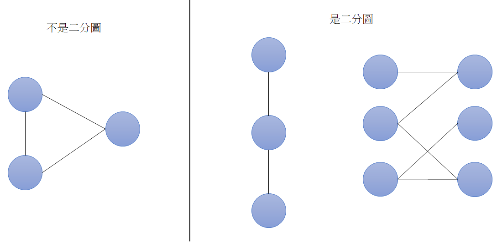
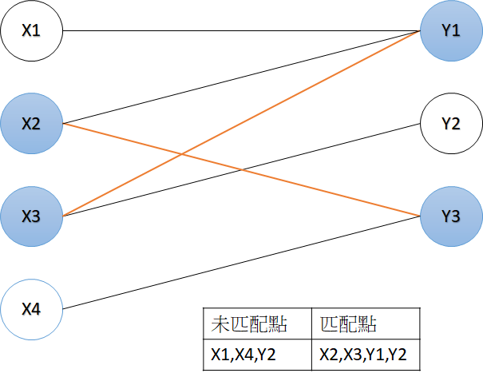
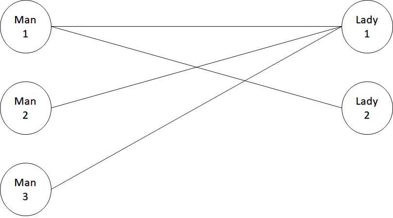
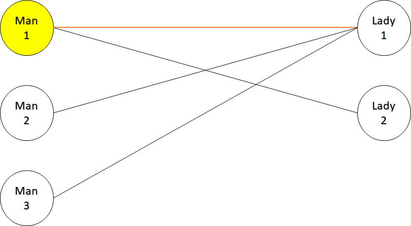
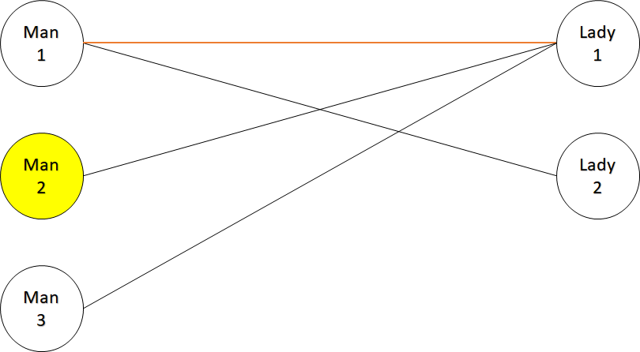
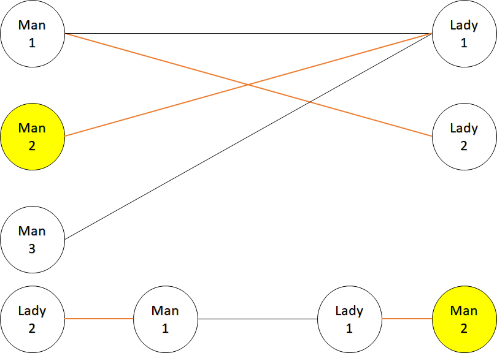
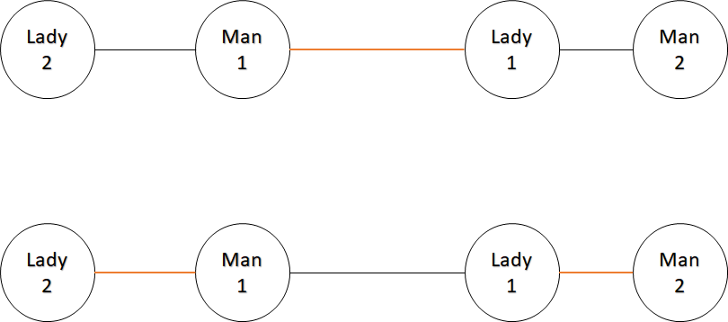
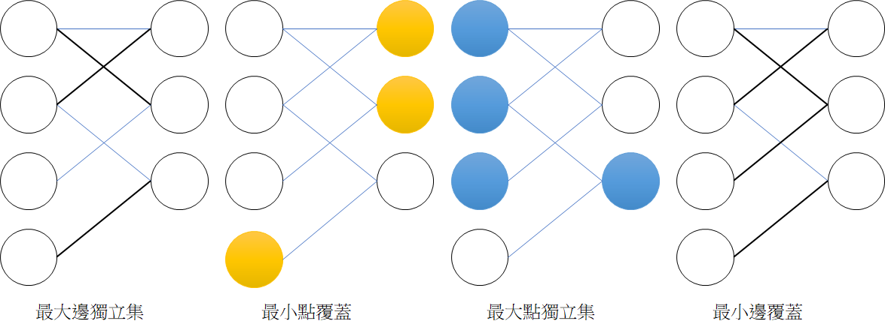
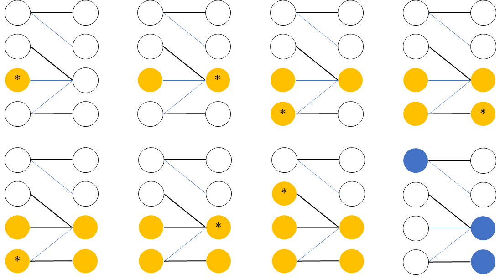

# 二分圖（Bipartite graph)

如果一張圖的點可以分成兩個集合，集合內的點彼此沒有邊相連。

## 基本介紹

- 不存在奇環，奇環為邊數為奇數的環。
- 用兩種顏色塗所有的點，存在至少一種辦法使得任兩相鄰點對顏色相異。（著色問題）
- 現實中二分圖應用範圍
    - 配對：男女配對，機器人分配工作
    - 輪替：二維座標、棋盤，座標是點，鄰居關係是邊
    - 交錯：二維座標、棋盤，行列式點，座標是邊



## 著色問題

???+ Question "著色問題"
    給定一張圖 $G$，用兩種顏色(黑色和紅色)塗所有的點，是否存在至少一種辦法，使得任兩相鄰點對顏色相異?

這題其實也在判斷一張圖是否為二分圖：一張圖有奇環，表示至少有一對相鄰的點同色。

### 算法

用 `color` 紀錄每個點的顏色（無色 `-1` 、紅色 `0` 、黑色 `1` )，一開始每個點紀錄為無色。利用 BFS 或 DFS 遍歷所有點，首先，判斷一個點是否有顏色，如果點為無色，就讓這個點變成紅色，否則照舊。接著，讓其他相鄰且無色的點 $v$ 的顏色和這個顏色相異，並遍歷點 $v$，如果在遍歷途中發現有任意相鄰點對同色，則該圖不是二分圖。

所有點和邊最多遍歷一次，時間複雜度 $O(V+E)$。

```cpp
--8<-- "docs/graph/code/isBipatirate.cpp"
```

## 匹配

-   匹配：在圖論中是指一個邊集合，集合中任意兩條邊沒有共同頂點。
    - 匹配點、非匹配點、匹配邊、非匹配邊
    - 最大匹配（最大邊獨立集）：一張圖的所有匹配中，有著最大邊數的匹配。
    - 完美匹配：如果一個匹配包含所有的點，那麼該匹配稱為「完美匹配」。
    - 最大權重匹配：一張圖的所有匹配中，有著最大邊權重和的匹配。



## 二分圖最大匹配

假設今天有一個配對節目，這個環節男生選擇一到多位女生，工作人員要依照男生的選擇，讓越多對男女配對越好。



一開始讓一號男生和一號女生配對。



再來讓二號男生跟其他人配對，但很不巧他唯一的選擇，一號女生已經和一號男生配對，為了讓配對數增加，讓一號男生和其他選擇(二號女生)配對，如此一來配對數增加到兩對。





匹配演算法的概念就是如此：為一條匹配邊的兩個點，各自找到一個非匹配點，讓兩個匹配點改成和非匹配點匹配，增加匹配數。

???+ "交錯路 (Alternating Path) 及增廣路 (Agumenting Path)"
    交錯路：依序經過非匹配邊、匹配邊、。。。、非匹配邊、匹配邊、非匹配邊所形成的路徑。
    
    增廣路：從非匹配點出發，經過交錯路，最後經過另一個集合的非匹配點，該路徑稱為增廣路。
    
    增廣路上的未匹配邊會比匹配邊多一條，將未匹配邊變成匹配邊，匹配邊變成未匹配邊(在這裡稱為翻轉)，匹配數量會多一條。

    下面的例子，兩條路徑都是增廣路，但只有上面一條路徑稱為增廣路。

    

在圖上持續尋找增廣路，翻轉增廣路，直到無法再找到任何一條增廣路，就是最大匹配。

### 匈牙利演算法 (Hungarian algorithm)

要介紹演算法前，先引入 Berge's Theorem。

???+ "Berge's Theorem"
    如果一個匹配 $M$ 找不到任何增廣路，那麼 $M$ 就是一個最大匹配。
    
    此定理可延伸出，如果一個非匹配點 $v$ 找不到增廣路，那麼存在不包含 $v$ 的最大匹配 $M'$ 。

根據 Berge's Theorem，我們得到一個算法：假設二分圖分成兩個集合 $X,Y$，枚舉集合 $X$ 未匹配的點 $X_i$ ，如果找到增廣路，則翻轉所有邊，否則就把 $X_i$ 移出匹配。找出增廣路的方式為：
- 從 $X$ 集合的每個點 $X_i$ 開始 DFS，去拜訪集合 $Y$ 的每個和 $X_i$ 相連的點 $Y_j$ ，
    - 如果 $Y_j$ 是未匹配點，則找到一條增廣路。
    - 如果 $Y_j$ 是匹配點，則從和 $Y_j$ 匹配點 $X_{i'}$ 開始 DFS 尋找增廣路。

$X$ 集合個每個點都匹配一次，最多有 $V$ 個點，每次 DFS 的時間複雜度為 $O(V+E)$ / $O(V^2)$，整體時間複雜度為 $O(V(V+E))$ / $O(V^3)$。


```cpp
--8<-- "docs/graph/code/hungarian.cpp"
```

## 匹配相關問題

- 最大邊獨立集 $M$ （最大匹配）：為圖上最大的邊集使得每個點至多和一條邊相鄰。
- 最大點獨立集 $I$ ：是一張圖中，最多有幾個點互不相鄰的最大集合。
- 最小點覆蓋 $C_V$ ：最小的點集使得圖上每條邊都至少與點集中一個點相鄰。
- 最小邊覆蓋 $C_E$ ：最小的邊集使得圖上每個點都至少與邊集中一條邊相鄰。



根據 König’s theorem，可以整理出下列事項：

-  $|M|=|C_V|$ 
-  $|I|=|C_E|=|V|-|M|$ 

下列說明，在找出最大匹配後，如何找出這些問題的一組解：

### 最小點覆蓋

從 $X$ 中的未匹配點 DFS，依序經過未匹配邊 -> 匹配邊 -> 未匹配邊 -> 匹配邊 -> ...，最小點覆蓋即為左側所有未拜訪過的點 + 所有右側拜訪過的點。



### 最大點獨立集

剛好跟最小點覆蓋互補。

### 最小邊覆蓋

最大匹配的邊，加上每個未匹配點所連接的任意一條。

## 二分圖最大權重匹配

KM 演算法 (Kuhn-Munkres Algorithm) 用於二分圖最大權重匹配，此演算法必須應用到完美匹配的情況，我們要增加一些點或邊來滿足：

- 兩集合的點數量要一致，如果不一樣的話，少的集合要補多一些點。

- 每個點都要和另外一個集合的所有點相連，如果邊不存在，請補上一條權重為 $0$ 的邊。

KM 演算法直接在點上調整權重，比在邊上調整權重簡單，作法是在每個點加上一個 vertex labeling， $lx,ly$ 分別為 $X,Y$ 集合的 vertex labeling。

-  $lx(i)=max_{i\le j\le n}\{w(i,j)\},ly(i)=0$ 

-  $lx(i)+ly(j)\ge w(i,j)$ 

於是這個問題就變成最小化 $\Sigma_{i\in X} lx(i)+\Sigma_{i\in Y} ly(i)$ ，我們透過不斷調整 vertex labeling，找到一條匹配邊皆滿足 $Lx(u)+Ly(v)=w(i,j)$ 的增廣路，最後得出的匹配邊即為答案。把一個最大化所有匹配邊的權重和，轉換成最小化所有點的權重和，在線性規劃中，是 primal problem 和 dual problem 的轉換。

```cpp
--8<-- "docs/graph/code/km.cpp"
```

更多的參考程式碼可參考 [二分圖最大權完美匹配 KM 算法 - 日月卦長的模板庫](http://sunmoon-template.blogspot.com/2016/05/kuhn-munkres-algorithm.html) 和 [二分图最大权匹配 - OI Wiki](https://oi-wiki.org/graph/graph-matching/bigraph-weight-match/) 。

## 相關題目

???+ Question "LibreOJ 6000"
    有 $N$ 位正駕駛和 $M$ 位副駕駛，一位正駕駛要搭配一位副駕駛，給定可以一起執勤的名單，請問最多可以一次出動幾組人員?

最大二分圖匹配練習。

???+ Question "LibreOJ - 6226"
    給定一張 $N\times N$ 的棋盤，放置 $M$ 個障礙物，請問最多可以放多少騎士，彼此之間不會互相攻擊?(騎士走日字形)
-
騎士的走法不存在奇環，因此可以把問題轉成二分圖，將座標 $(x,y)$ 和所有騎士從 $(x,y)$ 可以走到的點相連，不能互相攻擊代表要找到越多不相連的點越好，也就是最大點獨立集數量。

## 例題練習

-   二分圖判定
    -  [UVa 11396 - Claw Decomposition](https://onlinejudge.org/index.php?option=onlinejudge&page=show_problem&problem=2391) 
-   二分圖最大匹配
    -  [UVa 12083 - Guardian of Decency](https://onlinejudge.org/index.php?option=com_onlinejudge&Itemid=8&page=show_problem&problem=3235) 
    -  [UVa 12549 - Sentry Robots](https://vjudge.net/problem/UVA-12549)
-   獨立集和覆蓋
    -  [UVa 11419 - SAM I AM](https://onlinejudge.org/index.php?option=com_onlinejudge&Itemid=8&page=show_problem&problem=2414) 
-   二分圖最大權匹配
    -  [UVa 01349 - Optimal Bus Route Design](https://onlinejudge.org/index.php?option=com_onlinejudge&Itemid=8&page=show_problem&problem=4095) 

[^1]:  [二分图的最大匹配、完美匹配和匈牙利算法 - Renfei Song's Blog](https://www.renfei.org/blog/bipartite-matching.html) 

[^2]:  [Matching - 演算法筆記](https://web.ntnu.edu.tw/~algo/Matching.html#8) 

[^3]:  [二分图 - OI Wiki](https://oi-wiki.org/graph/bi-graph/) 

[^4]:  [二分图最大匹配 - OI Wiki](https://oi-wiki.org/graph/graph-matching/bigraph-match/) 

[^5]:  [二分图最大权匹配 - OI Wiki](https://oi-wiki.org/graph/graph-matching/bigraph-weight-match/) 

[^6]:  [二分圖最大權完美匹配 KM 算法 - 日月卦長的模板庫](http://sunmoon-template.blogspot.com/2016/05/kuhn-munkres-algorithm.html) 

[^7]:  [一般圖最大權匹配 - 日月卦長](https://jacky860226.github.io/general-graph-weighted-match-slides/#/) 

[^8]:  [進階圖論 - 板中培訓講義](https://drive.google.com/file/d/1DMK5D4mpD5lKjy01SJuIIFlx45poKKSE/view) 
