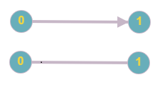
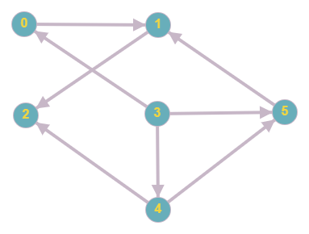
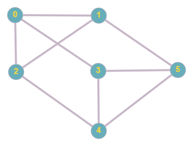
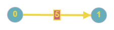
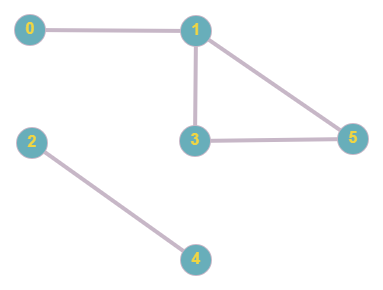
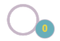
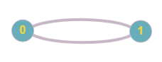

# 圖論概念

圖是由邊集合和點集合所形成的圖形，這種圖形通常用來描述某些事物之間的某種特定關係。頂點用於代表事物，連接兩頂點的邊則用於表示兩個事物間具有這種關係。

數學式為 $G=(V,E)$ 。 $G$ 代表圖（Graph)， $V$ 代表點（vertex)， $E$ 代表邊（edge)。

## 術語

-   無向邊、有向邊：邊具有方向性，無向邊代表邊沒有指定方向， $(u,v)$ 和 $(v,u)$ 等價；有向邊則有指定方向， $(u,v)$ 和 $(v,u)$ 是不同的。
    - 

-   無向圖、有向圖、混合圖：無向圖是只有無向邊的圖，類似地，有向圖是只有有向邊的圖，混和圖則是包含無向邊和有向邊。
    - 
    - 

-  $|V|$ ：點數，通常用 $V$ 表示。

-  $|E|$ ：邊數，通常用 $E$ 表示。

-   權重（weight)：在點或邊上附帶一個數字稱做「權重」，邊上權重較常見，權重通常代表代價，例如所需花費時間或金錢。
    - 

- 相鄰 (adjacent)：無向圖中，兩個點 $u$ , $v$ 相鄰代表存在一個邊 $e_i = (u, v)$ 。

- 指向 (consecutive)：有向圖中， $u$ 指向 $v$ 代表存在一個邊 $e_i = (u, v)$ 。

- 度（degree)：無向圖中，一個點連到的邊數稱為 "度"，在有向圖分為出度（out-degree，簡稱 $d_{out}$ ）及入度（in-degree，簡稱 $d_{in}$ )，分別代表該點指向別點及被指向的邊數。

- 路徑（walk)：一條由 $x$ 到 $y$ 的路徑 $x=v_1,v_2,v_3...,v_k=y$ 。根據限制可以分為下列幾種：

|      | 開放    | 封閉（ $v_1=v_k$ ) |
| ---- | ----- | --------------- |
| 無限制  | walk  | closed walk     |
| 不重複邊 | trail | circut（迴路）      |
| 不重複點 | path  | cycle（環）        |

-   連通 (connected)：無向圖中，若 $u$ 和 $v$ 存在路徑，則 $u$ 和 $v$ 連通。若一群點兩兩連通，則這些點都連通。
    - 下圖中，
    - 

-   自環 (loop)：一條邊 $e_i = (u, v)$ 滿足 $u = v$ , $e_i$ 即稱為自環。
    - 

-   重邊 (multiple edge)：在一張圖中，存在 $e_i$ , $e_j$ 滿足 $i$ != $j$ and $e_i = e_j$ ，則稱為重邊。
    - 

## 特殊的圖

- 簡單圖：一個沒有自環、重邊的連通圖稱為簡單圖。

- 連通圖（connected Graph)：無向圖中，任意兩點皆可經過一些邊訪問彼此，這張圖即為無向圖。

- 請見 [樹](./tree.md) 章節。

- 完全圖（Complete Graph)：無向圖中，任意兩點 $u, v$ 皆存在一條邊 $e_i = (u, v)$ ，稱為完全圖。一張 n 個點的完全圖簡記為 $K_n$ ，在集合上曾為完全圖為 "團"

- 競賽圖（Tournament Graph)：有向圖中，任意兩點 $u, v$ 皆存在一條邊 $e_i = (u, v)$ ，稱為競賽圖。

- 有向無環圖（Directed acyclic graph, DAG)：沒有環的無向圖。

- 二分圖（Bipartite Graph)：能將圖上的點分成兩個集合，任意一條邊 $e_i = (u, v)$ 都滿足， $(u, v)$ 在不同集合裡，該圖稱為二分圖。

- 平面圖（Planar Graph)：可畫在平面上，且任意兩條邊皆不重疊的圖。

## 圖的關係

- 子圖（subgraph)：如果 $G'=(V', E')$ 是 $G=(V, E)$ 的子圖，則 $V'\in V$ 且 $E'\in E$ 。

- 補圖 (complement graph) graph)：令 $G=(V,E)$ 是一個圖， $K$ 包含所有 $V$ 的二元子集 (2-element subset)。則圖 $H = (V, K\setminus E)$ 是 $G$ 的補圖。換句話說，把原本的邊移除，加入原本不存在的邊即是補圖。

- 同構 (isomorphic)：
