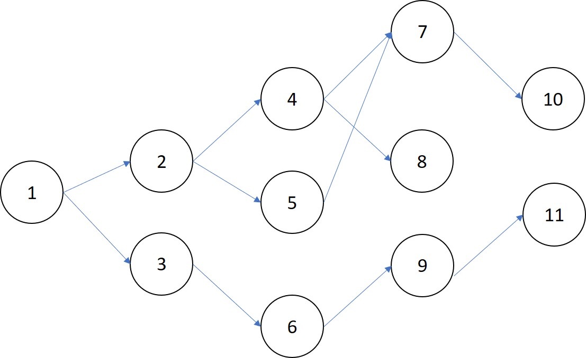
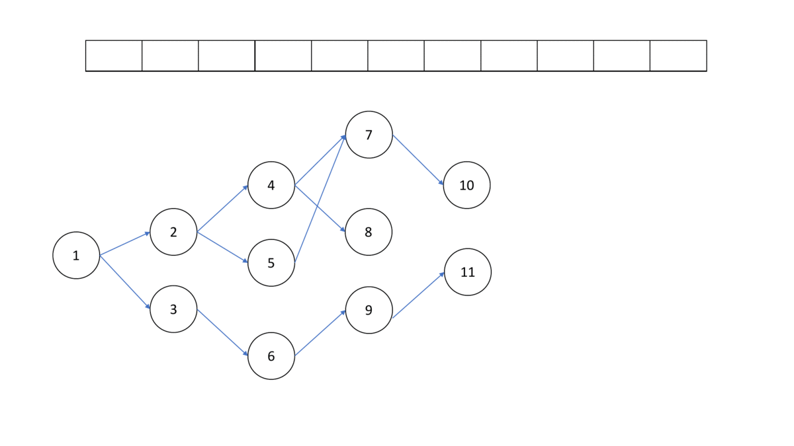

# 有向無環圖 (Directed Acyclic Graph, DAG)



有向無環圖可以代表事物之間的相依關係，例如擋修機制，或是函示庫的套件安裝。

有兩種辦法可以檢查一張圖是否為有向無環圖。

## 拓譜排序

拓樸排序是對將有向圖轉換成一個線性序列，也用來判斷一張圖是否為有向無環圖，方法如下：

- 將入度 = 0 的點加入 queue
- 從 queue 當中拿一個點 $u$ 
- 拔掉點 $u$ 
- 重複上敘步驟，直到 queue 裡面沒有點



做完拓譜排序後，如果所有點都被加入過 queue 過，代表這張圖是 DAG，反之，圖中有環。

```cpp
int q[N], din[N];
vector<int> G[N];

bool TopologicalSort(int n) {
  int head = -1, tail = -1;
  for (int i = 0; i < n; ++i) {
    if (din[i] == 0) {
      q[++head] = 1;
    }
  }
  while (head > tail) {
    int s = q[++tail];
    for (int i : G[s]) {
      if (--din[i] == 0)
        q[++head] = i;
    }
  }
  return head == n;
}
```

時間複雜度為 $O(V+E)$ 。

### 拓譜順序

拓譜排序中，從 queue 拿出的順序稱為拓譜順序，拓譜順序不唯一。

## DFS + 時間戳記

另一種是利用 DFS + 時間戳記，如果發現有任一條邊 $(u,v)$ ， $tin[u]>tin[v]$ ，那就無解，否則依照 $tout$ 由大到小形成拓譜排序。

時間複雜度為 $O(V+E)$ 。

## 例題練習

-  [UVa 10305 - Ordering Tasks](http://uva.onlinejudge.org/external/103/10305.pdf) 
