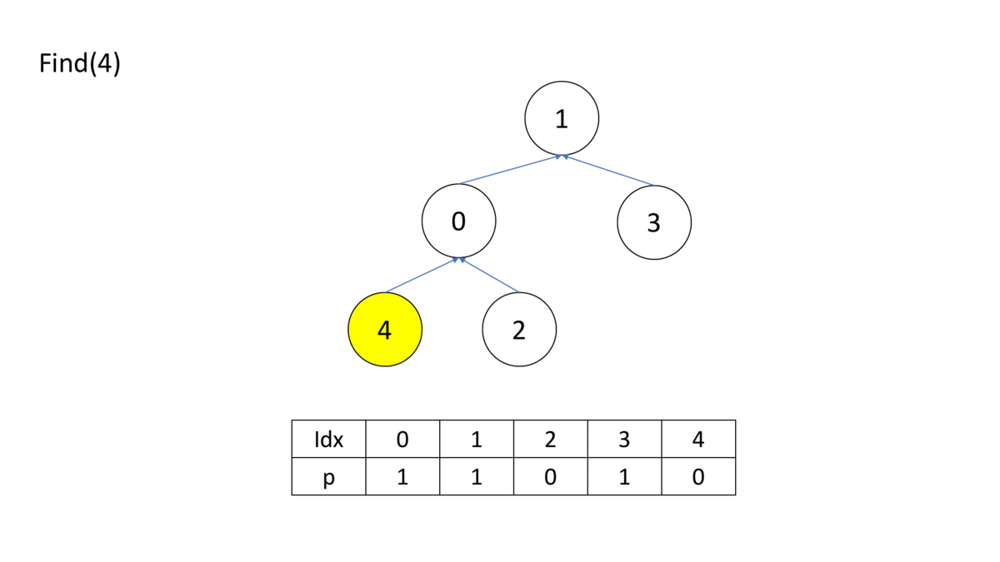
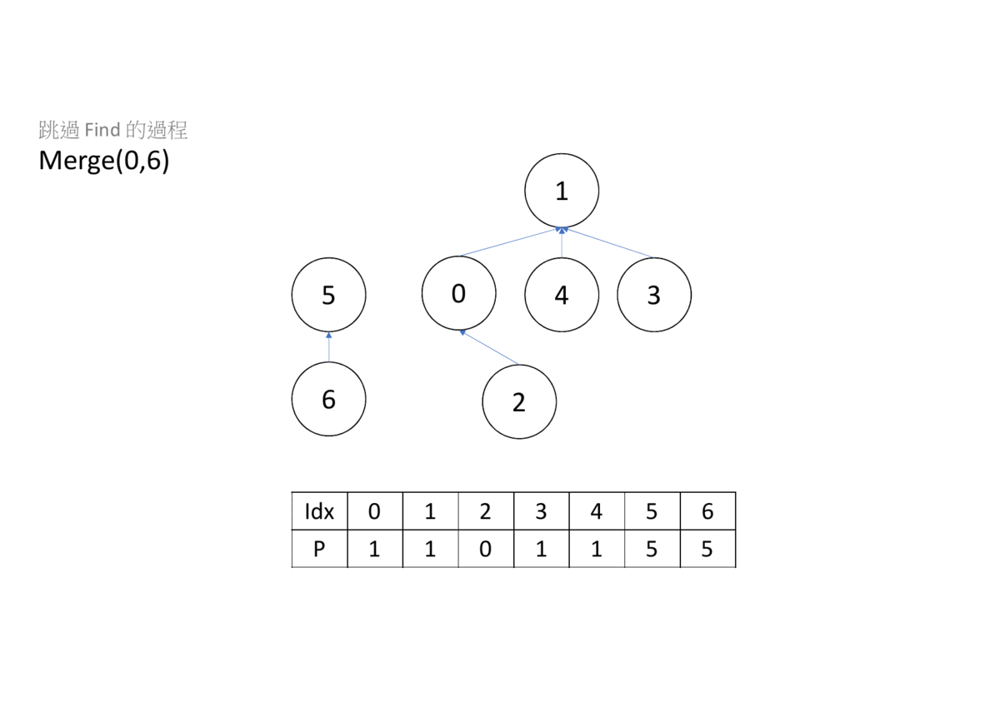

# 並查集

並查集是一種樹狀結構，他支援兩件事

- 查詢所隸屬集合
- 合併兩個集合

我們把集合轉化成樹，一顆樹代表一個集合，樹根代表集合的老大，查詢隸屬集合就回傳樹根是誰（一個樹餔可能有兩顆樹根吧），合併的時侯，就把一顆樹的樹根只到另一顆，以下為詳細的描述。

## 初始

一開始的時候，每個點自成一個集合，所以把樹根都設為自己。

## 查詢

查詢的時候，要查到樹根為自己的點，為止否則的話就要繼續查。

```cpp
--8<-- "docs/graph/code/djs1.cpp"
```

狀態壓縮：在合併之後原本被指向的樹根就沒用了，我們可以一邊做查詢時，一邊做更新。

```cpp
--8<-- "docs/graph/code/djs2.cpp"
```



## 合併
找出兩個點的樹根，將一個樹根合併指到另一個樹根。

```cpp
--8<-- "docs/graph/code/djs3.cpp"
```



啟發式合併：建立一個 $h[i]$ 代表樹的高度，亦是元素最大遞迴次數， $h[i]$ 一開始為 $1$ 。再來，我們每次都讓高度小的高度大的合併，如果遇到高度一樣的，就讓合併別人的樹高度加 $1$ 。如果要把高度變為 $x$ ，則至少需要 $2^x$ 個點，由此推出 N 個點所形成最高之高度為 $\log(N)$ 。

```cpp
--8<-- "docs/graph/code/djs4.cpp"
```

也可以維護並查集的個數，個數大的合併個數小的並查集。

```cpp
--8<-- "docs/graph/code/djs5.cpp"
```

## 完整程式碼

```cpp
--8<-- "docs/graph/code/djs6.cpp"
```

## 相關題目

???+ Question "UVa 10608 - Friends"
    給定 $N$ 個人的朋友關係，如果兩個人是朋友，他們在同一個朋友圈，問有幾個人在最大的朋友圈。

???+ Question "UVa 11503 - Virtual Friends"
    給定 $N$ 個人的朋友關係，如果兩個人是朋友，問兩個人成為新朋友，他們的朋友圈總共有幾個人。

這兩題題目相似，都要維護每個集合的個數，最後答案會根據每個集合的數量計算出來。

UVa 10608 這題需要注意最大的朋友圈可能不只一個，如果有多個集合大小一樣，需要累加答案。

UVa 11503 給定朋友的名字，在實作上，會利用 `map` 將名字對應數字再做計算。

## 例題練習

-  [UVa 00615 - Is It A Tree?](http://uva.onlinejudge.org/external/6/615.pdf) 
