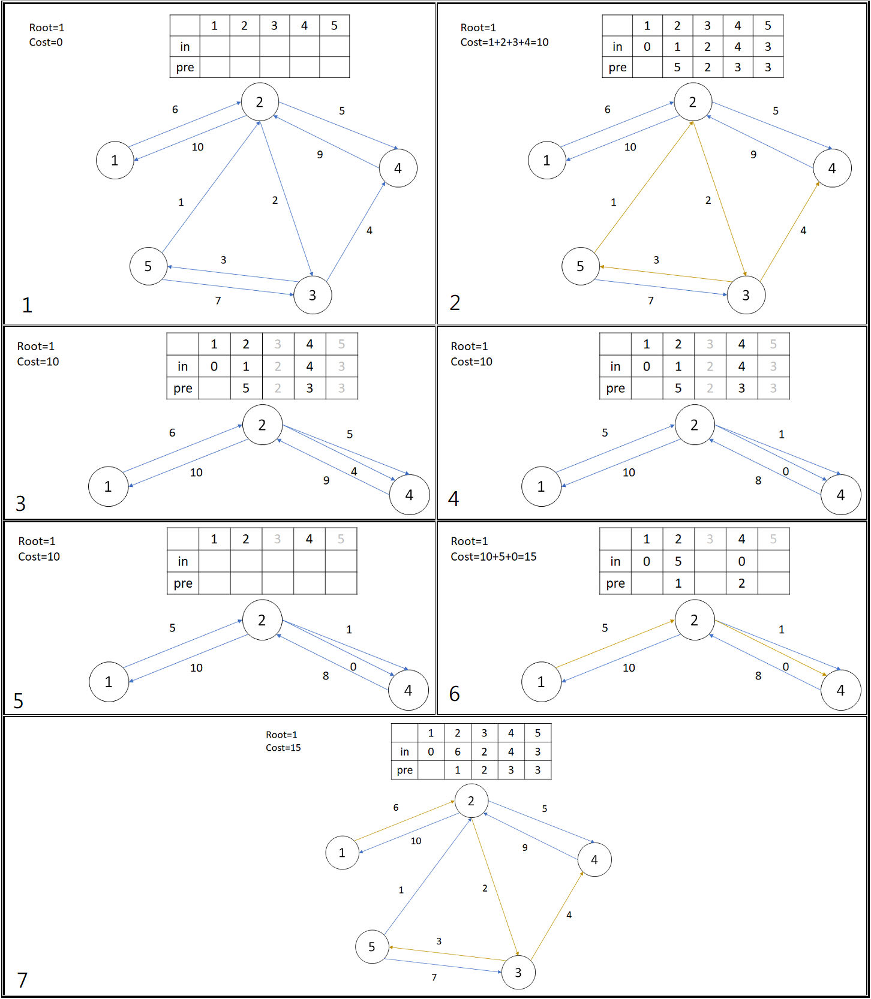

# 最小樹形圖

在一張有向圖中，如果存在一點 root，滿足：

- 從 root 可以到圖上其他節點。
- root 的入度為 0，其他節點入度為 1。

該圖稱為樹形圖。

在一張圖裡，邊權重和最小的子圖稱為最小樹形圖，也可以說是有向圖版的最小生成樹。

演算法步驟如下：

- 除了 root 之外的所有點選擇權重最小的入邊，如果有點沒有入邊，代表無法形成樹形圖。
- 判斷被選進的邊中有沒有環，如果有環將該還縮成一個點，
- 如果沒出現環終止演算法，否則回到步驟一。



```cpp
--8<-- "docs/graph/code/dmst.cpp"
```


## 例題練習

???+ Question "UVa 11183 - Teen Girl Squad "
    給定一張圖，求出最小生成樹。

???+ Question "UVa 11865 - Stream My Contest"
    給定有 $N$ 個點和 $M$ 條邊的網路，每條邊有起點、終點和寬頻，訊號會從點 $0$ 傳送到其他地方，在建造成本最大為 $C$ 的情況下，最多可達到多少寬頻速度?

二分搜寬頻速度 $x$，$F(x)$ 代表只使用寬頻 $\le x$ 的邊，建造成本是否 $\le C$。
