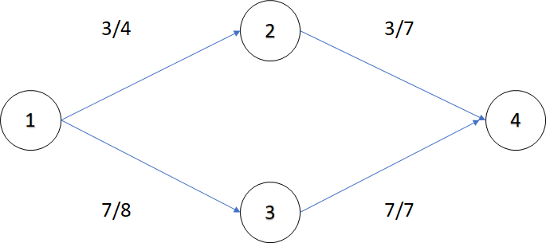
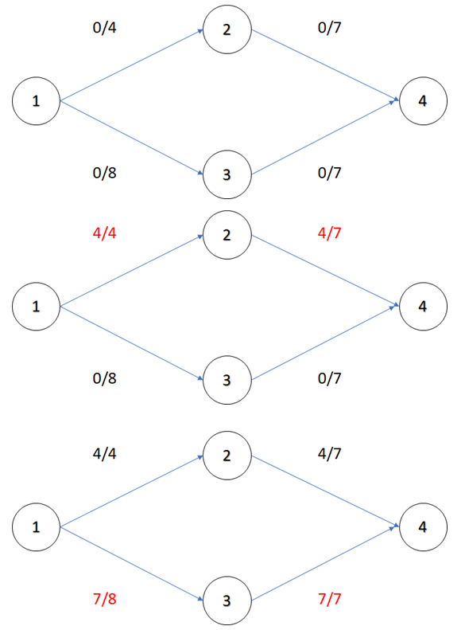
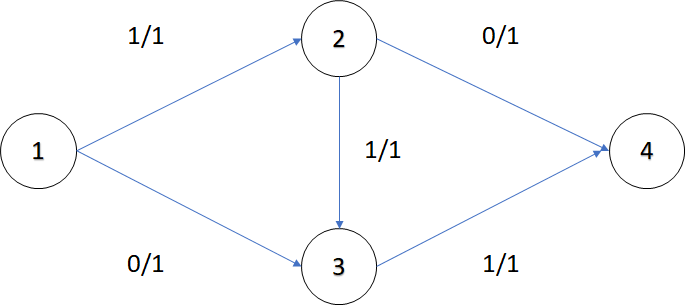
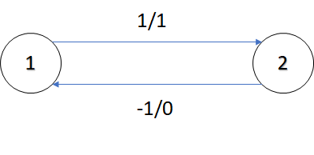
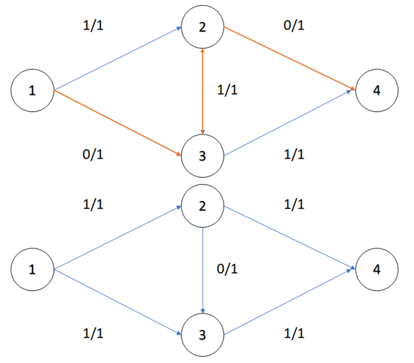
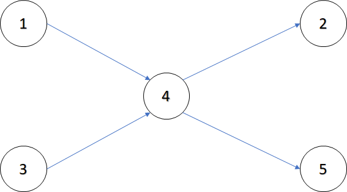
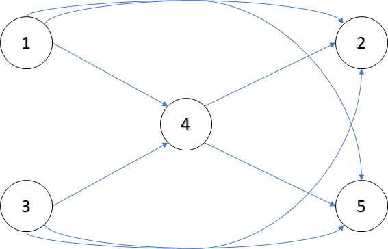
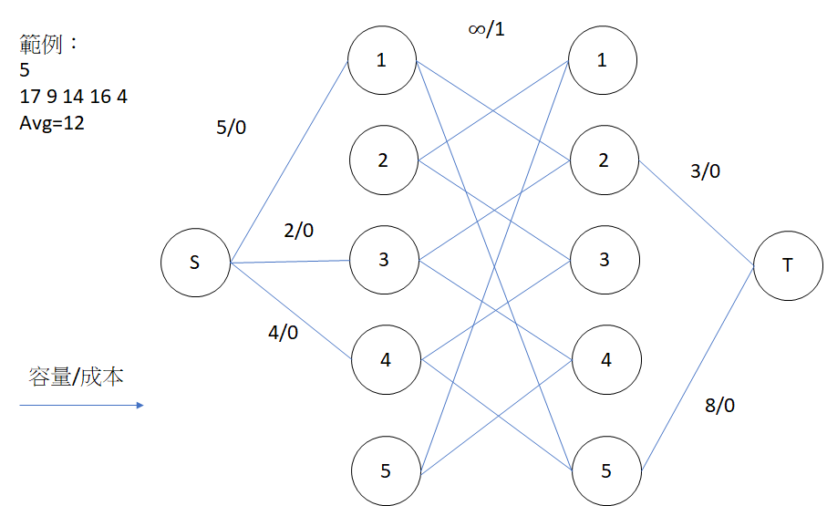
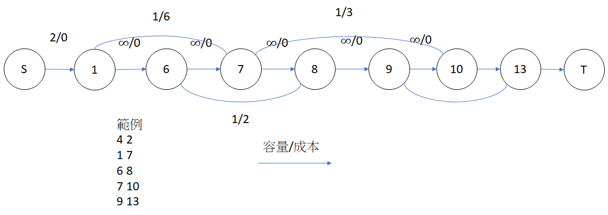

# 網路流

## 性質和例子

網路流的性質：有起點和終點，有流量限制。

例子：水流、網速、高速公路。

## 定義

給定一張圖 $G=(V,E)$，每條邊 $e(u,v)$ 有容量\ $C(u,v)$ 和流量 $F(u,v)$，剩餘流量 $R(u,v)=C(u,v)-F(u,v)$。

給定 $s$ 和匯點 $t$，我們稱網路流為「$s-t$ 網路流」，$s-t$ 網路流的流量 $|f|=$ 源點 $s$ 流出的流量和，$=$ 流進匯點 $t$ 的流量和。

???+ "$s-t$ 可行流"
    給定一個 $s-t$ 網路流，如果符合以下條件，稱為「$s-t$ 可行流」，也就是合法的 $s-t$ 網路流

    - 流量限制：$F(u,v)\leq C(u,v)$
    - 流量對稱：$F(u,v)=-F(v,u)$
    - 流量守衡
        - 非源點 $s$ 和匯點 $t$，流入的流量和等於流出的流量和 流入的流量和等於流出的流量和
        - 源點 $s$ 流出的流量和等於流進匯點 $t$ 的流量和

    

## 最大流演算法

如上文所述，一個 $s-t$ 可行流($s-t$ 網路流)的流量 $|f|=$ 源點 $s$ 流出的流量和，$=$ 流進匯點 $t$ 的流量和。在現實例子中，我們希望 $|f|$ 越大越好。

基本想法：重複尋找從 $s$ 到 $t$ 的路徑，計算這條路徑最大流量 $max_f$，$|f|+=max_f$，並將這條路徑所有邊扣除 $max_f$，無法找到一條路徑使 $|f|$ 增加就停止。



但這樣的演算法不一定能找到最大流量，如下圖的最大流量是 $2$，但只找到 $1$ 單位的流量。



為了解決這個問題，我們讓流量可以逆行，根據流量限制和流量對稱，一條邊 $e(u,v)$，反向邊 $e(v,u)$ 的容量 $C(v,u)=0$，流量 $F(v,u)=-F(u,v)$，所有剩餘流量 $>0$ 的邊形成的圖稱為剩餘網路 $G_r$。



藉由逆行的機制，選擇路徑 $1\to 3\to 4$，可以再找到 $1$ 單位的流量。



增廣路徑 (Augmenting Path)

- 假設 $f$ 是可行流，$G_r$ 是 $f$ 的剩餘網路
- $P$ 是$ G_r$ 在一條從 $s$ 到 $t$ 的路徑，稱為擴充路徑。
- $max_f=min_{e\in P}r(e)$
- 一條邊 $(u,v)$ 增加流量 $max_f$，代表
    - $F(u,v)+=max_f$
    - $r(u,v)-=max_f$
    - $F(v,u)-=max_f$
    - $r(v,u)+=max_f$

???+ "增廣路徑"
    假設 $G_r$ 是可行流中的剩餘網路，$P$ 是 $G_r$ 在一條從 $s$ 到 $t$ 的路徑，且每一條邊的剩餘流量 $>0$，稱為擴充路徑。

令 $max_f=min_{e(u,v)\in P}r(e(u,v))$ 為擴充路徑的瓶頸流量，也就是為可行流再找到 $max_f$ 的流量。假設 $e(u,v)$ 為 $P$ 上往匯點 $t$ 的邊。

- 所有前往匯點的邊流量加上 $max_f$: $F(u,v)+=max_f,r(u,v)-=max_f$
- 所有離開匯點的邊流量扣除 $max_f$: $F(v,u)-=max_f,r(v,u)+=max_f$

藉由加入反向邊機制和定義增廣路徑，找最大流的演算法雛形誕生：在剩餘網路上找到增廣路徑來擴充流量，直到剩餘網路沒有從 $s\to t$ 的路徑，即獲得最大流。

根據增廣路徑的找法，下列簡述三個演算法：

- Ford-fulkerson：利用 DFS 枚舉增廣路徑，如果流量為實數域無法保證程式會結束，流量為整數域時間複雜度為 $O(Ef)$。
- Edmonds-karp：利用最短路枚舉增廣路徑，時間複雜度 $O(VE^2)$
- Dinic：先做 BFS 將點分層(有向無環圖)，再用 DFS 遍歷搜尋增廣路徑，一次找到多條增廣路徑，時間複雜度為 $O(V^2E)$。

## Dinic 演算法實作

```cpp
--8<-- "docs/graph/code/dinic.cpp"
```

變數解釋

- $n,s,t$：點的個數，源點、匯點。
- $level[u]$：BFS 裡用來表示這次點 $u$ 是第幾層。
- $now[u]$：DFS 裡用來表示這次點 $u$ 是第幾層。
- $Edge$：有向邊，存放終點、剩餘流量，反向邊的編號。反向邊的編號用在 DFS 更新反向邊的剩餘流量。

新增邊

- 無向邊：拆成兩條方向相反，剩餘流量相同的有向邊。
- 有向邊：增加正向邊和反向邊。

BFS

- 設源點 $s$ 為第 $0$ 層。
- 將所有和 $s$ 相連且剩餘流量 $>0$ 的點設為第 $1$ 層。
- 將所有和第 $1$ 層的點相連且剩餘流量 $>0$ 的點設為第 $2$ 層。
- 以此類推，已經標記的點不會再標記第 $2$ 次。
- 如果匯點 $t$ 沒有被標記，代表已經找到最大流了。

DFS

- 依據 BFS 的分層標記，遍歷完所有滿足 $s\to$ 第 $1$ 層的點 $\to$ 第 $2$ 層的點 $\to ...\to t$ 的路徑。
- 在往下遞迴時計算瓶頸流量，往上時更新相關邊的剩餘流量。

## 二分圖最大匹配

設二分圖兩個集合為 $X,Y$，$X$ 集合的所有點和源點連接一條剩餘流量無限大的邊，$Y$ 集合的所有點和匯點連接一條剩餘流量無限大的邊，二分圖原本的邊剩餘流量設為 $1$，最大流即為二分圖最大匹配。

## DAG 的最小路徑覆蓋

???+ Question "DAG 的最小路徑覆蓋"
    給你一張 DAG，請問問最少要幾條路徑才能覆蓋所有點。

    分成不相交路徑和相交路徑。

    不相交路徑： $1\to 4\to 5,3,2$，共 $3$ 條。

    相交路徑： $1\to 4\to 5,3\to 4\to 2$，共 $2$ 條。
    
    

不相交路徑：將一個點拆成兩個點，分別代表指向別人的點和被別人指向的點。

一開始每個點都是獨立的路徑，總共有 $V$ 條，在二分圖上找到一條匹配邊，就等於把兩條路徑變成一條，路徑數 $-1$。答案為 $V-$ 最大匹配數。

相交路徑版本：先做一次 Floyd-warshall，如果 $x$ 可以藉由其他點抵達 $y$，建一條 $(x,y)$ 的邊。題目變成頂點不相交的最小路徑覆蓋。

以下圖為例，如果選定了 $3\to 4\to 2$ 作為第一條路徑，$1$ 可以在不經過 $4$ 的情況下連到 $5$。



## 最小(大)花費最大流

???+ Question "最小(大)花費最大流"
    每條邊除了流量以外還有單位價錢 $k$。對於每條邊，如果流了 $f$ 的流量就要付 $k\times f$ 的水道維護費，在最大流量的情況下，要讓花費最小(大)。

演算法和 Dinic 相似，改用最短路徑演算法找尋增廣路徑，因為要處裡負邊 (反向邊)，要使用 SPFA。如果要計算最大花費，在一開始把花費乘以 $-1$，算出結果後再乘以 $-1$。

```cpp
--8<-- "docs/graph/code/mcmf.cpp"
```

變數解釋

- $Edge$：有向邊，存放每條邊的兩端點、費用和剩餘流量。
- $n$：點的個數
- $pre[u]$：SPFA 中，紀錄 $u$ 是被哪個點鬆弛，也可以說是在最短路徑中，$u$ 的父節點。
- $dis[u],inque[u]$：SPFA 中，紀錄從源點 $s$ 流一單位到 $u$ 的最小(大)成本。
- $inque$：用於 SPFA。
- $ansFlow, ansCost$：紀錄最大流和最小(大)成本。

新增邊

- 和 Dinic 新增反向邊的想法類似，差別在於反向邊的成本是原本的成本乘以 $-1$。

SPFA

- 根據成本和流量鬆弛。
- 如果匯點 $t$ 的最小成本 $=\infty$，代表已經找到最小(大)花費最大流。

update

- 根據 $pre$，可以找到一條從匯點 $t$ 到源點 $s$ 的路徑，利用遞迴找到瓶頸流量，再更新最大流和最小(大)花費。

### 相關題目

???+ Question "LibreOJ 6013"
    有 $N$ 個環形倉庫，每個倉庫物品數量不等，貨物只能往相鄰的倉庫移動，問最少要搬運多少貨品讓每個倉庫物品數量相同?

算出 $N$ 間倉庫的平均貨物數 $avg=\Sigma a[i]/N$。

對於第 $i$ 間倉庫貨物數 $a[i]$，如果 $a[i]>avg$，建一條從 $S$ 到 $i$ 的容量 $a[i]-avg$ 花費為 $0$ 的邊，如果 $a[i]<avg$，建一條從 $i$ 到 $T$ 的容量 $avg-a[i]$ 花費為 $0$ 的邊。

為了防止從 $S$ 容出的容量直接跑到 $T$，將所有點拆成兩個點 $X_i,Y_i$，對於所有的 $X_i$，分別和 $Y_{i-1},Y_{i+1}$ 建立一條容量無限花費為 $1$ 的邊。

最大花費即為答案。



???+ Question "LibreOJ 6014"
    給定 $N$ 個區間 $[L_i,R_i]$，選定一些區間，如果集合內包含點 $x$ 的區間不超過 $K$ 個，稱為合法集合，問合法集合的最長長度和為多少。
因為 $L_i,R_i$ 的範圍過大，須將 $[L_i,R_i]$ 離散化，另外要去除重複元素，得到時間段 $T_1,T_2,...,T_M$。

建立一條源點 $s$ 到 $T_1$ 容量為 $K$ 花費為 $0$ 的邊，建立一條 $T_M$ 到匯點 $t$ 容量為 $K$ 花費為 $0$ 的邊，相鄰兩個時間段建立一條容量無限花費為 $0$ 的邊。

對於每個區間 $[L_i,R_i]$，建立一條從 $L_i$ 到 $R_i$ 容量為 $1$ 花費為 $R_i-L_i$ 的邊。

最大花費即為答案。



## 例題練習

- DAG 的最小路徑覆蓋
    - POJ 1422
    - POJ 2594
    - LibreOJ 6002
    - LibreOJ 6003