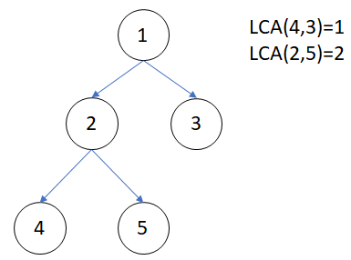
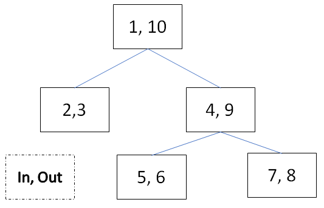

# 最低共同祖先 (Lowest Common Ancestor, LCA)

???+ Question "最低共同祖先"
    在有根樹上任意兩點 $u,v$ ，兩點祖先交集中，深度最深的一個點，稱為兩點的最低共同祖先 (Lowest Common Ancestor, LCA)。

    給定一顆有根樹 ($V$ 個點) 和 $Q$ 筆詢問，每筆詢問輸出兩點 $u,v$ 的最低共同祖先。

    - 
    
直觀的做法是利用 DFS 尋找兩點的 LCA，每次查詢時間複雜度為 $O(V)$，這種辦法就容易超過時間限制。

這裡介紹利用倍增法找尋任意兩點的最低共同祖先，這裡用轉態轉移式定義出定義 $par[i][j]$：

- 狀態： $par[v][i]$ 代表 $v$ 的第 $2^i$ 層祖先。
- 初始狀態： $par[v][0]=u$ , $u$ 為 $v$ 的父節點。
- 轉移： $par[v][i]=par[par[v][i-1]][i-1]$ 。

和一般的倍增法相同，將算法分成三個步驟。

第一步是 DFS，找出每個點的父節點，以及紀錄進入和離開的時間戳記。

- 

第二步用兩層迴圈算出 $par$ 剩餘答案。

最後根據 $par$，用二分搜找出 $u,v$ 兩點的最低共同祖先，由於任意兩點 $u,v$ 的共同祖先有單調性， $u$ 點的所有祖先，在 $LCA(u,v)$ （包含）之上的祖先是兩點的共同祖先，剩下的只是 $u$ 的祖先，因此可以用二分搜枚舉 $p$ 尋找 $LCA(u,v)$ ，在二分搜過程，時間戳記用於判斷 $p$ 是否為 $v$ 的祖先。
    
DFS 的時間複雜度為 $O(V+E)$，計算 $par$ 剩餘答案的時間複雜度為 $O(V\log V)$，每次查詢操作的時間複雜度為 $O(\log V)$，整題時間複雜度為 $O((Q+V)\log V)$。

```cpp
--8<-- "docs/graph/code/lca.cpp"
```

找出最低共同祖先的算法，可推廣到找尋 $(u,v)$ 路徑上的資訊，例如：路徑長度、最小（大）權重的邊。

假設 $w=LCA(u,v)$，把 $u$ 到 $v$ 的路徑 $p$ 可以拆成 $u\to w$ 和 $v\to w$。

## 例題練習

???+ Question "Atcoder Beginner Contest 209 D - Collision"
    給定一棵樹，請問 $u,v$ 需要移動偶數步還是奇數步?

練習樹上任兩點之間的距離，令 $dist[v]=$ 從 $1$ 到 $v$ 的距離，$u$ 到 $v$ 的距離 $=dist[u]+dist[v]-2*dist[LCA(u,v)]$。

??? "參考程式碼"

    ```cpp
    --8<-- "docs/graph/code/abc209D.cpp"
    ```

???+ Question "CodeForces 609E - Minimum spanning tree for each edge"
    給定一張無向圖 $G$，求包含邊 $(u,v)$ 的生成樹中，權重最小的生成樹為何?

先求出一顆最小生成樹 $G'$，權重和為 $W$，利用最低共同祖先求出節點 $mxLen[i][j]=$ 節點 $i$ 到第 $2^j$ 個節點的最大權重路徑，對於每一條邊 $(u,v)$，在 $G'$ 中找到從 $u$ 到 $v$ 的最大權重路徑 $maxW$。答案 $=W-maxW+w(u,v)$（如果 $(u,v)\in G'$，$maxW=w(u,v)$）。

???+ Question "UVa 11354 - Bond"
    給定一張無向帶權圖，有多筆詢問，詢問 $(u,v)$ 之間的路徑最大權重邊權值最小為何。
    也就是詢問最小瓶頸樹中， $(u,v)$ 之間的路徑最大邊重權為何。

這題要先利用 Krusal 求出最小瓶頸樹，接著利用 LCA 求出每個點 $u$ 到它的第 $2^i$ 層祖先的路徑中的最大邊重權。

??? "參考程式碼"

    ```cpp
    --8<-- "docs/graph/code/uva11354.cpp"
    ```

???+ Question "CodeForces 1328E - Tree Queries"
    給定一棵樹，$1$ 為樹根，每次詢問給定 $K$ 個點，有沒有一條路徑和這些點的距離 $\le 1$?

在 $K$ 個點中找出最深的點 $u$，對於每個點 $v$，判斷 $v$ 的父節點 $f$ 是否為 $u$ 的祖先。