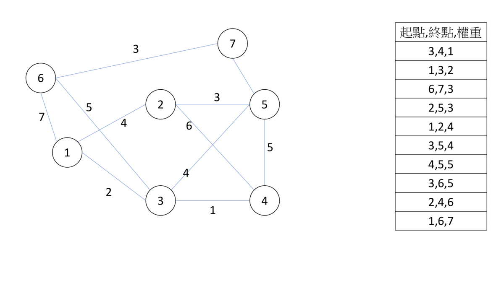

# 最小生成樹（Minimun Spanning Tree, MST)

在一張圖中，如果有子圖剛好為也為一顆樹，我們就稱該子圖為生成樹。現在我們在圖上加上權重，而在所有的生成樹中，權重總和最小的，我們稱為 "最小生成樹"，最小生成樹並不唯一，以下介紹幾種最小生成樹的演算法。

## Kruskal’s algorithm

Kruskal’s algorithm 的概念是，合併兩顆 MST 的時候，加入連接兩顆樹中，最小權重的邊。所以我們就利用 greedy，將邊依權重由小到大排序，如果邊的兩邊是在不同的 MST，我們就把合併（並查集應用於此），反之就跳過。

- 

排序需花 $O(E\log E)$ 的時間，選邊需要花 $O(E\alpha(V))$ 的時間，總共時間複雜度 $O(E(\log E+\alpha(V)))$ 

```cpp
--8<-- "docs/graph/code/kruskal.cpp"
```

## Prim’s algorithm

Prim’s algorithm 的思維則是，將一棵 MST 連出的邊中，加入權重最小的邊（距離最近的點），重複執行後得出最小的生成樹。在實作上，首先取一個點當 MST，更新所有與它相鄰的點，更新後把距離最小的點加入 MST（不用並查集），持續執行更新及加入點的動作，直到所有點都已加入 MST。維護最小距離用 priority_queue 維護，每個點只會被合併一次，每條邊都只會遍歷一次，複雜度 $O((V+E)logE)$ 。另外有一個資料結構用費波那契堆（fibonacci heap）可以達到 $O(E+V\log V)$ 。但是因為它常數比較大，實作複雜，我們不會使用它。總體而言，Kruskal 比 Prim 好用。

## Borůvka’s algorithm

Borůvka’s algorithm 和 Prim 一樣都在加入 MST 和最鄰近的點，不一樣的是，它讓所有的 MST 一起做這件事。每次找出每棵 MST 外權重最小的邊，並加入 MST（如果權重一樣，就找索引值最小的），檢查是否只剩一棵 MST，如果不是就重複掃描的動作，這裡一樣用並查集維護聯通性。\\最差的情況為每次都剛好兩兩成對合併，這樣最多只會執行 $\log V$ 次，整題複雜度為 $O((V+E)\log V)$ )。期望複雜度可以達到 $O((V+E))$ （因為每次並查集都會被合併 + 查詢，所以 $\alpha$ 可以完全省略）。

## 最小瓶頸樹

???+ Question "最小瓶頸樹"

    給定一張圖，求一顆生成樹，樹的最大邊權值最小。

最小生成樹必定是一顆最小瓶頸樹（但最小瓶頸樹不一定是一顆最小生成樹），因此求出最小生成樹即為答案。

## 例題練習

-  [UVa 12176 - Bring Your Own Horse](http://uva.onlinejudge.org/external/121/12176.pdf) 
-  [UVa 01234 - RACING](http://uva.onlinejudge.org/external/12/1234.pdf) 
-   最小瓶頸樹
    -  [UVa 01395 - Slim Span](https://onlinejudge.org/external/13/1395.pdf) 
