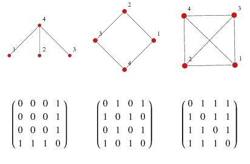
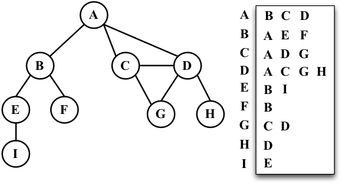

至於圖要怎麼存起來呢，以下介紹兩種辦法。

## 相鄰矩陣（Adjacency Matrix)

開一個 $V\times V$ 的資料結構 $M$ （通常會用二維陣列）， $M[a][b]$ 代表的是點 $a$ 至 $b$ 的邊數或權重。空間複雜度 $O(V^2)$ 。加、刪邊時間複雜度 $O(1)$ 。

- 

## 相鄰串列（Adjacency List)

開 $V$ 個可變長度的資料結構（通常在 C++ 用 `vector` 、在 C 用 `linked` list), 第 $i$ 個裡面放所有第 $i$ 個點指向的點的編號（和邊權或其他邊的資訊）。空間複雜度 $O(V+E)$ , 加邊時間複雜度 $O(1)$ 、刪邊時間複雜度 $O(V)$ 。

- 

## 使用時機

Adjacency Matrix 實作較簡單，在點數小的時，可以使用（大約在 $1000$ 左右）。其餘情況需使用 Adjacency List，否則會導致記憶體過大。
