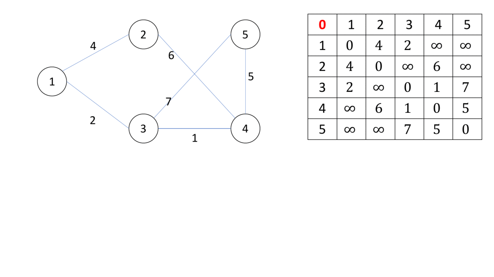
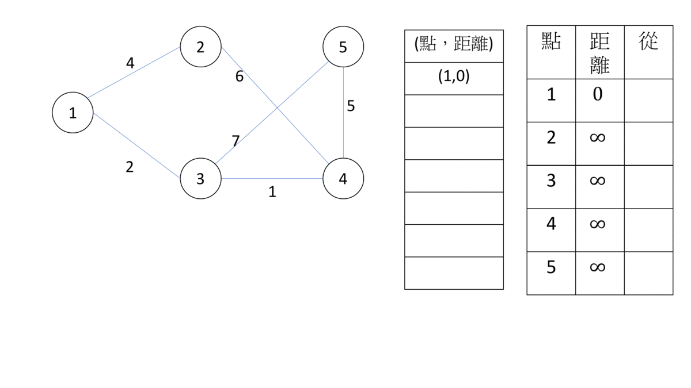

# 最短路徑

## 術語

- 負邊：權重為負的邊
- 負環：權重和為負的環
- 點源：成為起點的點，分成單源頭及多源頭。
- 鬆弛：單源頭最短路徑中，對於任意兩個點 $u,v$ ，起點 $s$ 到它們的距離 $d_u,d_v$ ，如果 $d_u>d_v+w_{u,v}$ ， $w_{u,v}$ 為邊 $(u,v)$ 的權重，我們可以讓 $d_u$ 更新為 $d_v+w_{u,v}$ ，讓 $s$ 到 $u$ 的距離縮短，這個動作稱為 "鬆弛"。

## Floyd-Warshall Algorithm

為多源頭最短路徑，求出所有點對的最短路徑。
Floyd-Warshall 是一種動態規劃問題，以下是他的 dp 式。

- 狀態： $dp[k][i][j]$ 代表，若只以點 $1 ∼ k$ 當中繼點的話， $i$ 到 $j$ 的最短路徑長。
- 轉移： $dp[k][i][j] = min(dp[k − 1][i][k] + dp[k − 1][k][j], dp[k − 1][i][j])$ 
-   基底：
    $$
    dp[0][i][j] = \left\{ \begin{array}{cc}w[i][j] & if\ w[i][j]\ exists\\INF & else\end{array} \right\}
    $$

- 

時/空間複雜度皆為 $O(V^3)$ ，利用滾動陣列技巧，空間複雜度可優化至 $O(V^2)$ 

```cpp
--8<-- "docs/graph/code/floydWarshall.cpp"
```

執行的時候如果 $dp[i][j]\leq 0$ ，代表存在負環，Floyd-Warshall 是可以判斷負環。

## 單點源最短路徑

求出一個點到所有點的最短路徑，其實就是以起點為根，最短路徑是由父節點鬆弛而來的最短路徑樹。我們找最短路徑，就是一直把鬆弛，直到所有點都不能鬆弛，所有點都獲得最短路徑了。要蓋出最短路徑樹，就只要把點指向最後一次被誰鬆弛就好了。

## Bellman-Ford Algorithm

為單點源最短路徑，設起點的最短路徑為 0，其他點為無限大，每次對所有邊枚舉，因為最短路徑不會經過同樣的邊第二次，所以只要執行 $V-1$ 輪，複雜度為 $O(VE)$ 。如果執行第 $V$ 次時還有邊可以鬆弛，代表有負環，Bellman-Ford 也可以當成負環的判斷方法。

```cpp
--8<-- "docs/graph/code/bellmanFord.cpp"
```

此演算法還有一個優化版本叫做 Shortest Path Faster Algorithm (SPFA)，他的做法是枚舉起點是鬆弛過的邊，以鬆弛過的點除非被重新鬆弛，否則不會更動。預期複雜度為 $O(V+E)$ ，不過最差狀況仍為 $O(VE)$ 。

```cpp
--8<-- "docs/graph/code/spfa.cpp"
```

## Dijkstra’s Algorithm

同樣為單點源最短路徑，他的想法和 Prim's Algorithm 類似，每次把離樹根最近的點加入最短路徑樹裡，並把所有與該點相連的邊鬆弛，已經加入的點不會在被鬆弛。

- 

使用 `priority_queue` 的複雜度為 $O((V+E)\log E)$ ，使用費波那契堆，複雜度為 $O(E+V\log V)$ 

```cpp
--8<-- "docs/graph/code/dijkstra.cpp"
```

而 Dijkstra’s Algorithm 不能處理負邊，原因是一旦點加入最短路徑樹，就不會再被更新，以維持良好複雜度，負邊會破壞此規則。

## 整理

| 演算法   | Floyd-Warshall | Bellman-Ford | SPFA            | Dijkstra                           |
| ----- | -------------- | ------------ | --------------- | ---------------------------------- |
| 點源    | 多點源            | 單點源          | 單點源             | 單點源                                |
| 時間複雜度 |  $O(V^3)$      |  $O(VE)$     | 期望複雜度 $O(V+E)$  | 使用 priority_queue $O((V+E)\log E)$  |
| 判斷負環  | O              | O            | O               | X                                  |
| 處理負邊  | O              | O            | O               | X                                  |

- 如果 $V\le 1000$，可以直接使用 Floyd，有時候需要計算許多點對的距離。
- 沒有負邊且起點固定(單點源)的問題使用 Dijkstra。
- 其他狀況使用 Bellmam Ford / SPFA。

## 例題練習

-   全點源
    -  [UVa 10803 - Thunder Mountain](http://uva.onlinejudge.org/external/108/10803.pdf) 
    -  [UVa 10724 - Road Construction](https://onlinejudge.org/external/107/10724.pdf) 
-   單點源
    -  [UVa 10917 - A Walk Through the Forest](https://onlinejudge.org/external/109/10917.pdf) 
-   判斷負環
    -  [UVa 00558 - Wormholes](https://onlinejudge.org/external/5/558.pdf) 

???+ Question "UVa 12519 - The Farnsworth Parabox"
    在多重宇宙中旅行，有 $M$ 條路線，第 $i$ 條路線可以從宇宙 $A_i$ 到 $y_i$ 年後的宇宙 $B_i$，也可以從宇宙 $B_i$ 到 $y_i$ 年前的宇宙 $A_i$，問有沒有一種走法可以到同一個宇宙的未來?

如果可以有一種方法可以到同一個宇宙的未來，反過來走可以到同一個宇宙的過去，將 $y_i$ 當成邊的權重，這題變成判斷有沒有負環。

???+ Question "AtCoder Beginner Contest 061D - Score Attack"
    給定一張有向圖，求 $1$ 走到 $N$ 的路徑中，權重和最大為何，如果為無限大，請輸出 `inf`。

把所有權重乘上 $-1$，就變成了求最短路徑，和判斷是否有負環。找到負環，還要判斷負環是不是對終點有影響，如果不影響終點，答案就不是 `inf`。

???+ Question "UVa 534 - Frogger"
    給定 $N$ 顆石頭的位置，假設一條路徑 $P=p_1,p_2,p_3,...$ 的 cost $=max(distance(p_i,p_{i+1}))$，請問 $1$ 號石頭到 $2$ 號石頭路徑 cost 最小為何?

這題可以修改 Floyd-Warshall 算法，定義 $dis[i][j]$ 為從 $i$ 號石頭到 $j$ 號石頭路徑 cost 最小值。

???+ Question "AtCoder Beginner Contest 243E - Edge Deletion"
    給定一張圖，問最多可以移除幾條邊，滿足：1. 原圖是連通圖 2. 任兩點最短距離不變

先用 Floyd-Warshall 計算任兩點之間距離，枚舉每一條邊 $i,j,w$，如果找到一個 $k(i,j\neq k)$ $dis[i][k]+dis[k][j]<=w$ 的情況，那麼這條邊可以移除。

