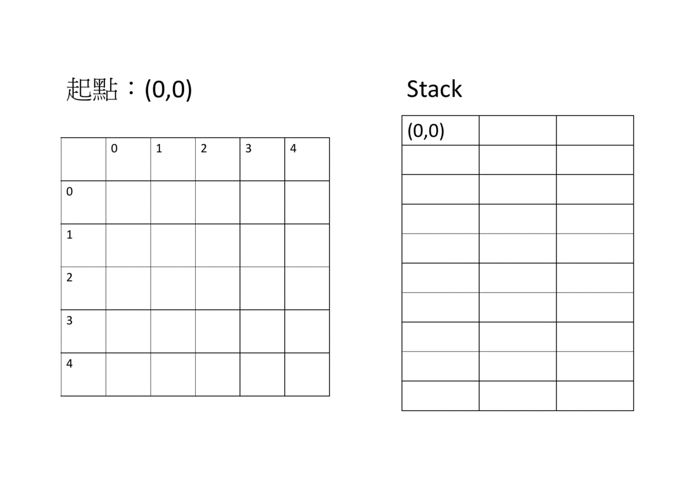
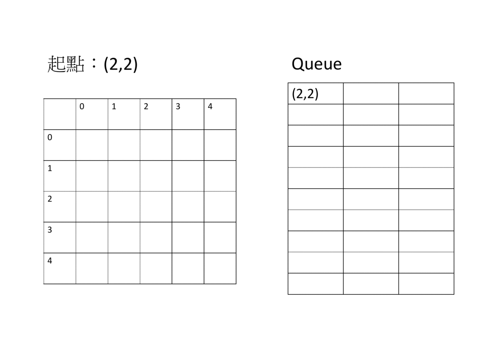
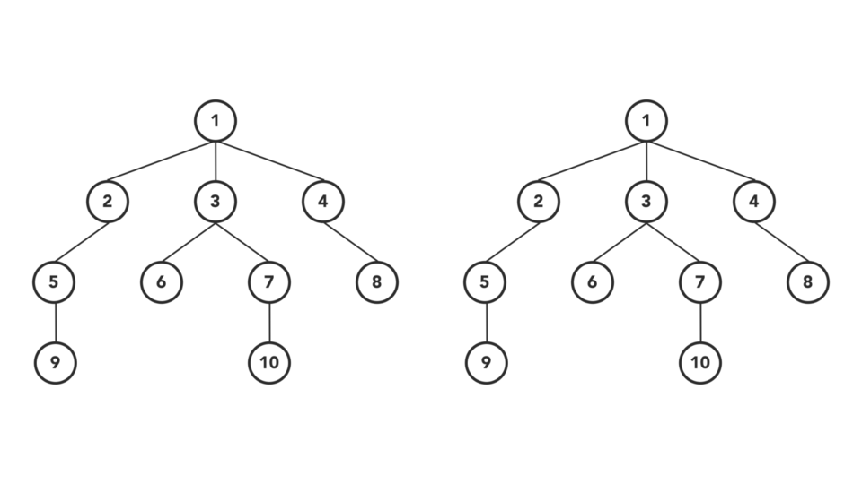

## 樹的遍歷

存好圖後，為了獲得某些資訊，需要遍歷或搜索圖。

- 虛擬碼

```txt
(1) 把起點放入「資料結構」中
(2) 當「資料結構」還有資料時，執行第 (3)，否則離開程式
(3) 從「資料結構」拿一個點出來，設該點為 u
(4) 並所有和 u 相連並沒拜訪過的點加入「資料結構」
(5) 回到 (2)
```

根據優先順序不同，有兩種做法

-   深度優先搜尋 (Depth First Search, DFS)：每次都嘗試往更深點走。
    - 
    - 
-   廣度優先搜尋 (Breadth First Search, BFS)：先把同一層的點（相同距離）走完，在走下一層。
    - 
    - 


-   DFS v.s. BFS
    - 

-   選用資料結構
    - DFS：越早「資料結構」加入的點會越後面拿出來，因此要用 `stack` 。
    - BFS：越早「資料結構」加入的點會越前面拿出來，因此要用 `queue` 。

## 範例程式碼

- DFS

```cpp
vector<int> G[N];
bitset<N> vis;
void dfs(int s) {
  vis[s] = 1;
  for (int t : G[s]) {
    if (!vis[i])
      dfs(i);
  }
}
```

- BFS

```cpp
vector<int> G[N];
bitset<N> vis;
void bfs(int s) {
  queue<int> q;
  q.push(s);
  vis[s] = 1;
  while (!q.empty()) {
    int v = q.front();
    q.pop();
    for (int t : G[v]) {
      if (!vis[t]) {
        q.push(t);
        vis[t] = 1;
      }
    }
  }
}
```

## 時間戳記 (Time stamp)

在 DFS 過程，可以記錄每個點進入和離開的順序，時間戳記可表示兩點的先後關係，通常用在以下地方：

- 最低共同祖先
- 樹壓平
- 有向圖的強連通元件

```cpp
int tin[N], tout[N];
int timer = 0;

void dfs(int v, int p){
    tin[v] = ++timer;
    for(int it: G[v]){
        if(it != p)dfs(it, v);
    }
    tout[v] = ++timer;
}
```

## 例題練習

-  [UVa 00572 - Oil Deposits](http://uva.onlinejudge.org/external/5/572.pdf) 
-  [UVa 11624 - Fire!](http://uva.onlinejudge.org/external/116/11624.pdf) 
-  [UVa 11953 - Battleships](http://uva.onlinejudge.org/external/119/11953.pdf) 
-  [Codeforces 598D - Igor In the Museum](https://codeforces.com/problemset/problem/598/D) 
