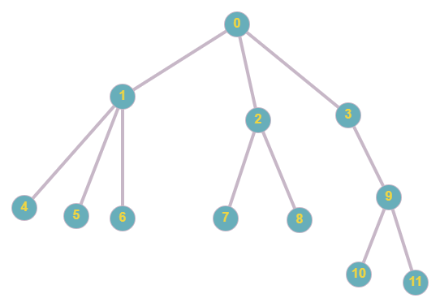
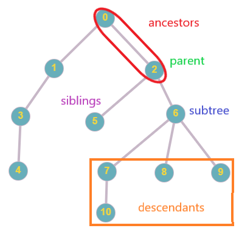
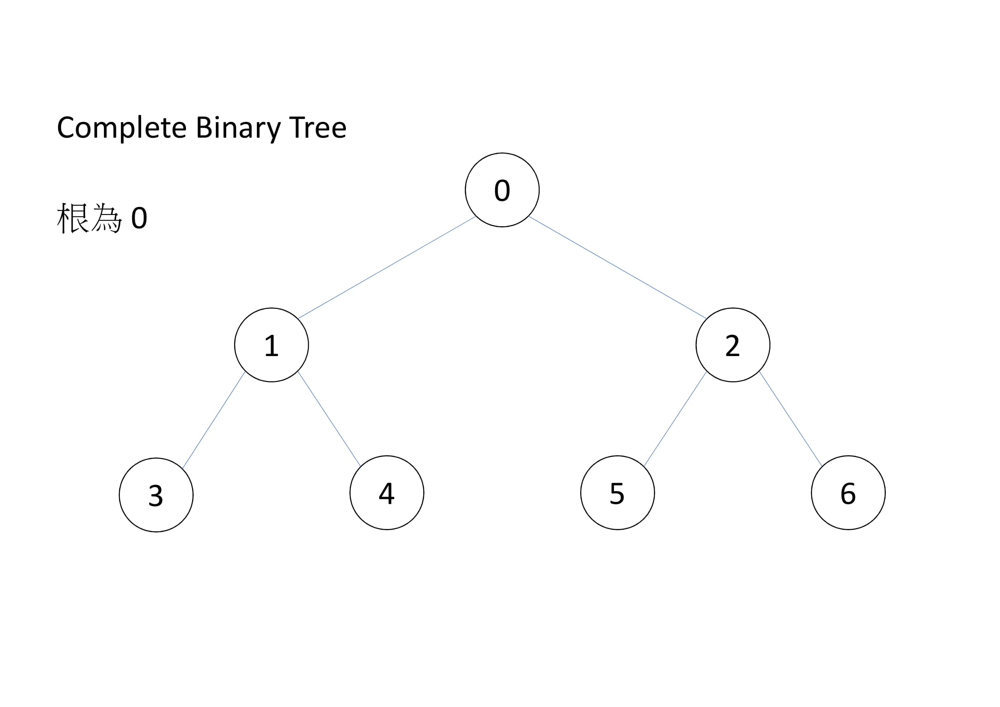
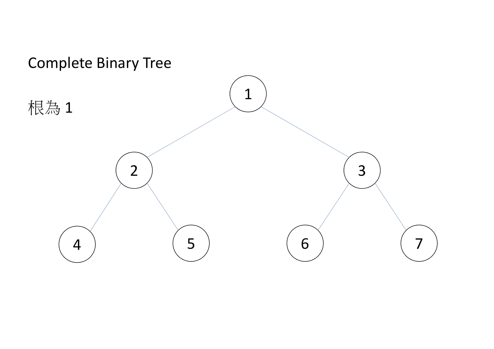

# 樹 (Tree)

樹是一張沒有環且連通的圖，有許多算法都是由樹發展出來。

## 特性

-  $|V|=|E|+1$ 。
-   沒有環，但加上一條邊會形成環。
    - 任意兩個點之間存在唯一路徑。
- 為連通圖，但拔掉一條邊即為不連通。
- 

## 術語

- 根 (root)：樹的一個代表性的點，通常會被當遍歷的起點，有給定根點的樹叫 有根樹，反之為無根樹。無根樹有時依照題目需求，需要隨機找一個點當根。

- 葉節點 (leaf)：度數 $\leq 1$ 的節點。

- 距離 (distance)：為兩個點所形成路徑之邊數，或是路徑上權重之和。

* * *

- 父節點 (parent)、子節點 (child：有根樹中，兩個相連的節點，較接近樹根的為父節點，另一個為子節點。

- 祖先 (ancestor)、子孫 (descandent)：有根樹中，節點到根結點中，所有的節點皆為祖先。反過來說，該節點是他的祖先的子孫。依題目所需，有時自己也是自己的祖先（尤其是根最常這樣定義）。

- 兄弟 (siblings)：相同父親的節點。

- 後代 (descendant)：子孫與子孫的後代。

- 

* * *

- 深度 (depth)：有根樹中，節點到根結點之距離。

- 高度 (height)：有根樹中，節點到與它距離最大的葉節點的距離稱為高度。根的高度稱為這整顆樹的高度。

* * *

- 子樹 (subtree)：如果 $T_1$ 為 $T$ 的子樹，則 $V_1\in V$ ， $E_1\in E$ 。

- 森林 (Forest)：由無數個互不連通的樹所形的圖為森林。

## 二元樹

-  $N$ 元樹：每個節點最多有 $N$ 個節點，稱為 $N$ 元樹。

- 最常見是二元樹，二元樹兩個子節點分別稱為左子節點 (left node) 及右子節點 (right node)，請見資料結構的 [二元搜尋樹](/dataStructure/bst) 和 [推](/dataStructure/heap) 。

-   特殊二元樹
    - Full Binary Tree：除葉節點外，每個節點都有兩個子節點。
    - Complete Binary Tree：每層節點全滿，除了最後一層，最後一層節點靠左。
    - Perfect Binary Tree：每層節點全滿，perfect binary tree 也是 full binary tree 和 complete binary tree。

## 儲存

### 紀錄子節點

最常遇到的情況。用 Adjacency Matrix 或 Adjacency List。

### 紀錄父節點

```cpp
int par[MXV];
```

### 儲存二元樹

紀錄左子節點和右子節點

```cpp
int Lc[MXV], Rc[MXV];
// or
int chlid[MXV][2];
```

### Complete Binary Tree

- 根據 Complete Binary Tree，可以開一個陣列，從上到下，從左到右依序編號。
-   子節點
    - 根節點可為 $0$ 或 $1$ 
    -   根為 $0$ ，左子節點是 $2x+1$ ，右子節點是 $2x+2$ 
        - 
    -   根為 $1$ ，左子節點是 $2x$ ，右子節點是 $2x+1$ 
        - 

### 利用指標儲存的樹

以下為常見用指標儲存的樹，這裡不提如何實作。
。- 二元搜尋（平衡）樹

    - 樹的旋轉

-   線段樹及相關可支援區間查詢的樹
    - 區間刪除
    - 區間搬移
