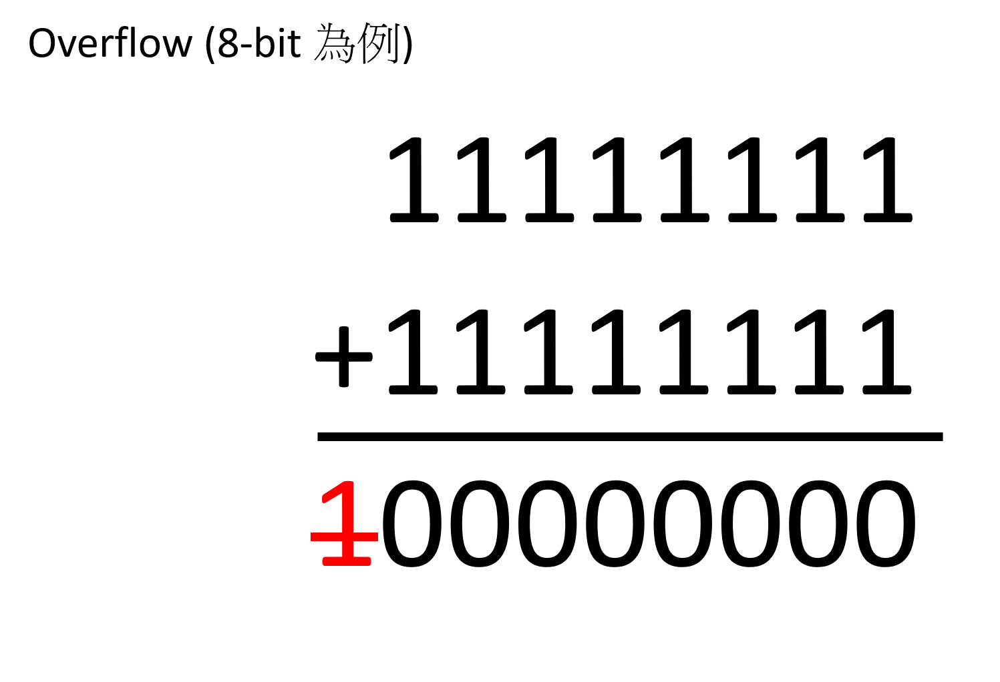
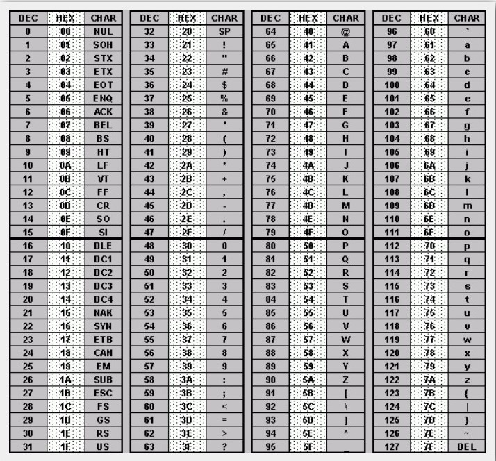

# 基礎資料型態型別

## 儲存資料

電腦是以二進位儲存資料，二進位是指數字是由 $0,1$ 組成，相較於常見的十進位是由 $0~9$ 組成，一個 $0$ 或 $1$ 稱為位元 (bit)，8 bits 稱為 byte（位元組），byte 是電腦基本儲存單位，下表為各種常見電腦儲存單位。

| 單位  | 備註         |
| --- | ---------- |
| 1B  | 1 byte     |
| 1KB | 1024 bytes |
| 1MB | 1024 KBs   |
| 1GB | 1024 MBs   |

在 C/C++ 裡，將所有的基礎資料型態分成四類說明，依序是整數、浮點數、字元、布林值。

## 整數

整數分成兩個部分，最左邊的位元表示正負號（ $0$ : 正， $1$ : 負），其餘表示數字。
通常會以 int 作為整數型態，int 兼顧範圍大小和記憶體大小。如果存的數字保證不會用到負數的話，可以在前面加上 unsigned，這樣最左邊的位元也會用來表示數字。

### 溢位

上表有給出每種型態的範圍。假設兩個相同型態加總後超過範圍，那麼最高位（最左邊）進位後會被捨去，造成結果和正確值不同，這個狀況稱之為溢位。

```cpp
#include <cstdio>

int main() {
  int a = 1000000000, b = 2000000000;
  printf("%d\n", a + b);
}
/*
-1294967296
*/
```
  


| 名稱                 | 別稱                              | 位元組   | 範圍                                                            |
| ------------------ | ------------------------------- | ----- | ------------------------------------------------------------- |
| short              | short int, signed short int     |  $2$  |  $–32,768$ to $32,767$                                        |
| unsigned short     | unsigned short int              |  $2$  |  $0$ to $65,535$                                              |
| int                | signed, signed int              |  $4$  |  $–2,147,483,648$ to $2,147,483,647$                          |
| unsigned int       | unsigned                        |  $4$  |  $0$ to $4,294,967,295$                                       |
| long long          | long long int, signed long long |  $8$  |  $–9,223,372,036,854,775,808$ to $9,223,372,036,854,775,807$  |
| unsigned long long | unsigned long long int          |  $8$  |  $0$ to $18,446,744,073,709,551,615$                          |

## 浮點數


浮點數分成 $3$ 個部分，sign bit（符號）：用來表示正負號、exponent（指數）：用來表示次方數、mantissa（尾數）：用來表示精確度。

| 名稱     | 別稱          | 位元組 | 範圍           | 精度        |
| ------ | ----------- | --- | ------------ | --------- |
| float  | 無           | 4   | 3.4E +/- 38  | 7 digits  |
| double | long double | 8   | 1.7E +/- 308 | 15 digits |

浮點數儲存也會有限制，如果小數點後個位數過多，會被捨去造成誤差，float 保證以 10 進位表示時，小數點後 7 位內會是正確，double 則是 15 位。

## 字元

C/C++ 採用 ASCII 字元集，一個數字對應一個字母，但這份字元集只有英文字母、數字、常見的符號，其他國家的文字則無。



| 名稱            | 別稱 | 位元組 | 範圍          |
| ------------- | -- | --- | ----------- |
| char          | 無  | 1   | -128 to 127 |
| unsigned char | 無  | 1   | 0 to 255    |
| wchar         | 無  | 2   | 0 to 65,535 |

## 布林值（C++)

布林值只有兩種植 Ture (1 或是說 非 0)、False (0)，當作邏輯變數，相較利用整數型態，有兩個有優勢，一個是節省記憶體，二是可以明確表示是用來記錄 True/False 狀態。

| 名稱   | 別稱 | 位元組 | 範圍     |
| ---- | -- | --- | ------ |
| bool | 無  | 1   | 0 to 1 |

## 後記

還有一個型態 enum，這裡先不提。

| 名稱   | 別稱 | 位元組    | 範圍  |
| ---- | -- | ------ | --- |
| enum | 無  | varies | TBA |
