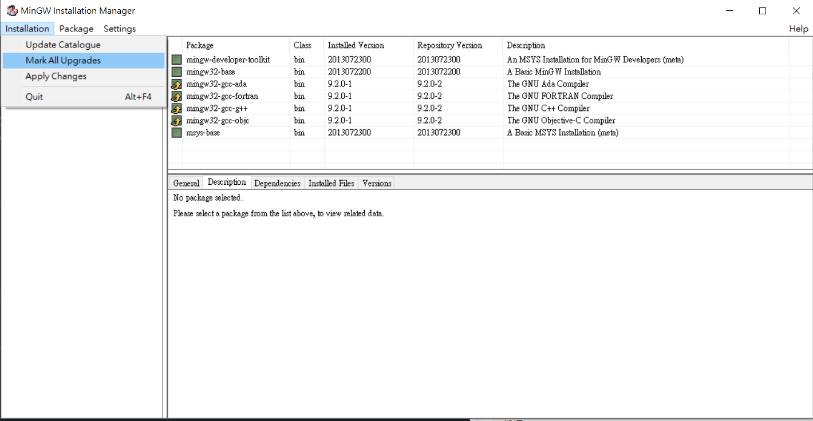
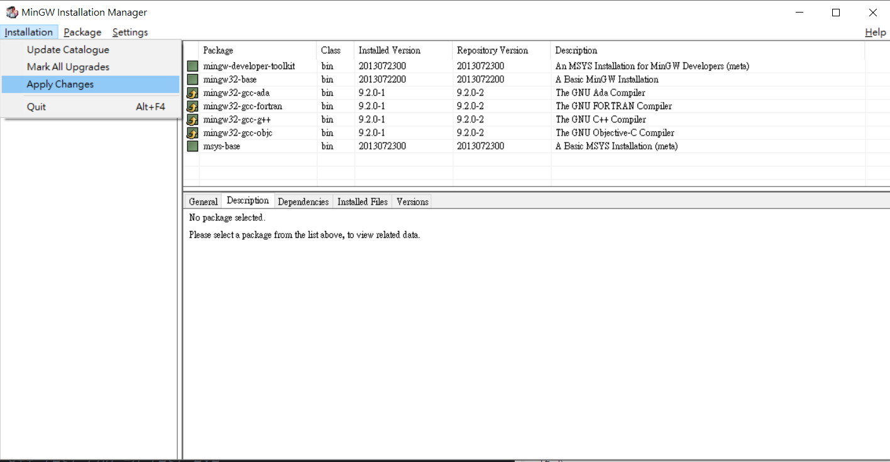
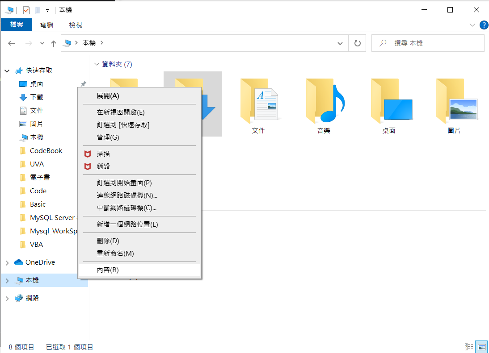
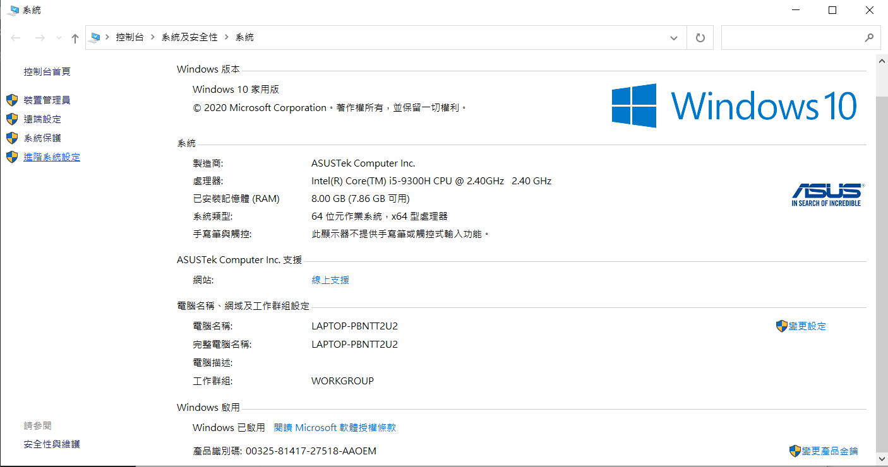
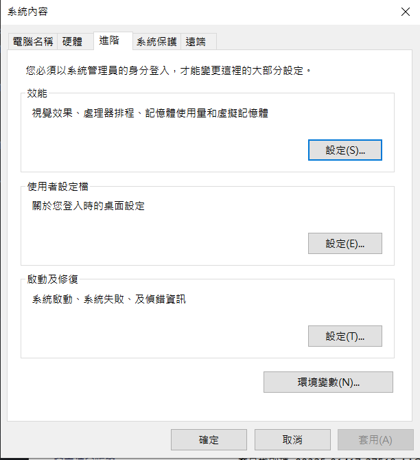
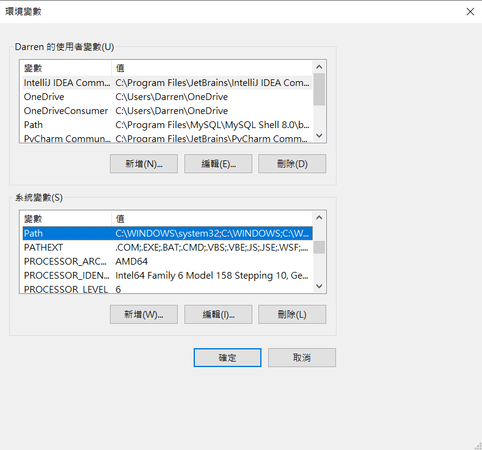
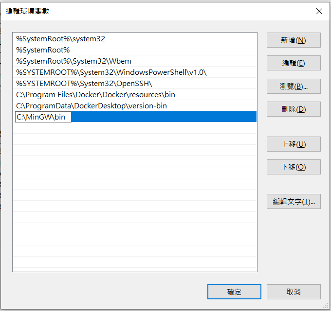
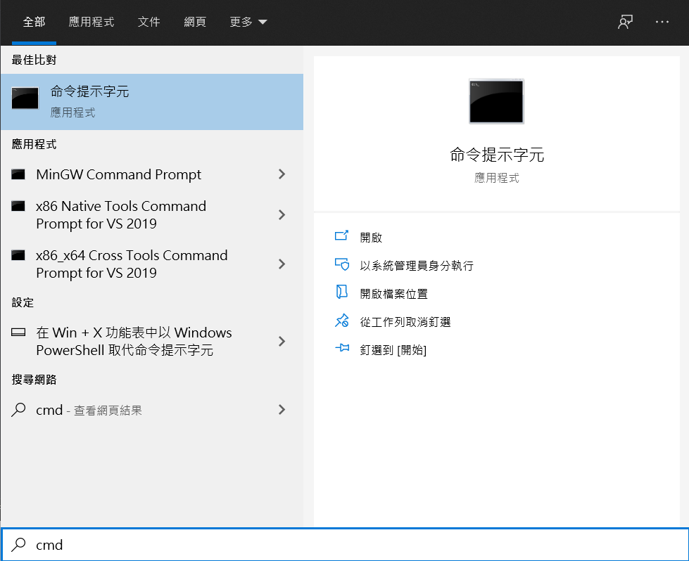
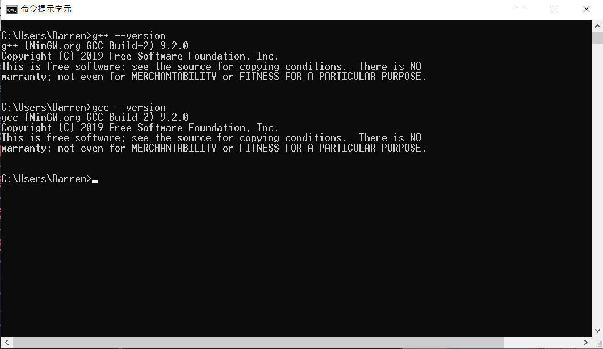
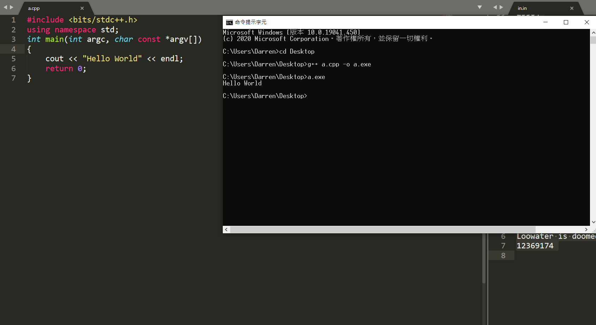

# 命令列 (Command Line)

## MinGW

 **要在電腦編譯 C 或 C++ 的檔案需安裝 MinGW** 

- 載點： <https://sourceforge.net/projects/mingw/> 

-   其他設定都不用改，直到這邊選 Mark All Upgrade
    - 

-   再選 Apply Change
    - 

## 設定環境變數：

-   對本機點右鍵選內容
    - 
-   進階系統設定
    - 
-   環境變數
    - 
-   點開系統變數中的 PATH
    - 
-   新增 `C:\MinGW\bin` （預設在這個 path 下）
    - 
-   打開 cmd
    - 
-   輸入 `gcc --version` （或 `g++ --version` ) 檢查是否安裝成功
    - 

## 格式

- C: `gcc*.c -o*.exe` 
- C++: `g++*.cpp -o*.exe` 
- Note: `-o` 是讓自己可以選擇 exe 檔要叫什麼名字，不然預設都會為 `a.exe` 

## 範例

前提： `a.cpp` 存在桌面

- 打開 cmd
- 到 `a.cpp` 檔案路徑： `cd C:\\Users\\User_name\\Desktop` （若存在桌面通常打開 cmd，可以直接 `cd Desktop` )
- 編譯： `g++ a.cpp -o a.exe` 
-   執行： `a.exe` 
    - 
- 輸入和輸出： `a.exe&lt;in.in> out.out` 
