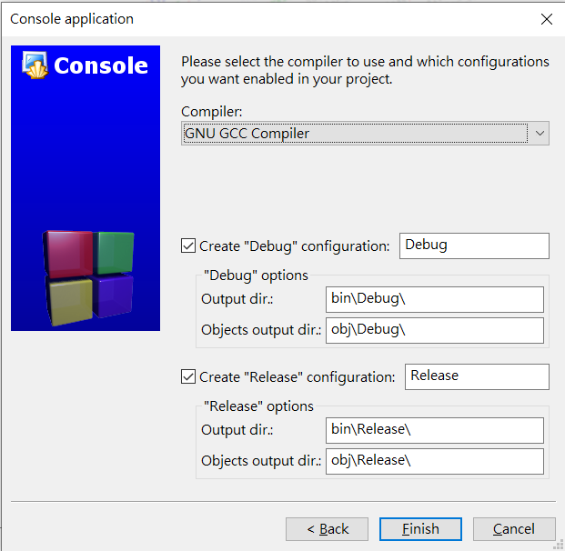

# Code::Blocks

- 載點： <http://www.codeblocks.org/downloads> 

## 建 c/cpp 檔

-   Create a new project
    - 
-   Console application
    - 
-   Select C/C++
    - 
-   輸入 Project title, 選想放的路徑
    - 
-   Finished
    - 
-   點開 Sources, 即可找到 c/cpp 檔
    - 
-   在剛剛選擇存放的路徑也可以找到 Project Folder
    - 

## 常用熱鍵

|     指令     |           功能           |
| :--------: | :--------------------: |
|  Ctrl + F9 |           編譯           |
| Ctrl + F10 |       運行上次成功編譯的檔案      |
|     F9     | 編譯並執行檔案（如有 Error 則會報錯） |
| Shift + F2 |       關閉/開啟左側資訊欄       |
