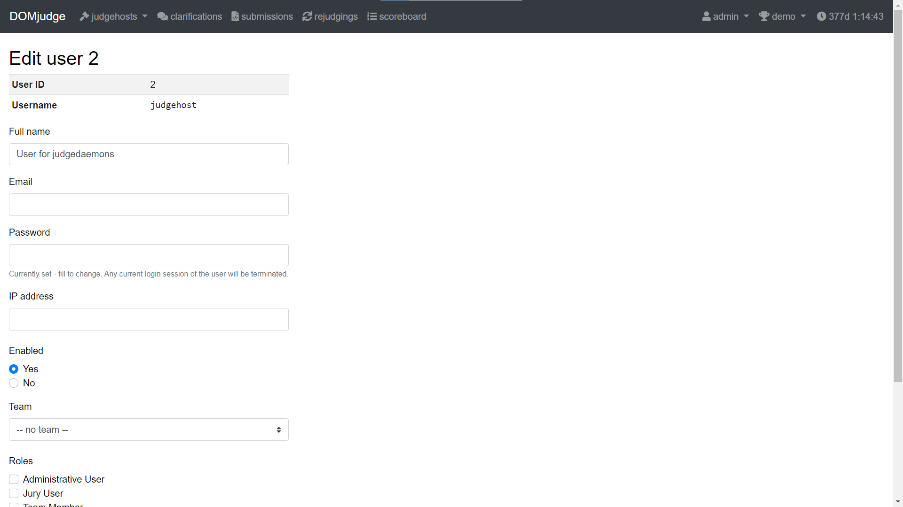
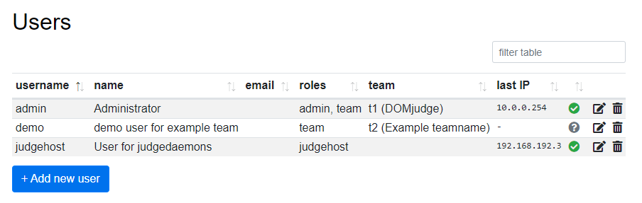
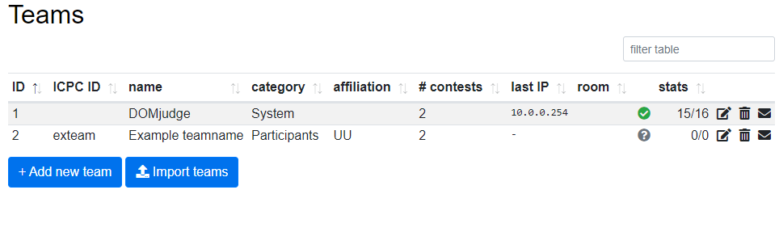
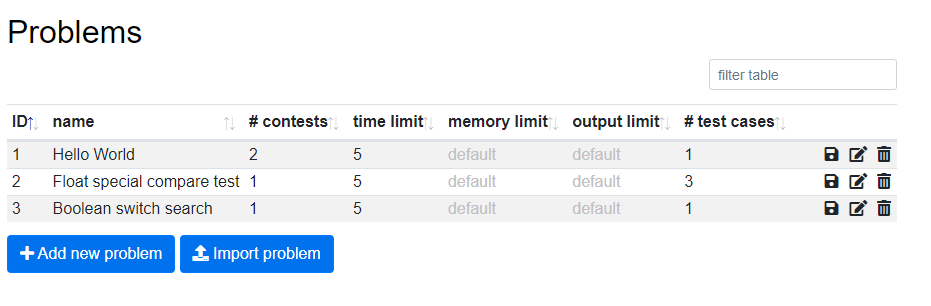
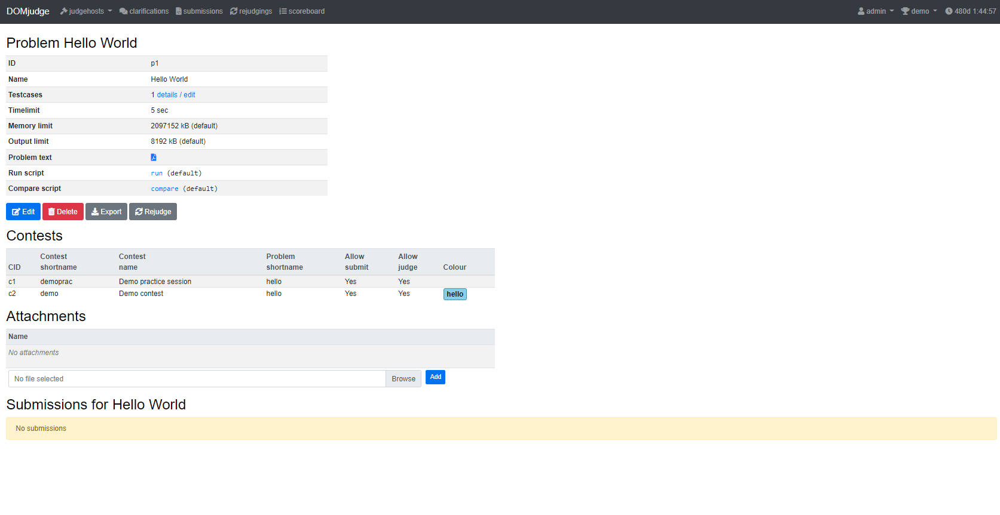
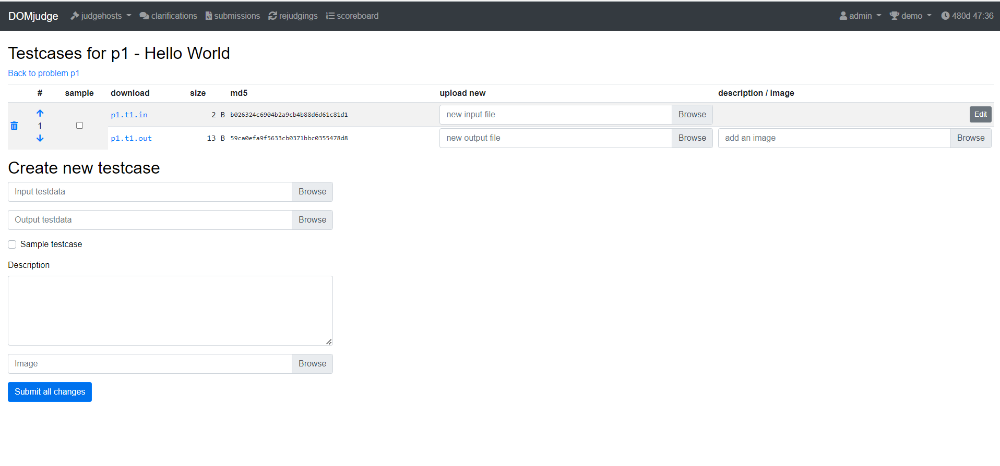

# Domjudge Admin

## 啟動 server

???+ 環境
    請先確認有安裝 docker 和 docker-compose

* `generate.py` 生成 `docker-compose.yml`，`-j` 調整 `Judgehost` 的數量（預設為 $1$）。

```
git clone https://github.com/FjuOnlineJudge/domjudge-setup
cd domjudge-setup/
python generate.py -j {number of judgehost}
sudo docker-compose up -d
```

* 檢查是否成功開啟，這時候 `domjudge/judgehost:latest` 開啟失敗是正確的

```
> sudo docker ps -a
CONTAINER ID   IMAGE                       COMMAND                  CREATED             STATUS                     PORTS                                         NAMES
73d206ecc5f8   domjudge/judgehost:latest   "/usr/bin/dumb-init …"   7 seconds ago       Exited (1) 5 seconds ago                                                 judgedaemon-0
bd34e340e120   domjudge/domserver:latest   "/scripts/start.sh"      About an hour ago   Up 6 seconds               0.0.0.0:80->80/tcp, :::80->80/tcp             domserver
09962ae62b21   mariadb                     "docker-entrypoint.s…"   About an hour ago   Up 6 seconds               0.0.0.0:13306->3306/tcp, :::13306->3306/tcp   dj-mariadb
```

* 取得 `admin` 密碼

```
sudo docker exec -it domserver cat /opt/domjudge/domserver/etc/initial_admin_password.secret
```

* 登入 domjudge，可看到 `jury` 頁面。

### 設定 judgehost

* 這時候 `.docker-compose.yml` 中的 judgehost 密碼和 domjudge 的 judgehost 密碼不同，必須一致 judgehost container 才會正確啟動。到 `jury` 頁面點擊 `Users` 進入帳號管理頁面，編輯 `judgehost` 的帳號，將密碼改成 `.docker-compose.yml` 中的 judgehost 密碼。



* 重啟 judgehost，在 `jury` 頁面點擊 `Judgehosts` 進入 judgehost 管理頁面，可以看到 judgehost 正常開啟（status 為綠色勾勾）。

```
sudo docker-compose up -d
```

## 管理帳號

在 jury 介面有 `Users` 和 `Teams` 兩個選項，`Users` 是登入的帳號，`Teams` 是提交 submission 的隊伍。

### 新增帳號

在 `jury` 頁面點擊 `Users` 進入帳號管理頁面，點擊 `Add new user` 按鈕進入新增帳號頁面，主要欄位說明如下：



- Username：登入帳號。
- Full name：名稱，只有管理員看的到，用來識別帳號持有人。
- Email：電子郵件。
- Password：登入密碼。
- IP address：限定登入 IP（不確定）。
- Enabled：使否啟用帳號。
- Team：帳號對應的 Team。
- Roles：帳號權限，一個帳號可以有多個 Role。
    - Administrative User：管理所有權限，除了不能提交 Submission。
    - Jury User：管理 Submission。
    - Team Member：提交 Submission。

在 `jury` 頁面點擊 `Teams` 進入隊伍管理頁面，點擊 `Add new team` 按鈕進入新增帳號頁面，主要欄位說明如下：



- Team name：隊伍名稱
- Category：隊伍類別，一般如果沒特別需求，設成 `Participants` 即可。
- Enabled：是否啟用隊伍。
- Add user to this team：team 對應的帳號。

### 匯入 `.tsv` 檔

需要一次新增大量 `user` 和 `teams`，可以將資料整理成 `.tsv` 檔 [^1] [^2]，在 `jury` 頁面點擊 `Import / export` 進入匯入匯出頁面，找到 `Teams & groups` 區塊匯入 `.tsv` 檔，先匯入 `teams.tsv`，再匯入 `accounts.tsv`。

* `teams.tsv` 格式
```
teams    1
team number    external_ID    group_id    team_name    institution_name    institution_short_name    country_code
```

* `accounts.tsv` 格式
```
accounts	1
account_type	fullname	username	password
```
    * 如果設 Role 為 `team` 的帳號，其 `username` 為 `team-{tid}`， 那麼系統會自動連結 ID 為 `tid` 的 `team`，因此採用上傳 `.tsv` 檔方式新增帳號，會先上傳 `teams.tsv` 再上傳 `accounts.tsv`。

### 開放自行註冊

在 `jury` 頁面點擊 `Team Categories` 進入隊伍類別管理頁面，可調整隊伍分類，隊伍有一個屬性為 `Allow self-registration`，設成 `Yes` 可開放給使用者自行註冊用。

## 管理比賽

在 `jury` 頁面點擊 `Contests` 進入比賽管理頁面，可以看到目前進行比賽狀態，以及所有比賽總覽，點擊 `Add new contest` 按鈕進入新增帳號頁面，主要欄位說明如下：

- Shortname：比賽縮寫，用於右上角的切換選單。
- Name：比賽名稱。
- Activate time：比賽可以被 `team` 看見的時間，要早於 jury submission 提交的時間。
- Start time、End time：比賽開始的時間。
- Scoreboard freeze time、Scoreboard unfreeze time：記分板停止更新和解除停止更新的時間，非必填。
- Deactivate time：比賽隱藏的時間，非必填。
- Enable public scoreboard：是否要公開記分板，要是不想要在準備的時候(例如測試賽)被知道題目內容，選擇 `No`。
- Enable contest：使否啟用比賽，當不起用的時候，所有 `team` 無法看到比賽，judgeing 也會停止。
- 題目列表：按列表右邊的 `+`，主要欄位如下：
    - Problem：新增已有題目。
    - Short name：題目縮寫。
    - Colour：題目代表顏色，非必填。

## 管理題目

有兩種辦法，手動輸入和匯入壓縮檔，兩種方式可交互使用。



### 手動輸入

在 `jury` 頁面點擊 `Problems` 進入題目管理頁面，點選 `Add new problem` 進入新增題目頁面，主要欄位說明如下：

- Name：題目名稱。
- Timelimit：程式執行時間限制。
- Memlimit：程式執行記憶體限制。
- Outputlimit：輸出大小限制。
- Problem text：題目說明檔(pdf,html,txt)。
- Run script：（編譯和）執行程式碼的腳本。
- Compare script：判斷輸出是否正確的腳本，需要 Special Judge 要自己寫腳本。
- Compare script arguments：Compare script 的參數 [^4]。
    - `float_tolerance E`：容許跟答案相差 $\le E$，$E$ 是合法的浮點數表示，例如：$0.1248,1e-5$。
    - `case_sensitive`：大小寫要一致，Domjudge 是寬鬆比對，預設輸出大寫或小寫不會影響答案。
    - `space_change_sensitive`：空格數量要一致，Domjudge 是寬鬆比對，預設是多或少輸出空白無異。

設定好題目，會轉移到題目資訊頁，會顯示題目設定、被哪些比賽使用、相關附件以及提交紀錄。



點擊 `Testcases` 欄位的 `details / edit` 頁面進入上傳測資頁面。



每次可以選擇新增一筆測資或更新現有測資，測資有五種屬性：輸入檔、輸出檔、是否為範例測資、描述、圖片。選擇好要更新的檔案後，點擊 `Submit all changes` 上傳，輸入輸出檔有各自的 MD5 值，可用來判斷是否為不一樣的檔案。

### 匯入題目

將所有檔案壓縮成壓縮檔，在題目頁面點擊 `Import problem`，選擇壓縮檔以及比賽，如果有選擇其中一場比賽，除了題目會自動加入該場比賽，壓縮檔內的範例程式也會自動提交，詳細說明請參考 [這裡](../contesttool/#_3)，

如果壓縮檔內包含範例程式，帳號必須指定一個 Team，範例測資才會提交到相對應的比賽。

`problem.ini` 的格式為 `key=value`，包含下方列出的項目 [^3]，最基本的寫法包含 `name` 和 `timelimit` [^2]。

- `name`：題目名稱。
- `allow_submit`：是否開放提交。
- `allow_judge`：提否開放 Judge。
- `timelimit`：程式執行時間限制。
- `special_run`：Special run script 的 ID。
- `special_compare`：Special compare script 的 ID。
- `points`：分數，預設為 $1$。
- `color`：題目代表顏色 (CSS)。

範例程式放在資料夾 `submissions` 相對應的子資料夾 [^4]：

- `accecpted`：預設結果 `correct` 的程式。
- `wrong_answer`：預設結果 `wrong-answer` 的程式。
- `time_limit_exceeded`：預設結果 `time-limit` 的程式。
- `run_time_error`：預設結果 `runtime-error` 的程式。

例如：`1.cpp` 預設結果是 `correct`，路徑為 `submissions/accecpted/1.cpp`。

藉由壓縮檔上傳的範例程式稱為 jury solution，jury solution 用來檢查測資是否正確，到 `jury` 頁面

測資放在 `data` 資料夾，分成公開測資和隱藏測資，分別放在 `data/sample` 和 `data/secret`，輸入輸出檔同名，輸入檔為 `.in`，輸出檔為 `.out`。

### 修改題目

在題目頁面，點擊對應題目的鉛筆按鈕，進入編輯題目頁面，編輯題目頁面和新增題目頁面相似，大致上多了題目 ID、編輯測資和匯入壓縮檔三個部分。

如果選擇匯入壓縮檔方式更新題目，測資和範例程式會新增而非覆蓋。

[^1]: [CCS System Requirements](https://ccs-specs.icpc.io/2021-11/ccs_system_requirements#teamstsv)

[^2]: [模板](https://github.com/FjuOnlineJudge/Contest-Tool/tree/master/template)

[^3]: [DOMjudge Problem format specification](https://www.domjudge.org/docs/manual/8.0/problem-format.html)

[^4]: [ICPC Problem Package Format](https://icpc.io/problem-package-format/spec/problem_package_format)
