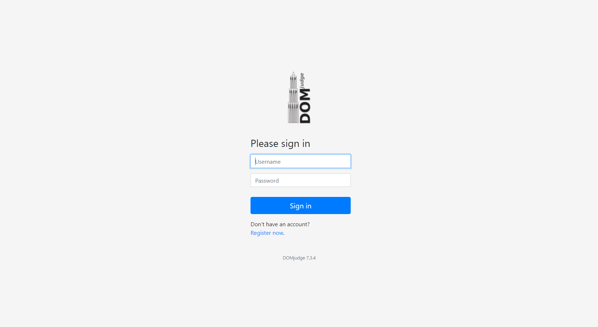
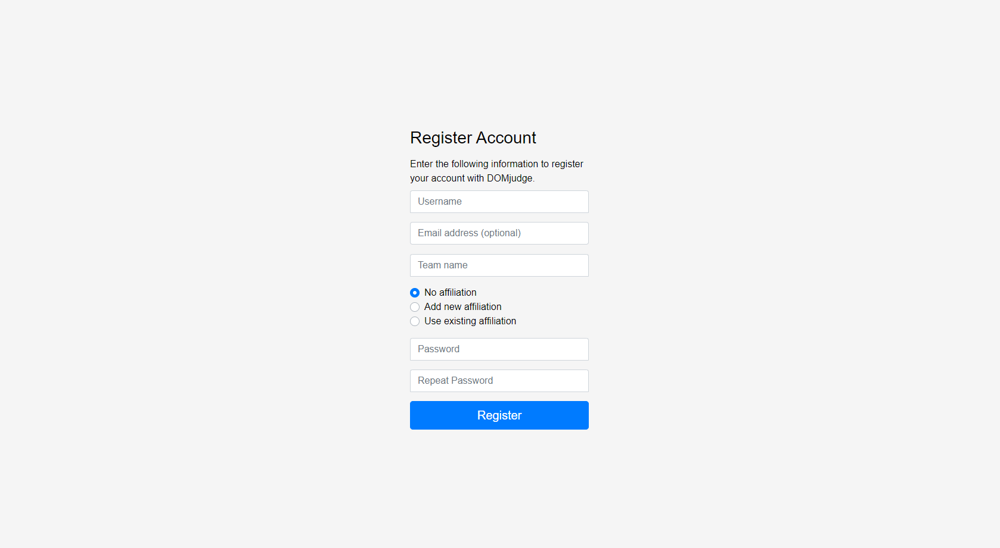
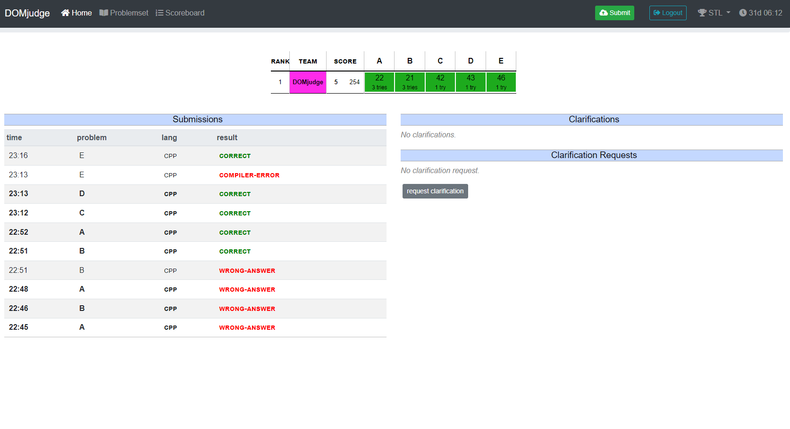
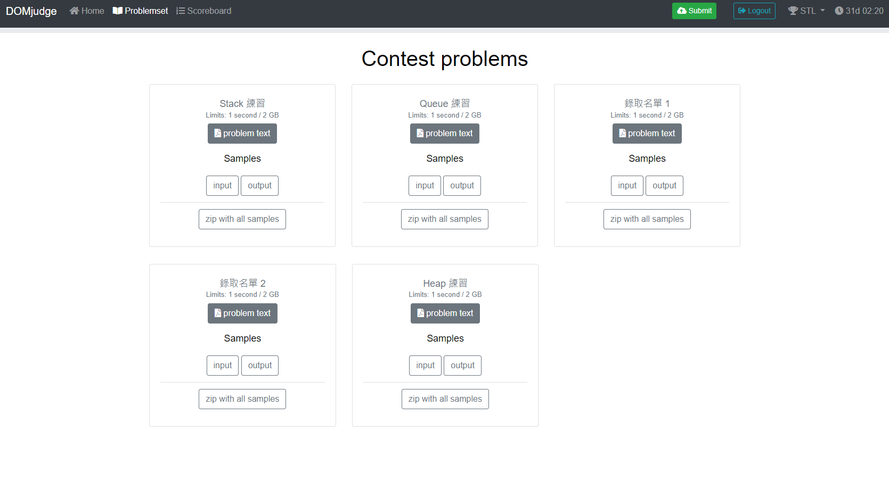
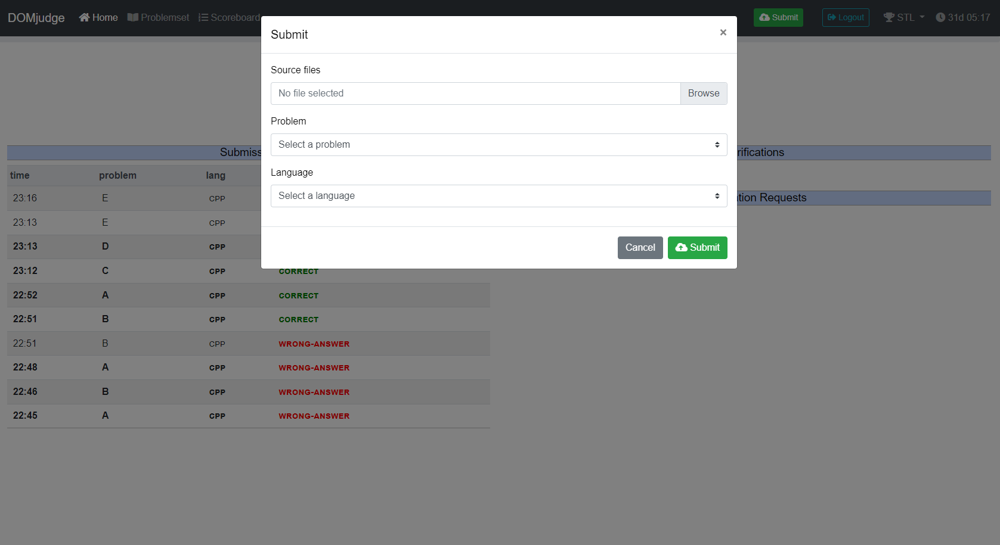
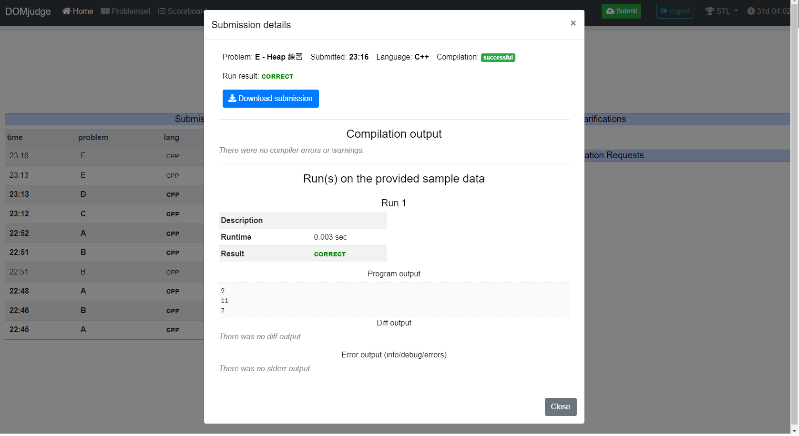
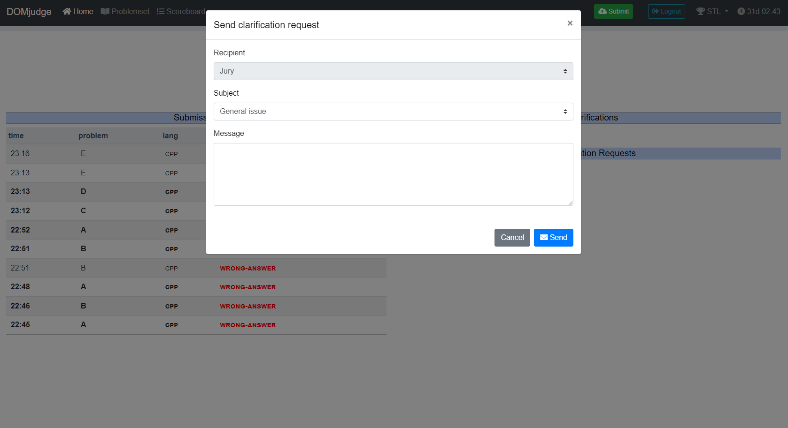
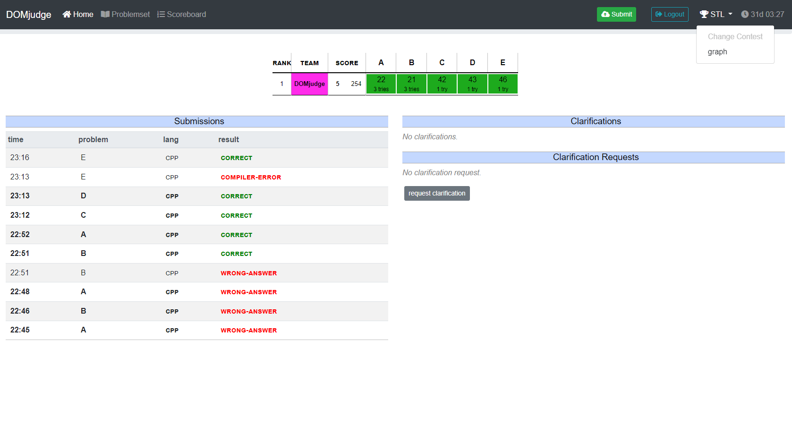

# Domjudge Team

## 註冊及登入

一般來說，主辦方會設定好帳號和密碼，利用密碼登入即可，一些比賽會提供使用者註冊帳號，欄位說明如下：

* `username` 和 `password`：登入帳號和密碼。
* `teamname`：記分板顯示的隊伍名稱。
* `email`：電子郵件，選填。
* `affiliation`：代表機構，選填。

登入成功後會來到首頁，可以看到解題狀況、繳交紀錄及詢問紀錄。

## 查看題目

點擊左上方的 `problemset`，可以看到每一題的題目和測資。

## 提交

點擊右上方的 `Submit`，會看到三個欄位，分別是檔案來源、繳交題目和繳交語言。檔案來源可以多選，如果只有一個檔案，系統會依據檔名和副檔名，自動選擇繳交題目和繳交語言（如果沒有匹配的則無影響），例如繳交 `A.cpp` 的檔案，系統會自動選擇 `Short name` 為 `A` 的題目，語言選擇 `.cpp`。

提交後，會在左方顯示結果，根據系統的設定，可能有提供下列服務：

* 看到範例測資的結果
* 下載程式碼

### Domjudge 提交結果

測資包含範例測資和隱藏測資，題目只會給範例測資，範例測資測試過不保證提交在 Domjudge 會對。

下面介紹幾種提交結果：

- `Correct`：你的程式碼通過所有測資，恭喜!!!
- `Compile Error`：程式編譯錯誤，本機如果編譯成功可詢問我
- `Wrong Answer`：程式執行成功，但輸出結果跟正確解答有出入，有可能但不僅限於下列情況
    - 答案範圍到 `long long`，程式碼只用 `int`
    - 想法有誤
    - 輸出了其他東西
- `Runtime Error`：程式執行到一半當機，有可能但不僅限於下列情況
    - 陣列的 index 超過範圍、陣列開太小
    - 除以 $0$
- `Time Limit`：時間超過限制，有可能但不僅限於下列情況
    - 無限迴圈的情況
    - 程式碼指令執行次數過高：程式一秒大約執行 $10^9$ 次，如果發現程式執行的次數會超過限制秒數乘上 $10^9$，那麼很有機會會出現 `TimeLimit`
- `Meomery Limit`：記憶體使用超過限制，幾乎不會出現，遇到就直接提問
- `Output Limit`：程式輸出大小超過限制，幾乎不會出現，遇到就直接提問
- `No Output`：程式沒有出現任何東西，偶爾會出現，有可能是想法錯誤(可以當成 `Wrong Answer` 的一種)，或者是測資有問題，遇到時候可以我我是不是測資的問題

## 提問

點擊右方 `request clarification`，選擇所要問的問題以及輸入內容，點擊發送，等待主辦方回應，主辦方也可能會發布公告，需要注意一下訊息以免錯過。

### 自辦賽提問事宜

- 可以提問
    - 題本缺失、勘誤
    - 題意問題
    - 本機編譯成功、上傳編譯失敗
    - 出現 `Meomery Limit`、`Output Limit`
    - 詢問測資是否有誤
- 不行提問
    - 出現 `Wrong Answer`、`Runtime Error`、`Time Limit` 詢問哪裡有錯。
    - 為什麼範例測資都對，上傳沒有答對。

## 切換比賽

如果有多場比賽，可點擊右上角的冠軍獎盃切換。

