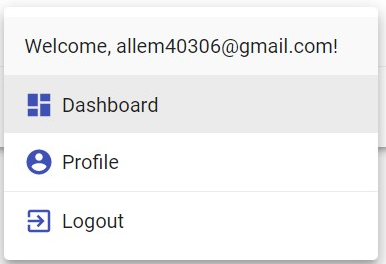
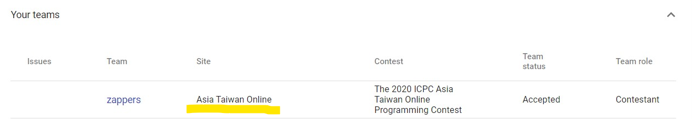
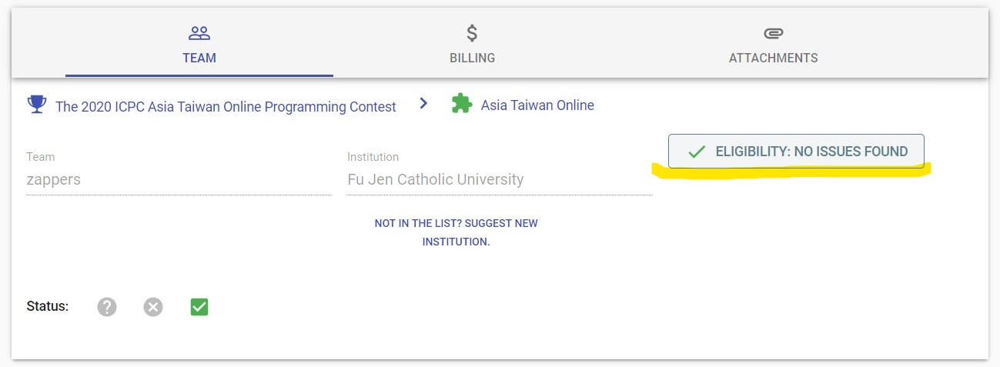
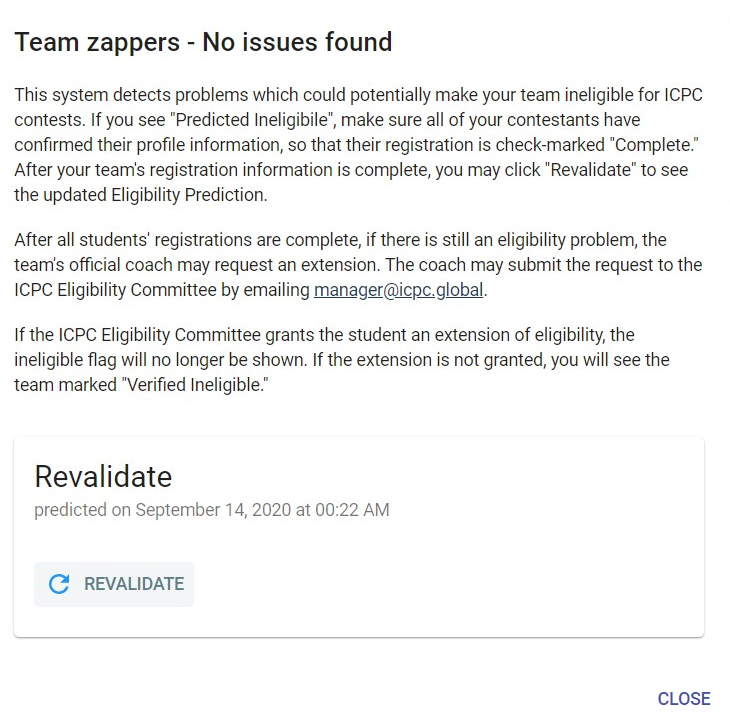
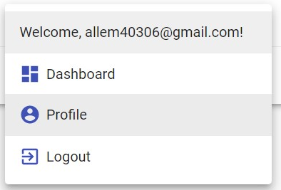
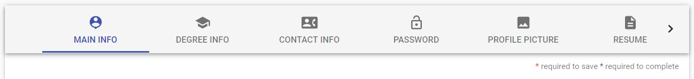

# ICPC 註冊事宜

## 註冊

- [官網](https://icpc.global/)
- 把註冊的 email 交給老師(教練)，用於註冊隊伍。

## 查看是否完成隊伍註冊

每次主辦單位都會要求的資料不盡相同，再註冊完隊伍後必須查看是否有把所有資料填完。

- 按 Dashboard
	- 
- 點 team 連結(注意是否為這次比賽)
	- 
- 按按鈕看看是什麼問題
	- 
- 填好了按 Revlidate 檢查
	- 

## 補上資料

- 按 Profile
    - 
- 邊欄上有 `*` 代表沒填好
    - 
