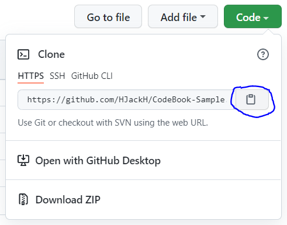
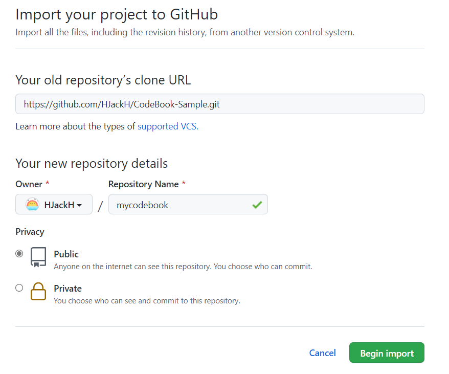
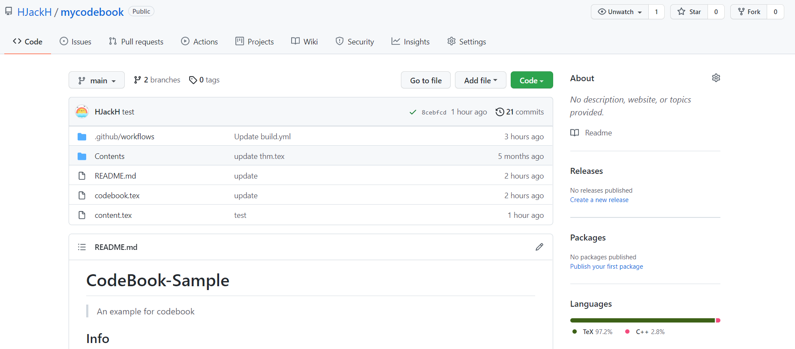
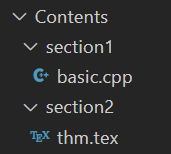
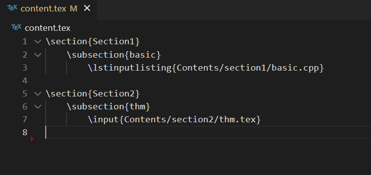
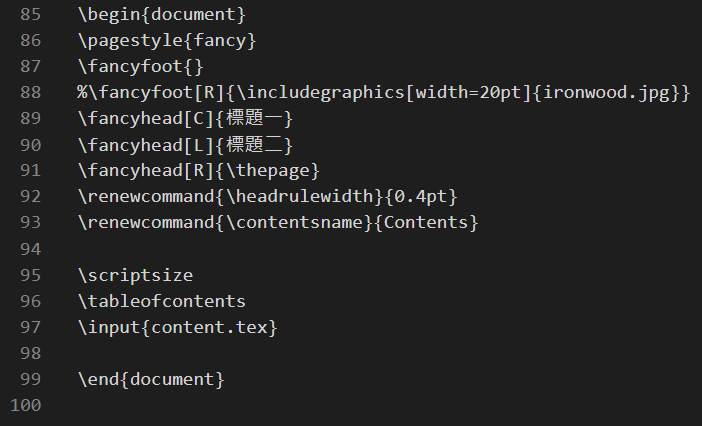
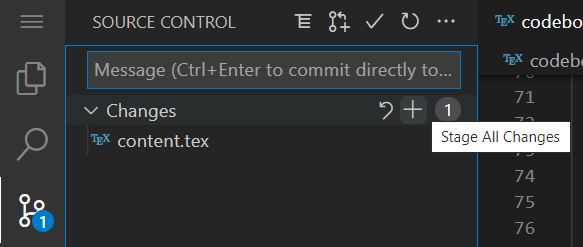
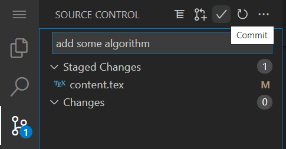

# 製作 CodeBook

> 這是一個超級懶人包建議你學習 `git` 的操作方法

## A. GitHub
* 註冊一個 github 帳號
    * https://github.com/

## B. 建立你的倉庫
* 範例頁面：https://github.com/HJackH/CodeBook-Sample
* 有兩種方法(選擇一種就可以)

1. fork
    * 

2. import
    * 先複製範例頁面 git 的連結
        * 
    * 點擊 `Import repository`
        * 
    * 貼上剛剛複製的連結
        * 

## C. 打開網頁編輯頁面 (codespace)
> 如果你會使用 git，也可以 clone 到本地編輯

* 先到剛剛你建立的倉庫
    * 

* 點鍵盤上的 `.`
* 或是改變網址
    * 原本: https://github.com/YOUR_NAME/mycodebook
    * 修改: https://github.dev/YOUR_NAME/mycodebook
    * 

## D. 將你的程式碼加到 codebook 中

1. 將程式碼先放到資料夾中
    * 可以是 `.cpp`(程式碼) 、 `.tex`(latex) 或其他文字檔案
    * 

2. 更改 `content.tex`
    * 程式碼檔案用 `lstinputisting`
    * latex 檔案用 `input`
    * 

## E. `codebook.tex` 中可設定的地方
* 修改個人、隊伍資訊
    * \fancyhead[C] 是中間的標題
    * \fancyhead[L] 是左邊的標題
    * 

## F. 上傳到 GitHub
1. git add
    * 
2. git commit
    * 可以打一些 commit 訊息(例如：add kruskal's algorithm)
    * 
3. git push(網頁編輯器不需要 push)

## G. 查看結果
* 等待 1 分鐘左右
* 切換到 `pdf` branch
    * 
    * 
