# 製作 CodeBook

> 這是一個超級懶人包建議你學習 `git` 的操作方法

## A. GitHub

-   註冊一個 github 帳號
    -  <https://github.com/> 

## B. 建立你的倉庫

- 範例頁面： <https://github.com/HJackH/CodeBook-Sample> 
- 有兩種方法（選擇一種就可以）

1.  fork
    - 

2.  import
    -   先複製範例頁面 git 的連結
        - 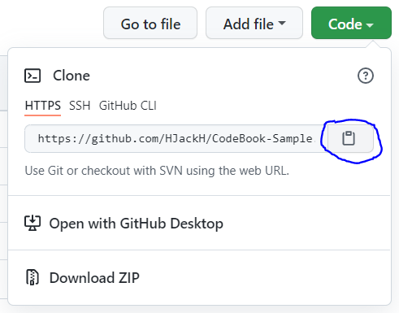
    -   點擊 `Import repository` 
        - 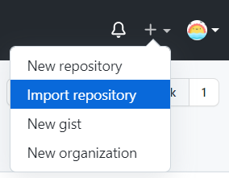
    -   貼上剛剛複製的連結
        - 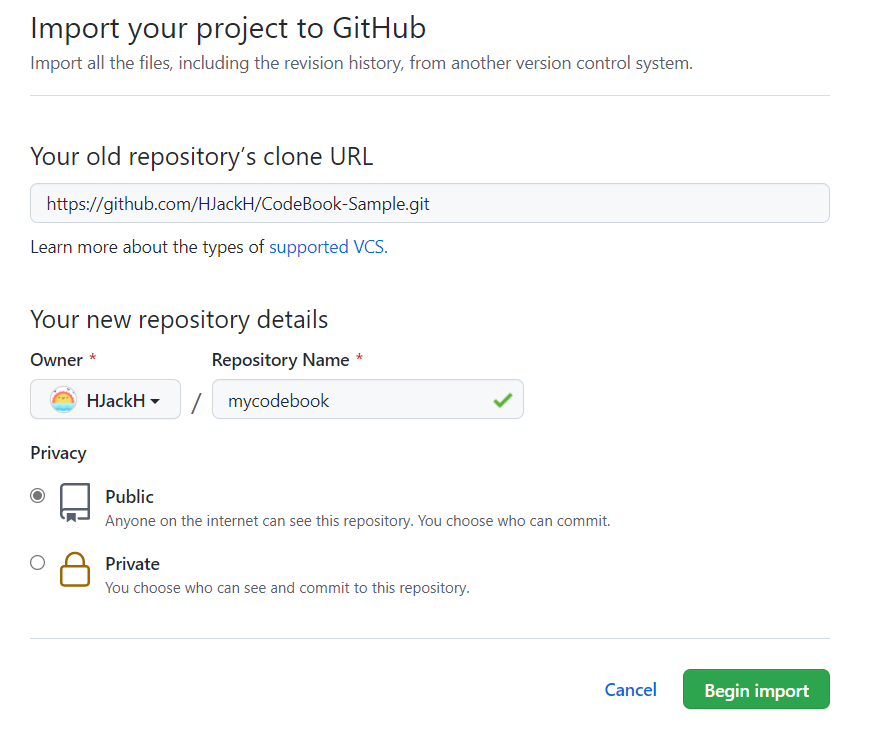

## C. 打開網頁編輯頁面 (codespace)

> 如果你會使用 git，也可以 clone 到本地編輯

-   先到剛剛你建立的倉庫
    - 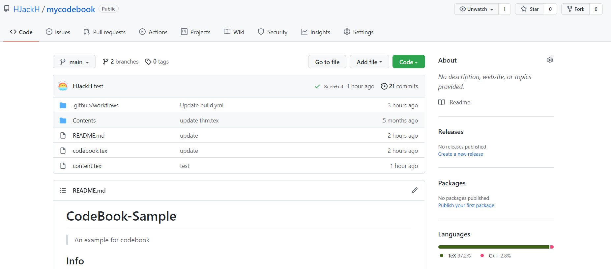

- 點鍵盤上的 `.` 

-   或是改變網址
    - 原本： <https://github.com/YOUR_NAME/mycodebook> 
    - 修改： <https://github.dev/YOUR_NAME/mycodebook> 
    - 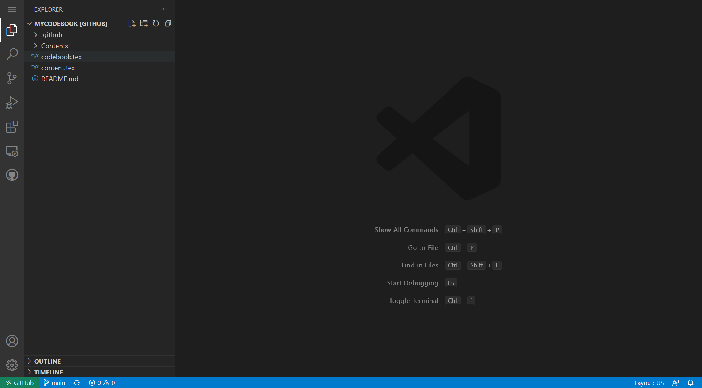

## D. 將你的程式碼加到 codebook 中

1.  將程式碼先放到資料夾中
    - 可以是 `.cpp` （程式碼）、 `.tex` (latex) 或其他文字檔案
    - 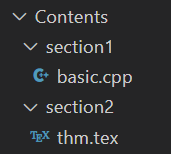

2.  更改 `content.tex` 
    - 程式碼檔案用 `lstinputisting` 
    - latex 檔案用 `input` 
    - 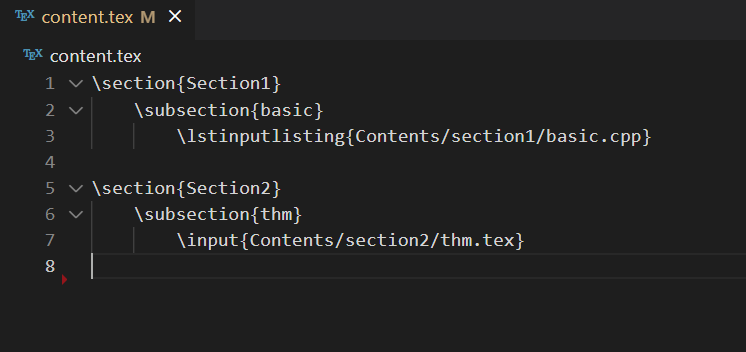

## E. `codebook.tex` 中可設定的地方

-   修改個人、隊伍資訊
    -  `\fancyhead[C]` 是中間的標題
    -  `\fancyhead[L]` 是左邊的標題
    - 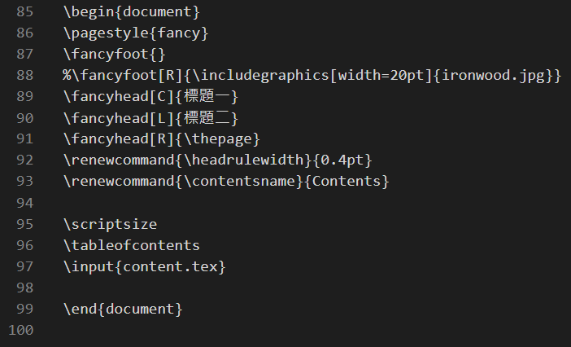

## F. 上傳到 GitHub

1.  git add
    - 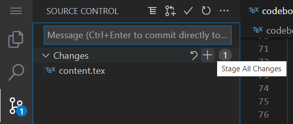
2.  git commit
    - 可以打一些 commit 訊息（例如：add kruskal's algorithm)
    - 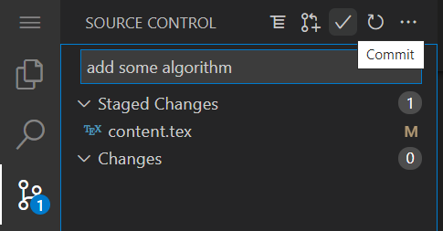
3. git push（網頁編輯器不需要 push)

## G. 查看結果

- 等待 1 分鐘左右
-   切換到 `pdf` branch
    - 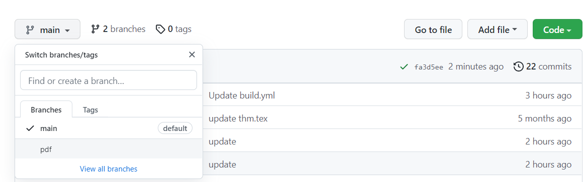
    - 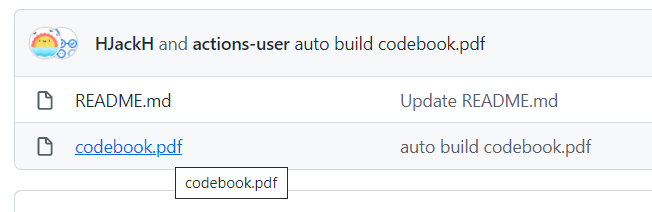
