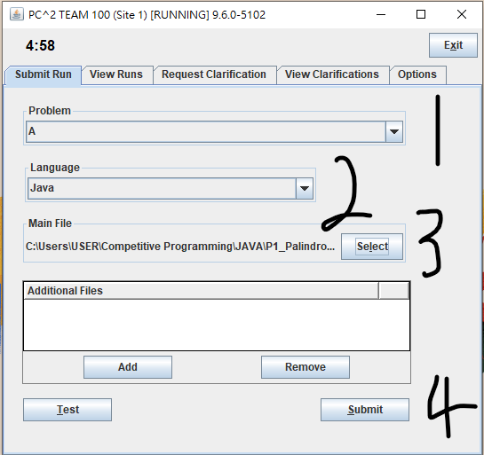
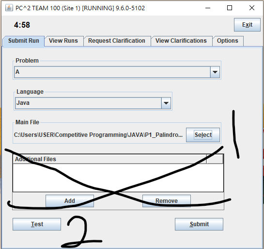
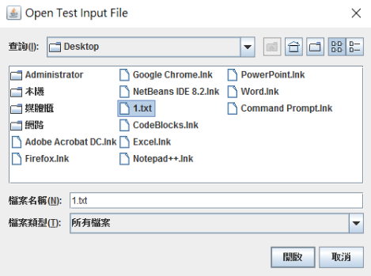
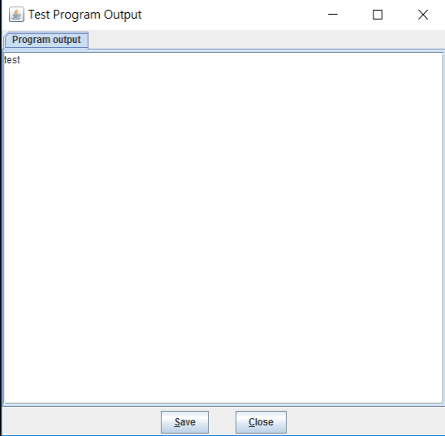
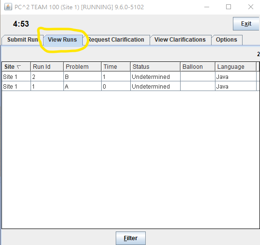

# 如何使用 PC^2

PC2 曾是許多賽事包含 ICPC Final 所使用的評測系統，現多被 Domjudge 取代。

## 提交

-   選擇題目、語言、程式碼
    - 

## 測試

- addititonal files 根本沒用
-   選擇要測試的程式，按 Test
    - 
-   選擇測試 **自製輸入檔** 
    - 
-   查看輸出結果
    - 

## 查看結果

-   點擊 View Runs
    - 
