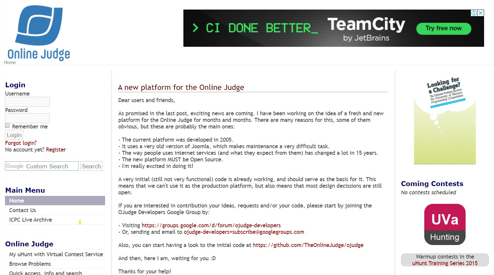
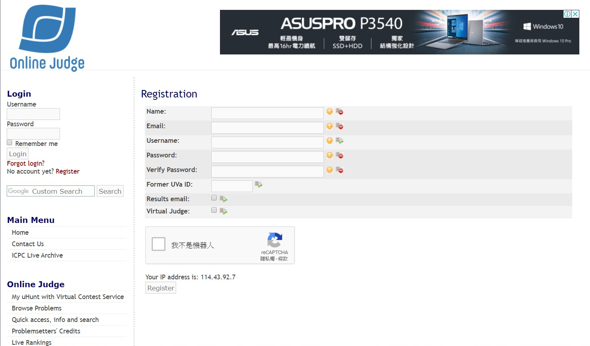
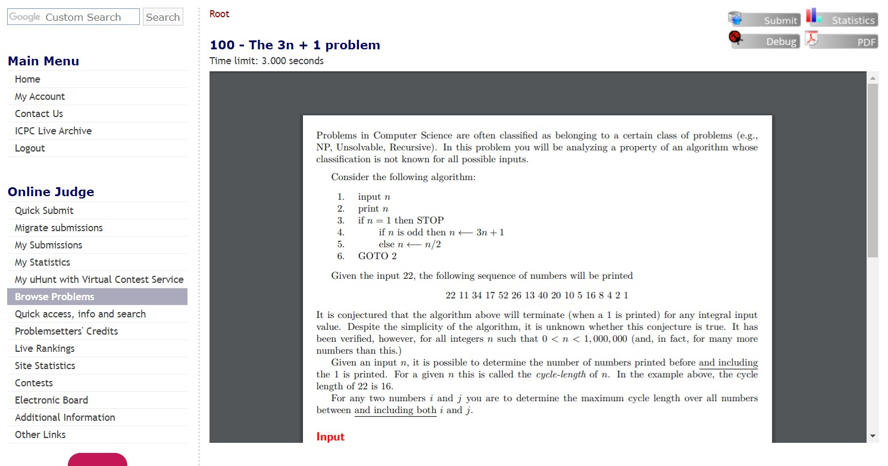
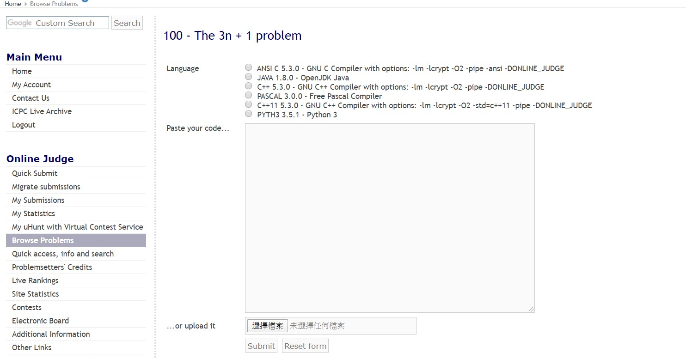
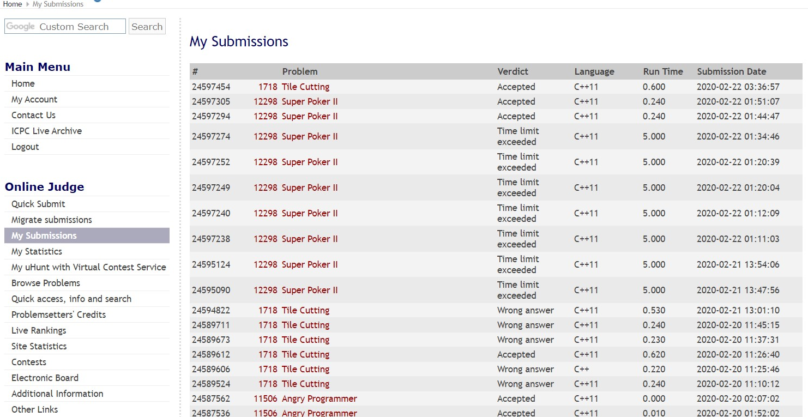
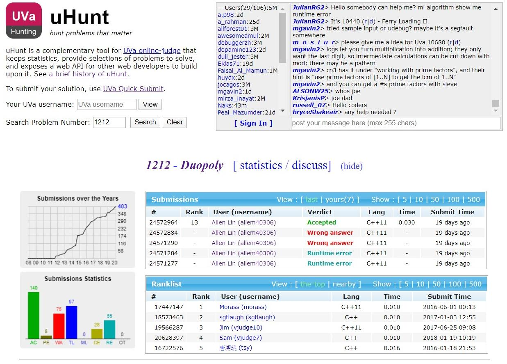
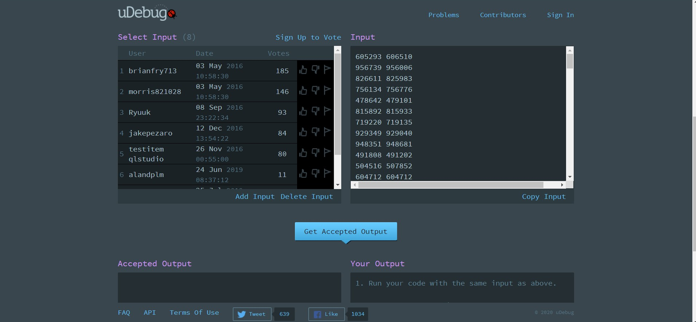

# UVa Online Judge

UVa 為第一個 Online Judge，原為西班牙 UVa 大學營運，現已獨立出來，網站名稱也不會再出現 UVa 字樣。

## 註冊

首頁左邊有個 login 邊欄，點擊 `register` ，會跳轉至註冊頁面。

- 
- 

各欄位說明如下：

-  `name` , `Email` , `username` , `password` , `verify password` 必填。
-  `former UVa ID` ：如果你之前有 UVa 帳號可以合併，沒有辦過就跳過。
-  `Result Email` ：看要不要把上傳的結果寄到你的 email。
-  `Virtual judge` ：是否為代理繳交程式碼的帳號，不要勾選。

## 找題目

- 用搜尋引擎。
- 使用 [UHunt](https://uhunt.onlinejudge.org/) 。
- 點左邊邊欄 `Browse Problems` ，找尋相對應題目。

## 提交題目

題目頁面右上角有 $4$ 個按鈕，按 `Submit` ，會跳轉繳交頁面。

- 

選擇語言，繳交程式碼（貼上程式碼或是上傳檔案），按 `Submit` 。

- 

## 查看結果

-   點左邊邊欄 `My Submissions` 
    - 
-   點左邊邊欄 `My uHunt with Virtual Contest Service` （建議）
    - 

##  [uDebug](https://www.udebug.com/UVa) 

在題目頁面有顆 `Debug` 按鈕，有人會提供 Debug 的測資，絕大部分都是可用的，基本上看按讚的人數 > 0 就能使用

- 
