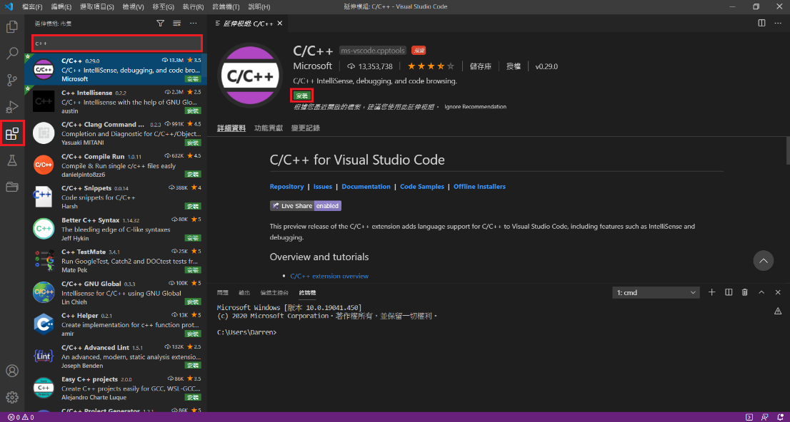
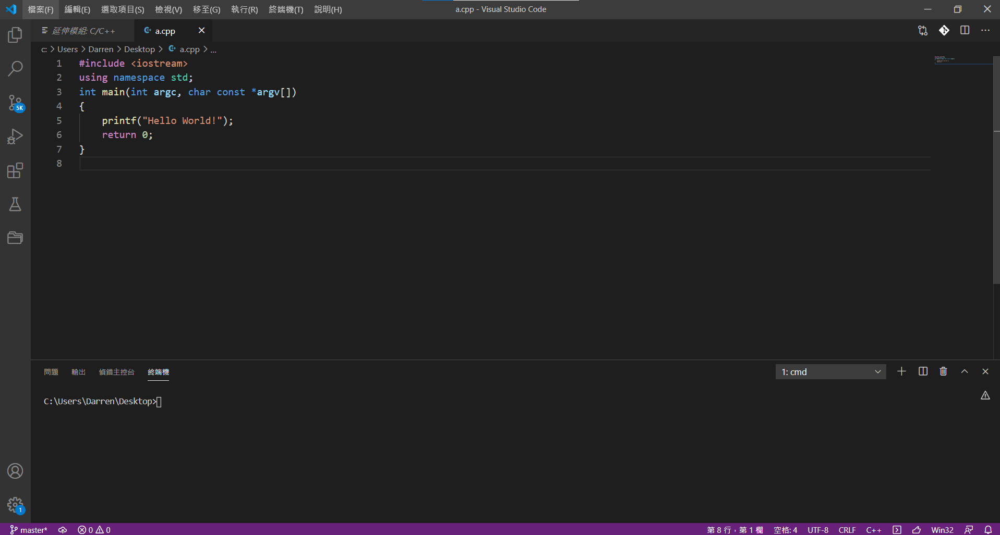
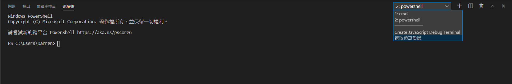
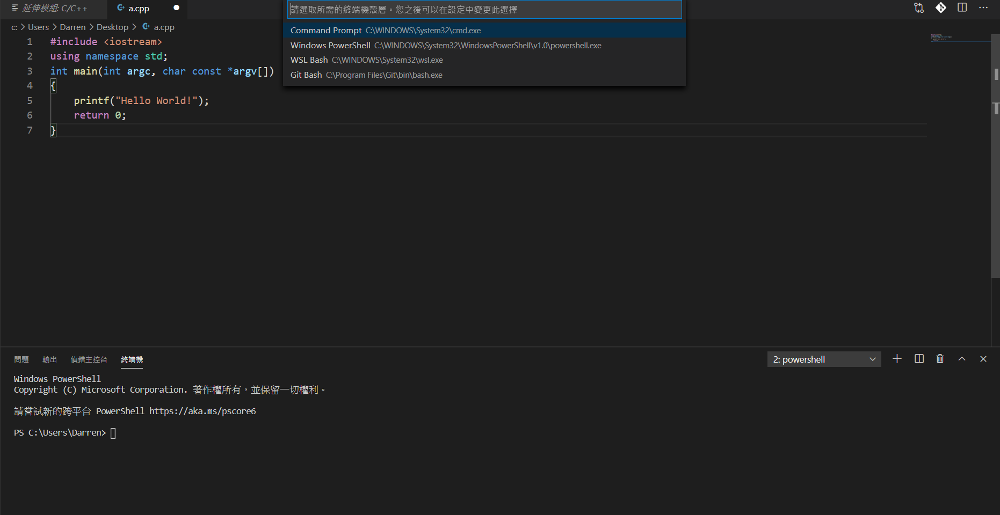

# Visual Studio Code

- 載點： <https://code.visualstudio.com/> 

-   C/C++ Extension
    - 

## 內建終端機

-   呼叫終端機：Ctrl +\`
    - 
-   預設是 powershell，建議調成 `cmd`
    - 
-   選 Command Prompt 按 `+` 打開即是 `cmd`
    - 

## 常用熱鍵

|        指令       |       功能       |
| :-------------: | :------------: |
|     Ctrl + X    |       刪除行      |
|     Ctrl + D    | 選取單字（可重複選取相同的） |
|     Ctrl + Y    |      回復上一步     |
| Shift + Alt + F |      自動排版      |

## 編譯

- 用 Command Line 編譯（gcc/g++)
